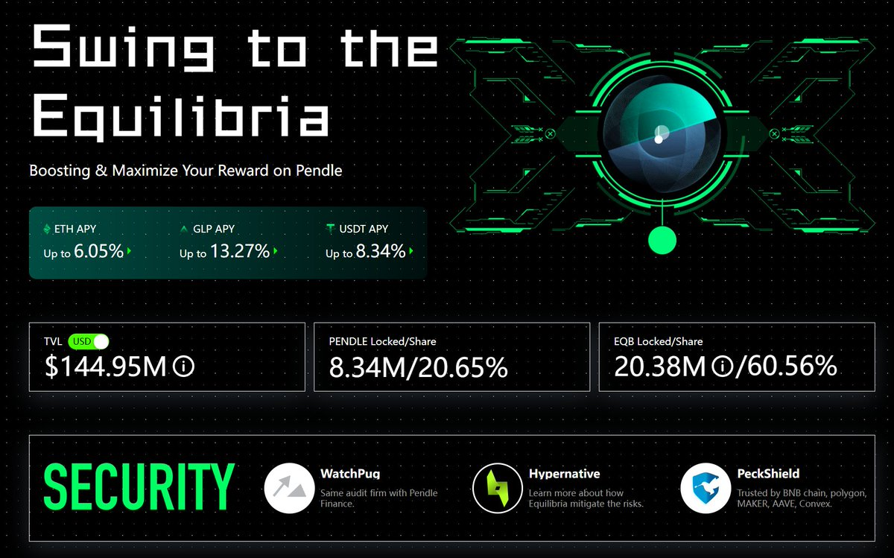

# Equilibria：vePendle 收益拆分機制與 EQB 槓桿策略

> **來源**: [@Cwish_CS](https://x.com/Cwish_CS/status/1922140938417406371) | [原文連結](https://twitter.com/Cwish_CS/status/1922140938417406371/photo/1)
>
> **日期**: 
>
> **標籤**: `vePendle` `Equilibria` `收益拆分`

---

> **來源**: [@Cwish_CS (Cwish)](https://twitter.com/Cwish_CS)
> **日期**: 2026-02-18
> **標籤**: `DeFi` `Pendle` `Equilibria` `vePendle` `收益拆分`

---

## 核心概念

Pendle (@pendle_fi) 可以將各類收益代幣拆成 PT 與 YT，那麼有沒有想過將 $PENDLE 的 ve-tokenomics 版本 —— $vePendle 的收益進行拆分呢？

本文將介紹：
1. @Equilibriafi 機制
2. $EQB 與 $ePENDLE 收益分配
3. $EQB 對於 vePENDLE Vote 的槓桿試算

## Equilibria 機制詳解

（注：原始內容僅為推文引言，完整內容需參考原推文串連結）
