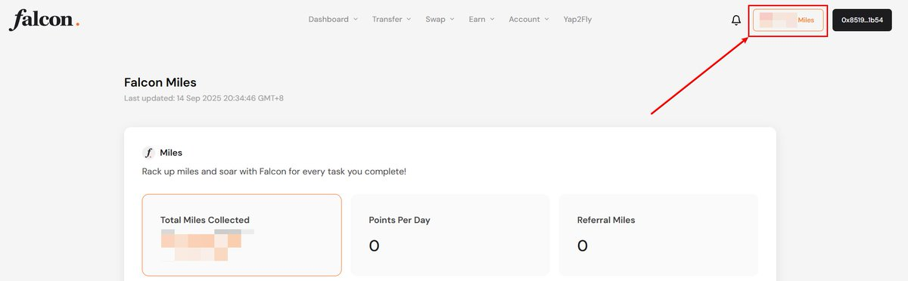
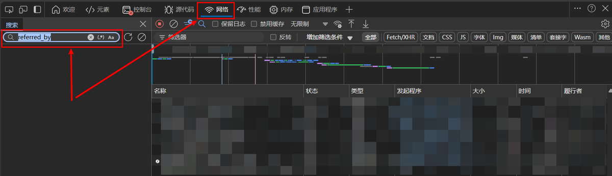
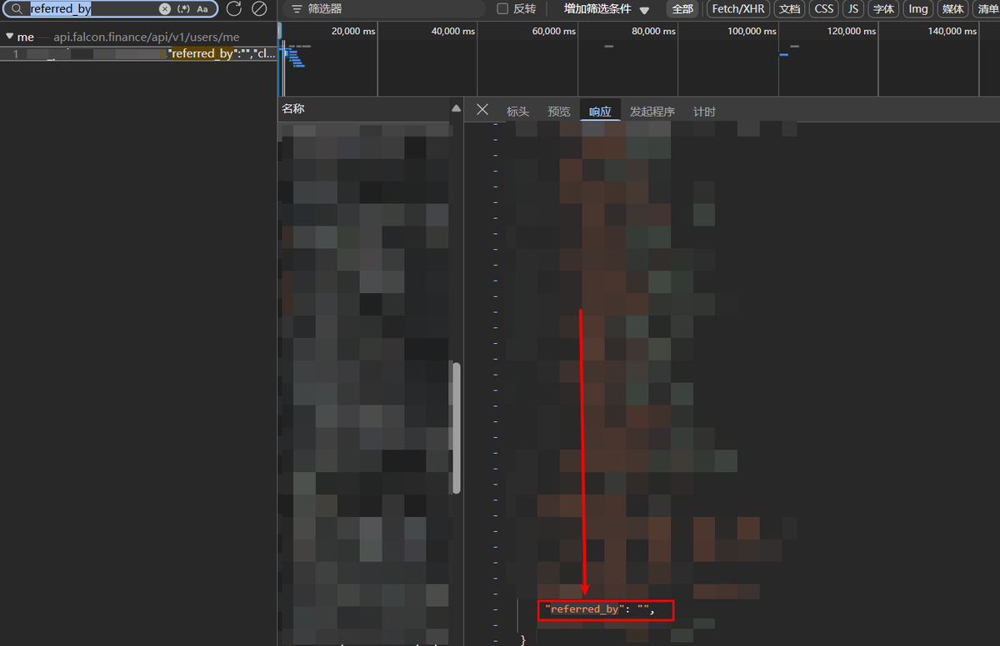

# Falcon Finance 推薦鏈接驗證指南

> **來源**: [@MaiMaiTi778](https://x.com/MaiMaiTi778/status/1967209625826255147) | [原文連結](https://app.falcon.finance/swap/mint?r=83105a51ea741adc3d2f53bf96ef452e)
>
> **日期**: Sun Sep 14 12:51:38 +0000 2025
>
> **標籤**: `Falcon Finance` `推薦分` `Miles Points`

---

好的，我會嚴格按照您的規則整理這篇文章。讓我開始處理：

---

> **來源**: [@MaiMaiTi778 (MaiMaiTi.edge 🦭)](https://twitter.com/MaiMaiTi778)  
> **日期**: 2026-02-18  
> **標籤**: `falcon-finance` `defi` `推薦驗證` `教學`

---

## 前言

教你如何確定 @falconfinance 的邀請鏈接是否成功。

在 Falcon 相關的信息群裡三個問題問的最多：

1. 我要不要 KYC
2. 1M 等於多少分
3. 推薦鏈接的 15% 沒拿到？怎麼確定我是否有推薦分？

第 1 和第 2 個問題我之前的帖子都解釋了，有興趣的可以去翻翻看。

這次主要寫一下怎麼看第 3 個問題。

## 驗證推薦鏈接的方法

首先，分數到底有沒有進賬其實你自己能算得出來。推薦分顯示有問題官方的確正在修復（有個徽章也是）。

那有些人就是想 100% 確定「推薦」是否生效，我們只能用一些「偏門」了。

### 操作步驟

只需要 3 個步驟：

1. 打開瀏覽器，進入你的 Miles Points 界面

2. 按一下鍵盤上的 F12，在出來的瀏覽器工具頁面的上方選到「網絡 (Network)」標籤界面，在左邊的搜索欄輸入 "referred_by"，然後 F5 刷新一下頁面

3. 查看一下輸出的結果

### 結果判讀

- 如果是 `"referred_by": " "`，那麼恭喜你，沒被推薦成功
- 如果是 `"referred_by": "XXXXXXXX"`，那麼也恭喜你，被推薦成功

## 推薦鏈接建議

這裡附上我的推薦鏈接：https://t.co/GancgoFPmd

不過不太推薦你們用我的，我設置的推薦雖然獎勵都是給你們的，但是我拉滿了只有 10%。

我推薦你們去找找 @MengLayer 或者 @btclin 的推薦鏈接，他們的推薦都是 15% 全反給你們的。
