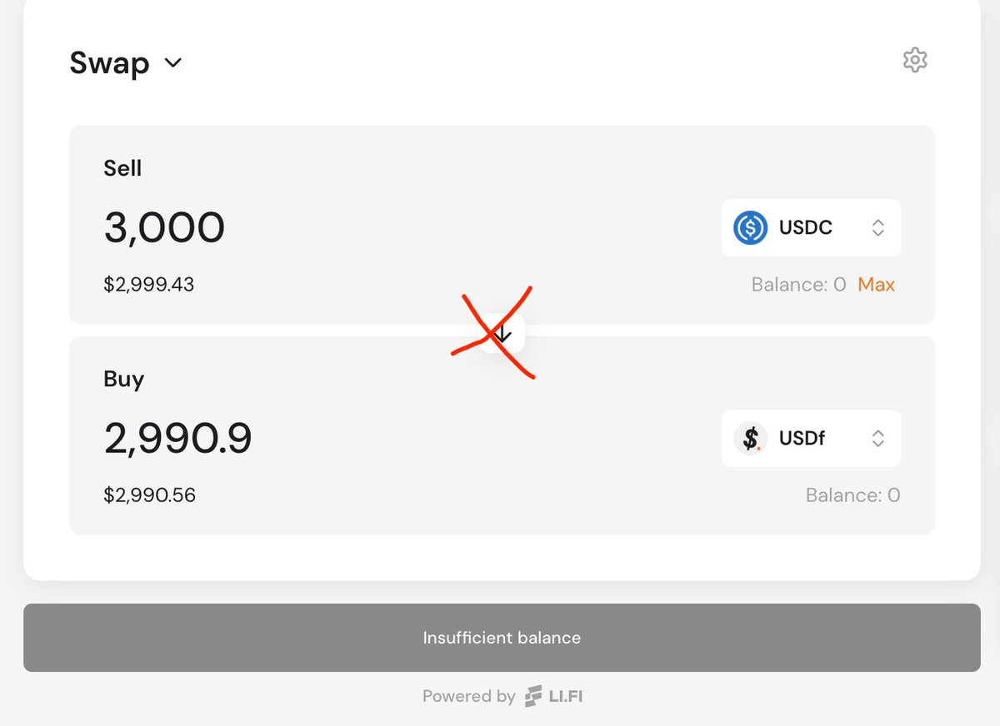
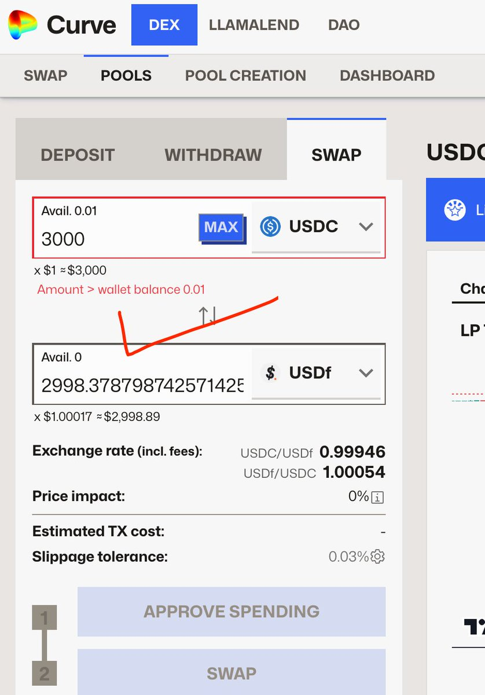
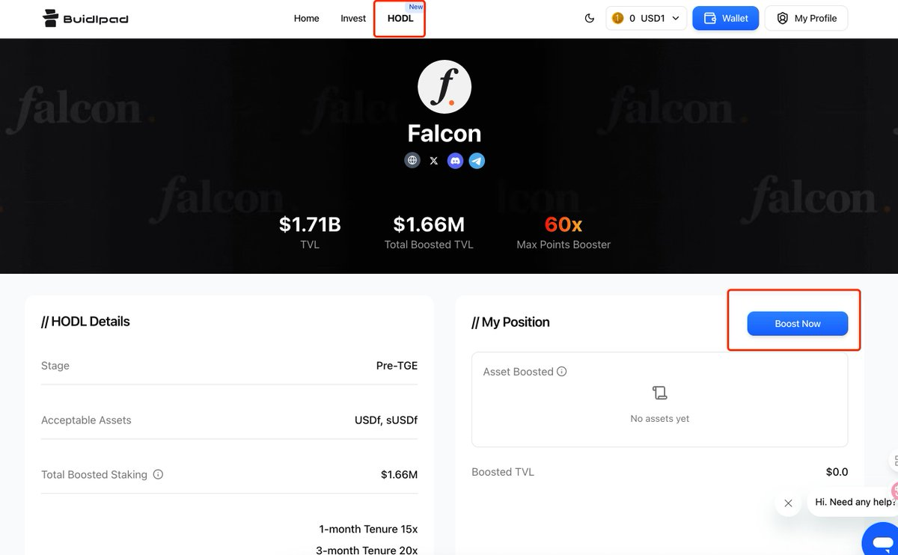
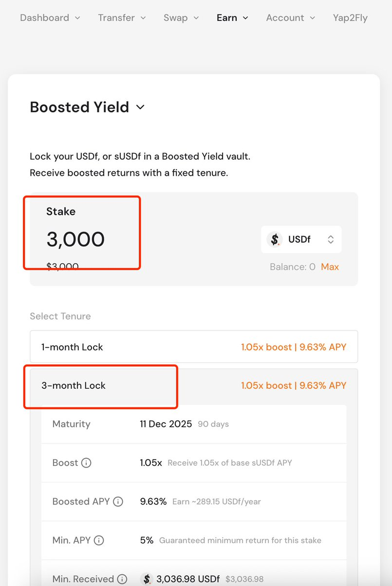

# Buidlpad x Falcon Finance 打新 HODL 最佳參與路徑

> **來源**: [@Nazarick_eth](https://x.com/Nazarick_eth/status/1966428309493071890) | [原文連結](https://www.curve.finance/dex/ethereum/pools/factory-stable-ng-391/swap)
>
> **日期**: Fri Sep 12 09:06:58 +0000 2025
>
> **標籤**: `IDO打新` `流動性挖礦` `風險管理`

---

> **來源**: [@Nazarick_eth (安兹大人 🦅)](https://twitter.com/Nazarick_eth)
> **日期**: 2026-02-18
> **標籤**: `DeFi` `IDO` `Buidlpad` `Falcon Finance` `HODL`

---

## 參與規則

Buidlpad 上線 @falconfinance $FF 打新，需要通過 Buidlpad 官網 HODL 處存入 3000U。

**存入金額與額度對應**：

| 存入期限 | FDV 估值 | 打新額度上限 | 額外獎勵 |
|---------|---------|------------|---------|
| 1 個月及以上 | 3.5 億 | 標準額度 | - |
| 3 個月及以上 | 3.5 億 | 4500U | 積分額外加成 |

## 最佳參與路徑（避坑版）

作者實測發現，直接在 Buidlpad 充值 USDC 會有以下問題：
- 換 USDF 需要在錢包主網直接換，不用充值到平台
- 充值到平台的 USDC 要 mint USDF 需 10000U 起步
- 提幣手續費 10U，且需 24 小時到賬

**推薦操作流程**：

1. **從 CEX 提 USDC 到自己錢包的 ETH 主網**

2. **去 Curve 用 USDC 兌換 USDF**
   - 損耗約 2U（直接 Falcon 官網兌換損耗 10U）
   - Curve 連結：https://t.co/17R0lpF1o1

3. **去 Buidlpad 官網存入 USDF**
   - 從頂部 HODL 處進入 Boost
   - 存入 USDF，選擇 3 個月期限

**金額建議**：稍微多存一點，例如提 3100 USDC，確保達到最低門檻。

## 關於 KYC

- **Falcon Finance**：沒有強制要求 KYC，但如果主帳號存入金額較多，建議完成 KYC。國內護照 + 地址證明可以通過
- **Buidlpad**：KYC 相關細節（作者省略）
