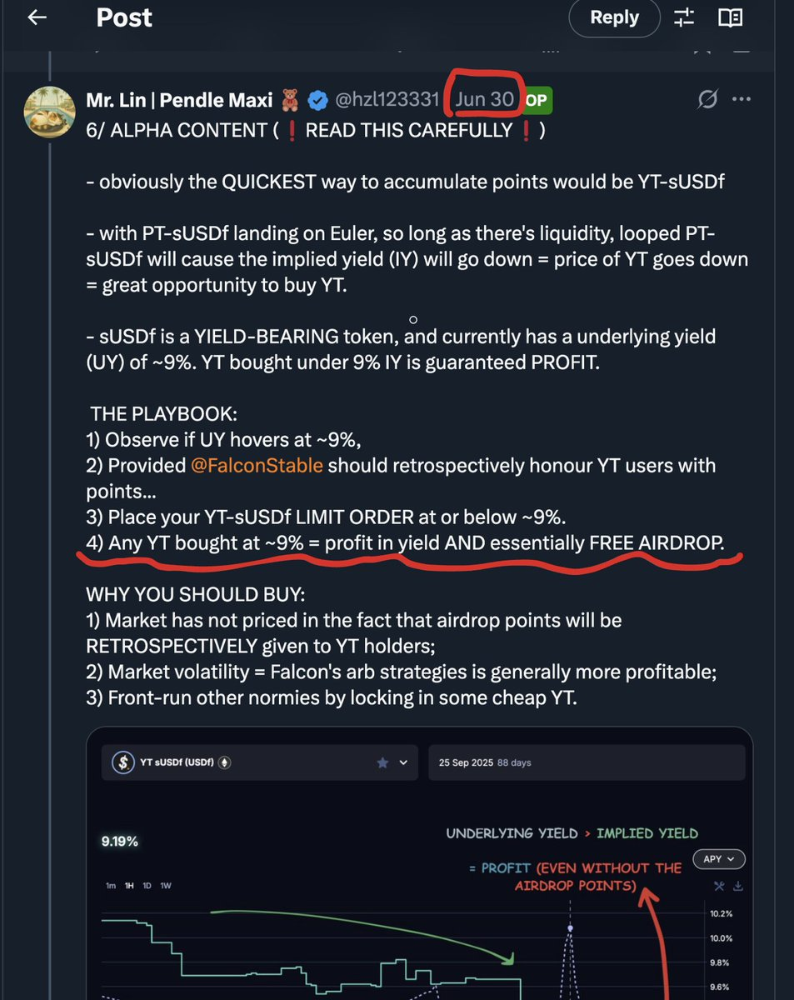

# Pendle 穩定幣收益策略與意見領袖指南

> **來源**: [@MaiMaiTi778](https://x.com/MaiMaiTi778/status/1966323663378280615)
>
> **日期**: Fri Sep 12 02:11:08 +0000 2025
>
> **標籤**: `Pendle` `固定收益` `DeFi 策略`

---

> **來源**: [@MaiMaiTi778 (MaiMaiTi.edge 🦭)](https://twitter.com/MaiMaiTi778)
> **日期**: 2026-02-18
> **標籤**: `pendle` `defi` `穩定幣收益` `意見領袖`

---

## 關鍵意見領袖推薦

如果你喜歡低風險玩穩定幣，使用 @pendle_fi 賺取積分類收益，只需要關注以下幾位意見領袖就夠了（包括最近很火的 @falconfinance）：

| 推特帳號 | 特色說明 |
|---------|---------|
| **@btclin** | IY 在 @falconfinance 9% 的時候就喊著衝 |
| **@ViNc2453** | 天天餵飭給你，害怕你賺少了 |
| **@TravelToEW** | 精算師，多關注大機率不會吃虧 |
| **@pendle_grandma** | 奶奶其實很少參與項目，但是只要她說衝了，無腦跟著就是 |

那個國外的實習生就算了吧，我的 USDL 都沒聲音了。

## 案例：YT-sUSDf 喊單

**來自 @BTCLIN 的分享：**

我算是全推特第一人公開喊單 YT-sUSDf 了吧 @falconfinance

有好幾個群友 DM 我，感謝我摁著他們頭買 YT-sUSDf

**實際收益計算：**

假設你 7 月 1 號買了 9% IY 的 1000U 的 YT-sUSDf：

- 到期日時能獲得 **~143M Miles**
- 以 1M = 50U 來算的話，那就是 **7150U 的空投**
- 而且還是零成本（底層利息一直在 9%）
