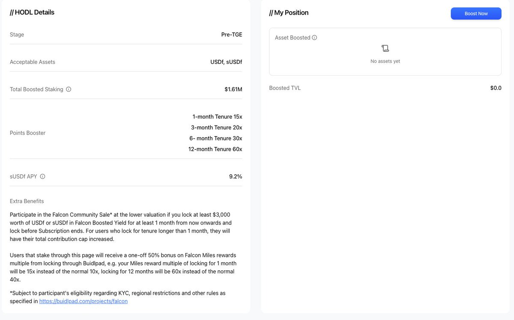

# Buidlpad Falcon Finance ($FF) IDO 參與策略與 HODL 技巧

> **來源**: [@degentalk_hk](https://x.com/degentalk_hk/status/1966421041636405319)
>
> **日期**: Fri Sep 12 08:38:05 +0000 2025
>
> **標籤**: `IDO策略` `鎖倉激勵` `Pendle生態`

---

> **來源**: [@degentalk_hk (Degen Talk)](https://twitter.com/degentalk_hk)
> **日期**: 2024-09-16
> **標籤**: `IDO` `Buidlpad` `Falcon Finance` `USDF` `質押策略`

---

## 項目概況

這次 @falconfinance 在 @buidlpad 上發幣 $FF 的規則稍微有些複雜。

首先這個項目是必須參加的，大家看到最近 Twitter 的討論度，或更直接看看 @pendle_fi 上的 YT 價格飆升就知道。TVL 已經上升到 1.6B，還有特朗普家族加持著。

## 申購規則

申購會在 9 月 16 號開始，公售 FDV 分為兩個 Tier，分別是 350M 和 450M FDV，主要分別是要鎖倉 USDF / sUSDF。

就算是 Tier 2 的 450M FDV 也是很便宜了，這個項目能上 1B 絕對不意外。

### Tier 1 要求

- **新用戶**（現在才開的用戶）：只需要選擇鎖倉 $3000 USDf/sUSDF 一個月
- **舊用戶**：最少需要鎖倉 $3000 USDf/sUSDF 三個月

### 額度規則

在公售細節裡：

- 正常一個賬戶最多能申購 $4,000
- 鎖倉 3 個月以上，額度提升到 $4,500
- 對於積分大於 5M Miles 的舊用戶，會有額外 15% 的額度提升，即最多 $5,175

鎖倉期間還能享受 8-10% 的 APY。

## 參與建議

👉 **簡單結論**：無論你是新用戶/舊用戶，直接鎖倉 $3000 USDf/sUSDF 就對了。

⭐️ **鎖倉技巧**：不要直接在 Falcon 官網 Stake，而是經過 Buidlpad 最新的 HODL 產品去質押，額度提升都是一樣，但這段時間能夠額外獲得 50% Miles 的加成。
