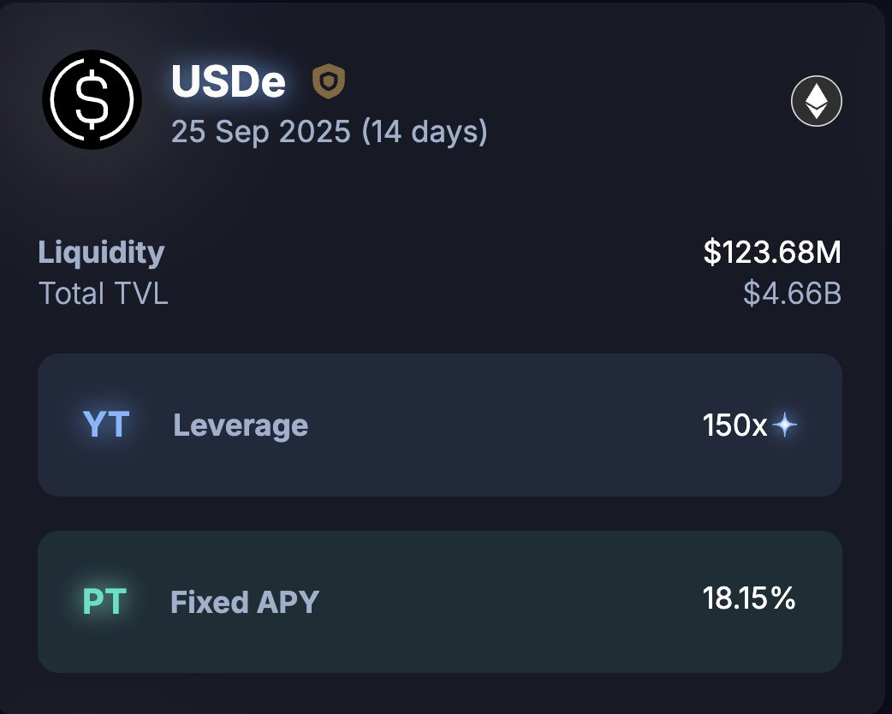

# Pendle 穩定收益策略：以 ENA 為例的保護性買權套利

> **來源**: [@Cryptorobber1](https://x.com/Cryptorobber1/status/1965710943305994652) | [原文連結](https://twitter.com/Cryptorobber1/status/1965710943305994652/photo/1)
>
> **日期**: Wed Sep 10 09:36:24 +0000 2025
>
> **標籤**: `Pendle` `覆蓋性買權` `空頭保護`

---

## 策略背景

七月 ENA 強勢上行後，我偏向 ENA 會有一波回調，於是一路從 ENA 0.69 空到 0.85，帳面浮虧 5k；多虧了 @pendle_fi @ethena 的 YT 機制，整體經過調倉還有些許盈餘。

## 策略架構：為空頭提供保護的 Cover Call

透過 Pendle 的 YT（Yield Token）機制構建保護性買權策略，在持有空頭部位的同時，利用收益代幣的特性來對沖價格上漲風險，實現類似傳統金融中 covered call 的效果。

## 關鍵機制

- **YT 收益代幣**：Pendle 將生息資產拆分為 PT（本金代幣）和 YT（收益代幣），YT 持有者獲得底層資產的收益權
- **空頭對沖**：當價格上漲造成空單浮虧時，YT 的收益可以部分抵消損失
- **調倉彈性**：根據市場走勢調整 YT 持倉比例，在保護和成本間取得平衡

## 實際案例

從 ENA 0.69 空到 0.85，價格逆勢上漲約 23%，原本會造成 5k 浮虧，但透過持有 ENA 相關的 YT 收益代幣，最終調倉後仍有些許盈餘。
