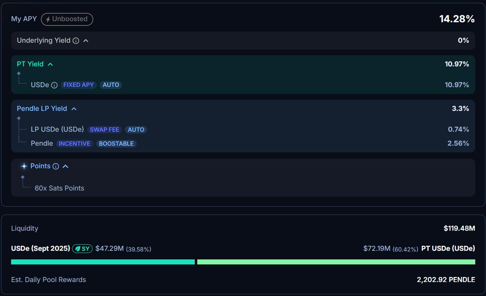
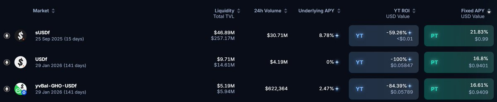

# Falcon Finance 穩定幣收益策略：YT 與 PT 的風險評估

> **來源**: [@0xlemoneth](https://x.com/0xlemoneth/status/1965431467364040931)
>
> **日期**: 
>
> **標籤**: `穩定幣收益` `YT槓鈿策略` `風險管理`

---

## Falcon Finance 穩定幣收益策略分析

幣安 33% 循環貸結束後，Falcon Finance 年化 22% 是否值得參與？本文從風險角度分析 YT 與 PT 的策略選擇。

## 幣安收益降級

幣安 USDC 原本在 10 萬額度內提供 12% 年化收益，從明天開始改為：
- 僅 1 萬額度內提供 6% 年化
- 同時砍額度和利率，比 Coinbase 更狠
- 之後僅放 1 萬順便刷 Alpha 每天領便當錢

## 替代方案：Pendle USDe 池子

在少了幣安這個去處後，目前選擇 @pendle_fi 9/25 到期的 $USDe 池子：

**選擇原因**：
- 快到期，交易量應該會隨之增加
- 底層資產是 $USDe，經過兩年和幾次閃崩依然維持與 USD 掛勾
- 不太需要擔心底層資產問題

**收益計算**：
- 按池內 4 成是 SY 的情況
- 每 10 萬 $USDe 每天可挖 240 萬分
- 保守估計 1 $ENA = 10 萬分，現價約 20u
- 換算年化為 7.3%
- 加上底層收益約有 2x% 年化

## Falcon Finance 的風險評估

目前 @falconfinance 光 PT 就有 22% 年化收益，但對於這種較新專案，不願意高比例部位參與。

**不願大倉參與的原因**：
- 20%-30% 收益不值得大部位去曝險
- 就算持有 $USDC 參與放款，若短期出現脫鉤
- 可能因流動性問題無法贖回
- 如果真的出事歸零，放貸 $USDC 和直接存錢結果一樣

**參與方式的風險等級**：
存錢 / 借貸(放款) / 買 PT / 組 LP 皆有相似風險

## YT vs PT：誰才是真正的風險承擔者

### 傳統觀念（僅適用大型老專案）
- PT = 固定收益
- YT = 承擔風險

### 新專案的實際情況
**PT 才是真正承擔風險的一方**：
- 需要投入大資金質押
- 若專案出問題，本金可能歸零
- 流動性風險可能導致無法贖回

**YT 反而是更好的風險控制工具**：

## 為什麼選擇買 YT 而非 PT

### YT 的價值組成
YT = 底層收益 + 項目積分 + 保險費

### YT 的優勢
1. **損失可控**：就算歸零，損失也只有積分價值歸零
2. **成本確定**：購買時就決定好成本，純看積分未來價值
3. **天然保險**：YT 本來就是確定歸零的工具（跟選擇權一樣）
4. **風險隔離**：在參與前就視為沉沒成本，決定好投入比例

### 購買 YT 的邏輯
當你購買 YT 時：
- 代表有人把大資金放到項目中質押
- 並且把質押獎勵全部給了你
- 你多給他一點補償（溢價）很合理

## 投資策略與風險偏好

### 個人風險偏好
- 喜歡較大比例參與少數項目
- 風險偏好較低，預期回報也放得較低
- 精力有限，比起廣撒網更喜歡能仔細跟的項目

### 槓鈴策略
透過大部位穩定現金流 + 小部位高風險投資，來綜合風險和收益

### 風險控制原則
- 每個人風險偏好不同，收益預期不同
- 只要知道自己在做什麼，就沒有對錯
- 一切都是博弈預期

## 警示案例：高槓桿賣價外選擇權

長期高槓桿賣價外選擇權：
- 每次都能穩賺，一兩年都沒事
- 結果在第三年遇到爆漲 / 黑天鵝，一次歸零
- 也可能賣了一輩子都沒遇到，那代表這輩子很幸運

**投資本質**：在確定性與不確定性間取捨

## 總結

沒有看空 @falconfinance，沒有覺得項目有問題，甚至有參與積分活動。只是單純分享：

- 對於新專案，PT 的風險可能被低估
- YT 反而是更好的風險控制工具
- 沒有選擇 @falconfinance $USDf PT / LP 來當理財
- 更願意用小部位參與 YT，控制風險的同時參與高收益機會
