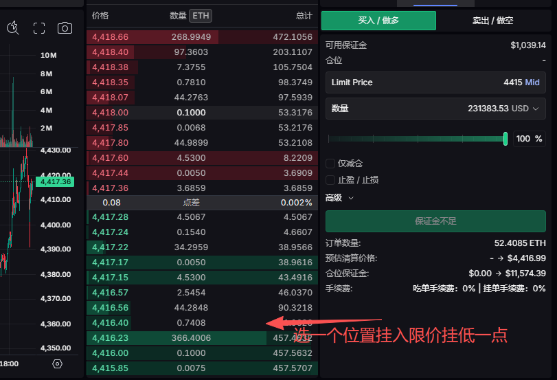

# EdgeX 與 Lighter 網格對沖策略：零損耗空投刷分指南

> **來源**: [@web3a99](https://x.com/web3a99/status/1963776840394551363) | [原文連結](https://pro.edgex.exchange/referral/XIAO)
>
> **日期**: Fri Sep 05 01:30:58 +0000 2025
>
> **標籤**: `網格交易` `空投農耕` `對沖策略`

---

> **來源**: [@web3a99 (笑苍生.btc)](https://x.com/web3a99)
> **日期**: 2026-02-18
> **標籤**: `EdgeX` `Lighter` `網格交易` `空投刷分` `對沖策略`

---

## 策略概述

這是一個利用 EdgeX 和 Lighter 兩個 DEX 平台進行**零損耗空投刷分**的網格對沖策略。核心思路是利用 Lighter 目前沒有開倉手續費的特性，透過主號與多個小號之間的限價單對沖，實現低成本刷取積分。

## 核心打法

### 大號策略：EdgeX + Lighter 對沖

- **操作方式**：使用限價單在兩個平台對刷
- **關鍵要點**：
  - 必須使用限價單
  - 拉長開單時間和持倉時間
  - 設置止盈止損，讓系統自動平倉
  - 一天開 2-5 單，消費約 5 美元
  - 慢慢累積分數，避免女巫檢測

### 小號策略：Lighter 多號低保打法

**前提條件**：
- Lighter 目前沒有開倉手續費
- 交易 3 萬美元可獲得約 3 分
- 持倉和爆倉分數更高
- 低保估計 5 分約值 70 美元

**操作方法**：

1. **帳號配置**：1 個 Lighter 主號 + 4-6 個輔助小號

2. **掛單設置**：
   - 主號：在某個價位（例如 4416）掛入 1 萬美元 X20 多單
   - 小號：在相同位置掛入空單，分散為：
     - 小號 1：1200 美元
     - 小號 2：2200 美元
     - 小號 3：1800 美元
     - 小號 4：1500 美元
     - 小號 5：2000 美元
     - **總計加起來等於主號的 1 萬美元**

3. **自動化執行**：
   - 掛上止損止盈
   - 讓系統自動觸發止盈止損
   - 幾乎沒有磨損

4. **刷分控制**：
   - 單號只刷 3 萬美元左右就停止
   - 只求低保，避免女巫檢測
   - 刷時間過長會被女巫

## 規模化操作

**收益估算**：
- 假設低保 5 分 = 70 美元/號
- 100 個號 × 70 美元 = 7000 美元
- 10000 個號理論上可行（執行力要求極高）

**協作方式**：
- 可以找幾個群友互相刷
- 組成小隊一起開單、止盈止損
- 降低操作難度和時間成本

## 風險與限制

### 女巫檢測風險
- 大號不能用多號對沖打法，容易被女巫
- 小號刷時間過長也會被女巫
- 單號控制在 3 萬美元交易量以內

### 策略失效條件
- **如果 Lighter 未來收取開倉手續費，此策略將無法執行**
- 目前策略基於 Lighter 零手續費的前提

### 執行難度
- 100 個號操作繁瑣，需要極強執行力
- 但正因為難度高，玩的人少，機會更大

## 注意事項

1. **大號與小號分開操作**：
   - 大號：EdgeX + Lighter 限價單對沖，拉長時間
   - 小號：Lighter 多號網格對沖，控制交易量

2. **止盈止損設置**：
   - 必須設置自動止盈止損
   - 減少人工干預，降低風險

3. **邀請碼問題**：
   - Lighter 目前需要邀請碼
   - 可以去 Discord 頻道申請

4. **女巫檢測應對**：
   - 如果被女巫，立即停止該號
   - 下週不再刷該號
   - 如果沒被女巫且出分，就繼續執行

## 平台連結

- EdgeX 註冊連結：https://t.co/ahfZPsGz9Y
- Lighter：需自行到 Discord 申請邀請碼

---

★ Insight ─────────────────────────────────────
1. **零損耗的核心**：利用限價單對沖消除方向性風險，本質上是用時間和操作複雜度換取空投積分，而非承擔價格波動風險
2. **女巫對抗策略**：大號和小號採用不同刷分強度，大號重質（長時間持倉、低頻交易），小號重量（多帳號、控制單號交易量），降低被關聯檢測的機率
3. **時間窗口套利**：此策略強依賴 Lighter 零手續費政策，一旦收費就失效，屬於典型的「政策套利」，需要快速執行
─────────────────────────────────────────────────
