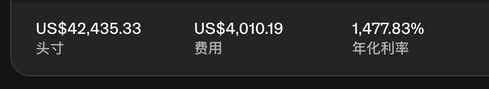

# WLFI 流動性提供者 20 分鐘賺取 10% 手續費機會

> **來源**: [@0xskycapital](https://x.com/0xskycapital/status/1962491577760350436) | [原文連結](https://twitter.com/0xskycapital/status/1962491577760350436/photo/1)
>
> **日期**: Mon Sep 01 12:23:48 +0000 2025
>
> **標籤**: `LP策略` `流動性挖礦` `手續費收益`

---

> **來源**: [@0xskycapital (sky)](https://twitter.com/0xskycapital)
> **日期**: 2026-02-18
> **標籤**: `DeFi` `流動性挖礦` `WLFI` `手續費收益`

---

## 快速獲利機會

大熱項目 WLFI，做 LP（流動性提供者）20 分鐘賺了 10% 手續費，屬於白撿錢機會。

## 相關資源

- [詳細說明連結](https://t.co/UKOUe324QV)
