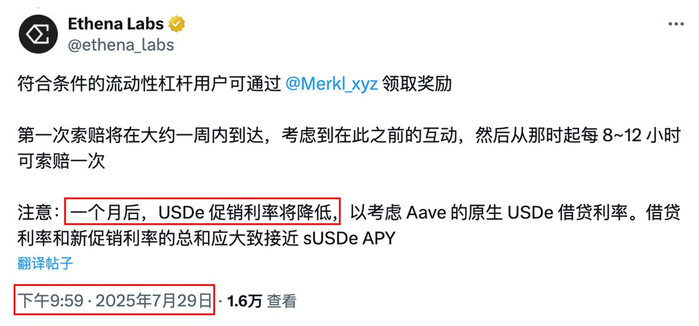
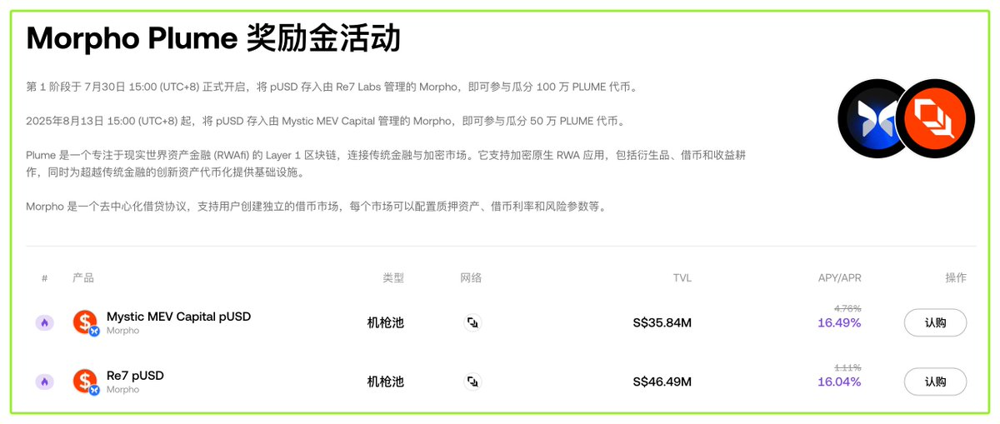

# USDe/sUSDe 無風險套利策略與時機把握

> **來源**: [@BitHappy](https://x.com/BitHappy/status/1959472866812113309)
>
> **日期**: Sun Aug 24 04:28:31 +0000 2025
>
> **標籤**: `套利` `Ethena` `Aave`

---

> **來源**: [@BitHappy (BitHappy)](https://x.com/BitHappy)  
> **日期**: 2026-02-18  
> **標籤**: `USDe` `sUSDe` `套利` `Aave` `Pendle` `Morpho` `無風險套利`

---

## 核心策略：USDe/sUSDe 無風險套利

社群小夥伴們又開始討論 USDe/sUSDe 的機會啦～

除了補貼循環貸和 PT 循環貸，最穩妥的方式依然是無風險套利。

比如，小夥伴提到：在 Aave 借出 USDe，透過 1Inch 兌換成 sUSDe，再進行 Unstake 解鎖。按當前情況計算，年化收益可達 20%（若能把握好時機，APY 還能更高）。

這個思路的核心邏輯，就是利用 sUSDe 在鏈上或交易所內的價格，與其官方 Unstake 解鎖價格之間的匯率差進行套利。

根據社群內多位大佬的實操經驗，如果能精準把握時機，單次利潤相當可觀，操作容量甚至可達百萬級。

## 最佳套利時機

而抄底匯率的最佳時機，往往出現在 USDe/sUSDe PT 到期，或循環貸集中解套的時候。

例如，Aave 和 Ethena 的循環貸此前官宣補貼僅維持一個月，之後會降低。如果補貼不再續上，sUSDe 和 USDe 就可能面臨拋壓。

不過，Morpho 前段時間也表示將與 Ethena 合作開放循環貸，如果屆時補貼續上，那麼這次的套利機會就會大幅減弱。

## 相關動態

昨天參與本末的 Space 時，探聽到幾個值得關注的消息！

1️⃣ **Ethena 和 Morpho 的循環貸**：也要開放與最近 AAVE 差不多模式的 Liquid Leverage 抵押借貸（循環貸）；

2️⃣ **Morpho 固定借貸利率新功能**：Morpho 後續會推出固定借貸利率的新功能，這個非常期待，存款端透過 Pendle 鎖定收益，借款端可透過 Morpho 鎖定支出，這樣循環貸的存借兩頭就都穩了；

3️⃣ **Plume 在 OKX 的激勵活動**：Plume 在 OKX 的激勵活動又上新了，目前 APR/Y 都在 16% 以上，其中存入資產的 pUSD 建議使用 USDC 鑄造，沒有滑點。

---

**提示**：以上僅為資訊分享，非投資建議，請自行做好研究！
