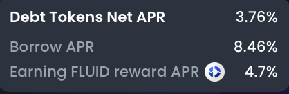
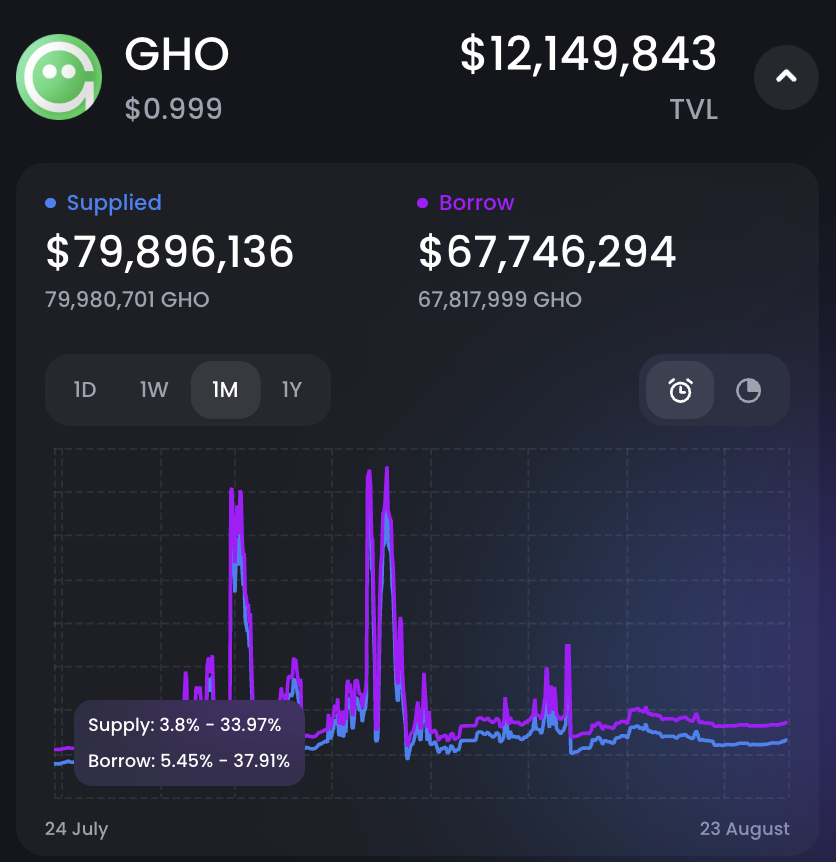

# sUSDe 折價套利實戰：GHO 循環貸策略與 117% 年化報酬分析

> **來源**: [@0xlemoneth](https://x.com/0xlemoneth/status/1959173139822440887) | [原文連結](https://app.ethena.fi/join/ivqwq)
>
> **日期**: Sat Aug 23 08:37:30 +0000 2025
>
> **標籤**: `sUSDe套利` `循環貸策略` `Ethena積分`

---




> **來源**: [@0xlemoneth (0xLemon)](https://twitter.com/0xlemoneth)
> **日期**: 2025-08-12
> **標籤**: `sUSDe` `套利` `GHO` `Fluid` `Ethena` `循環貸`

---

## 策略總覽

又贏了！這次換算低風險年化 117%！

經過了 11 天，$sUSDe 終於又回穩。以前都只有大致上講解邏輯，這次就來分享我的操作方式，以及我操作過程中觀察的細節，一切均為真實數據，鏈上可查。

## 實際交易數據

當初發文的時候，$sUSDe 買入比值為 1.1856807，現在賣出 1.19006，折價已經降到 0.04% 內。

### 收益計算

這 11 天內 @0xfluid 借貸利息平均約 7%，假設開十倍槓桿，則最後的換算年化：

```
(1.19006 / 1.1856807 - 1) / 11天 × 365天 × 10倍 - 7% × 9倍 = 59.56% APR
```

這還是建立在我買在相對高點（折價最少）的時候，大約 0.2%。在我購買發文之後一個禮拜內折價都沒有低於 0.2%，因此看了我的文章後去操作的各位，放到現在應該最少都有 60%-100% 年化。

## 操作方式詳解

### 核心策略

使用 @0xfluid 內建的循環貸機制，借出 $GHO，買入 $sUSDe。

### 為什麼選擇 GHO？

在 @0xfluid 上如果借 $USDT / $USDC 可以開到 10 倍，但 $GHO 只能開到 8.33 倍，那為什麼要用 $GHO 借貸呢？

之前 @aave 有和 @0xfluid 達成 400 萬美元的合作，購買 $FLUID 代幣，且保證至少 1/3 會提供給 @0xfluid 上刺激生態。

因此只要是存入 $GHO Vault 或是抵押借貸 $GHO，就可以獲得利息補貼，**目前借款換算淨利率為 3.76%**。

## 風險與注意事項

不過要使用這策略需要注意的點多很多：

### 1. GHO 波動風險

$GHO 的市值相對較小，因此波動較大，振幅可達萬十，如果開了倍數這也會是一筆不小的價差。

### 2. 供給量有限

供給量只有幾千萬，因此利息的波動也大，只要幾百萬就會讓借貸比例到達加速飆升區間。所以之前常常會跳到 10-30% 借款利息，如果都沒有人去平衡，扛個一兩天其實也不少。

### 3. 獎勵代幣稀釋

$FLUID 為獎勵代幣，如果進來的人稍微多一點，分的量就會變少，且很吃幣價影響。當每多一個人進來，就是：
- 分的量變少
- 借貸利息變高
- 拋壓變大

利益受三重因素的下降。

### 4. 槓桿倍數限制

只能開到 8.3 倍，如果是想要吃價差的會相對於 $USDT / $USDC 少了 1.7 倍，利潤少了 20%。

## 借 GHO 的優勢

### 1. 雙倍積分

除了抵押 $sUSDe 的 5x @ethena 積分以外，抵押 $USDe 相關資產借出 $GHO 還有額外的 5x 積分，所以相對於使用 U，積分提升為兩倍。

### 2. 更低的實際利率

獎勵 Token 價值去折抵之後利率常常在 5% 以下，所以相對於借 U 來說更便宜，且 $FLUID 這禮拜也隨著大盤反彈而飆升，這期間內我挖的 $FLUID 價值都快可以抵銷借款利息了。

不過相對的如果價格跌了，那你實際上付的利息就會比顯示的更高。

## 最終結論

當初要開的時候，因為發現 $GHO 已達到相對高點，因此借貸來賣出，買入 $sUSDe 算是相對划算的價格，且因為我長期看好 @0xfluid，所以多付點利息拿 $FLUID，當成折價購買 Token，也是可以接受的結果。

### 實際收益數據

- **投入**：79,000 USDT
- **當前價值**：80,800 USDT
- **FLUID 利息補貼**：1,000 USDT
- **換算年化**：117%

另外，每天還有快 600 萬 @ethena 積分，換算年化還可以再增加 10-20%，不過因為不能隨時提領所以就先不計算，當作是額外的空投，希望 10 月可以有所回報😊

## 重要提醒

這高利率裡面還有一些相對不可控的部分：
- $FLUID 漲到近期高點
- $GHO 跌了萬 8，因此還款金額相對下降

當初考慮到所有風險後覺得風報比不錯，所以才決定了此策略。

### 策略選擇建議

- **賺折價**：選擇 $USDT / $USDC
- **日常賺利差**：選擇 $GHO
- **想要複製**：記得要在各面向都考慮清楚！

## 背景：第三次 sUSDe 折價套利機會

市場很少連續給三次機會，但 $sUSDe 就是這麼瘋。7/20、7/31、8/12，每次都有不同原因，但結果都很香🤑

### 歷史戰績回顧

**7/20**：熊轉牛、資費回升 → 年化正常化 → 產生價差  
（當初認為偶遇機會，不可複製，所以只是簡短分享）

**7/31**：@pendle_fi PT 大量贖回 + 大盤走弱 → 折價重現 → 抹平後判斷下周 APY 下滑先撤

**8/12（現在）**：低利率 + 循環貸利息壓力 + 部分人離場 → 又出現折價

### 這次觀察

資費回穩、TVL 增速趨緩降低稀釋，再加上 $ENA 強勢。推測下次更新年化後會回穩，所以趁現在入場。

### 戰績

- 7/20：+2.6% / 5 天
- 7/31：+3% / 3 天
- 8/12：+117% 年化 / 11 天

---

★ Insight ─────────────────────────────────────
- **GHO 循環貸的隱藏成本**：雖然有 AAVE-Fluid 合作補貼，但 GHO 的小市值特性會帶來三重風險（波動、利息飆升、獎勵稀釋），必須密切監控
- **折價套利的時機選擇**：sUSDe 折價通常出現在市場轉折點（熊轉牛、PT 贖回、TVL 增速變化），不是隨時都有的機會
- **真實年化 vs 名目年化**：117% 年化包含了 FLUID 代幣獎勵和 GHO 價格波動的運氣成分，實際可複製的部分約 60-100%
─────────────────────────────────────────────────
