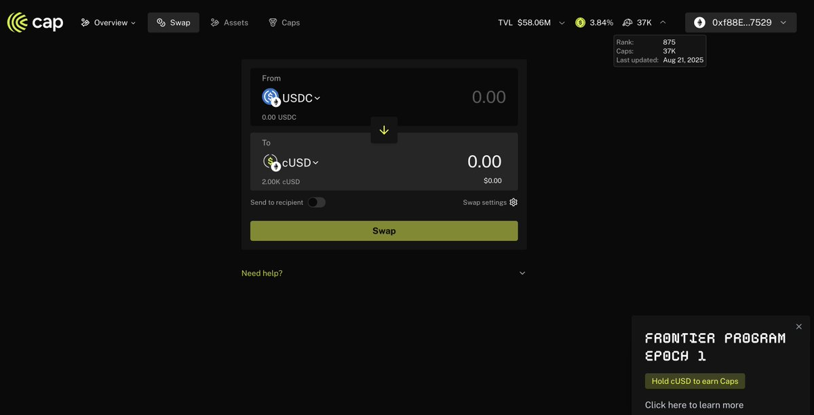
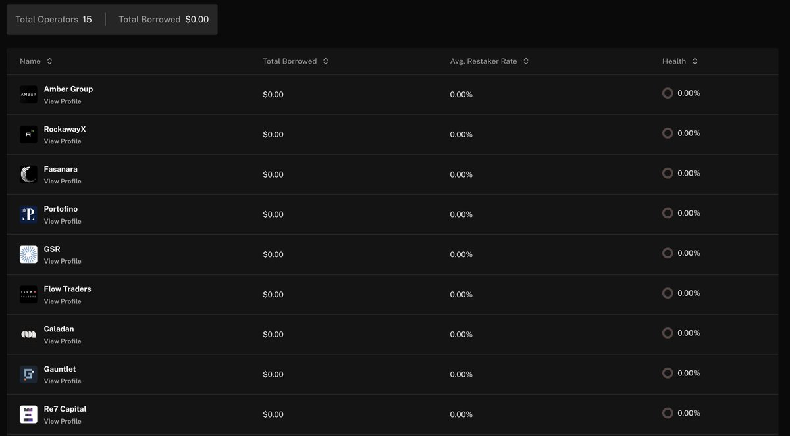
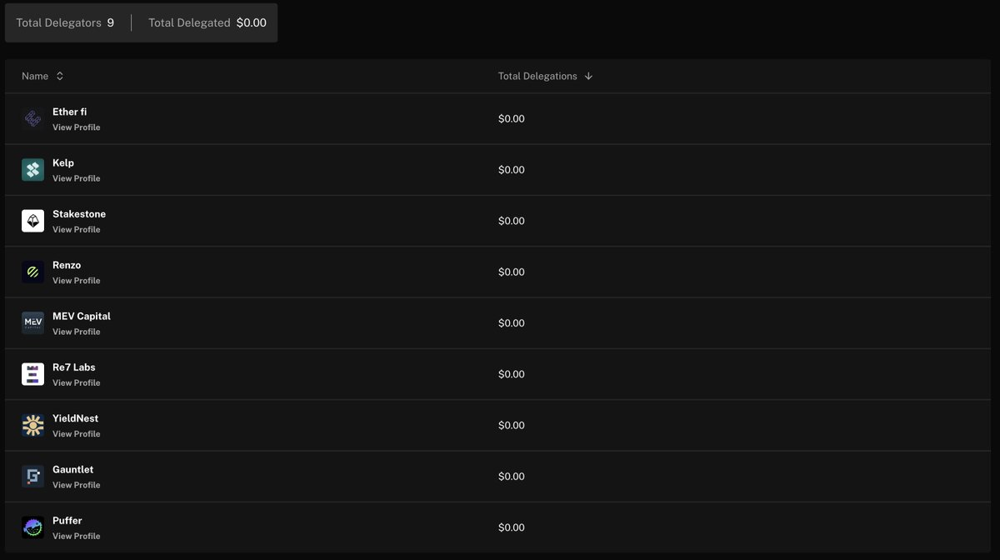

# Cap Money 穩定幣協議投資策略 - Pendle YT 挖分與頭礦機會

> **來源**: [@0xanonnnn](https://x.com/0xanonnnn/status/1958407730991161420)
>
> **日期**: 
>
> **標籤**: `穩定幣協議` `Pendle策略` `頭礦參與`

---

> **來源**: [@0xanonnnn (QQㄋㄟㄋㄟ甜到咩噗的Yankee)](https://twitter.com/0xanonnnn)
> **日期**: 2026-02-18
> **標籤**: `DeFi` `穩定幣` `Pendle` `Cap Money` `挖礦策略`

---

## 投資邏輯

分號存了點 @capmoney_，邏輯如下：

1. 前兩週持有 $cUSD 有 20x 積分加成，相當於頭礦
2. 目前 $cUSD 相關池子未上線 @pendle_fi，另一個 $stcUSD 池子上線了（但這個是收益池而非積分池），所以當前積分沒有被稀釋；後續 $cUSD 上線 @pendle_fi 我會再考慮 YT 玩法
3. @capmoney_ 是 @megaeth 生態協議，分號是為了等一個福報👀
4. 頭礦目前不卷，TVL 58M，單號存 2000 刀排名 <1000

**風險提示**：DeFi 協議有風險，投資需謹慎，NFA

---

## Cap Money 協議機制解讀

### 協議資產

Cap Money 目前上線兩個資產：
- **$cUSD**：穩定幣資產
- **$stcUSD**：質押生息資產

### 三方角色運作機制

#### 1⃣️ Users（用戶）

- 可以使用其他資產 mint 穩定幣 $cUSD
- 可以將 $cUSD 質押為生息資產 $stcUSD
- 協議承諾 $stcUSD holder 可以獲得最低 x% 的 APY 收益

**收益來源**：來自第三方運營商（operators）的策略收益

#### 2⃣️ Operators（運營商）

- 第三方運營商負責執行收益策略
- 如果 operators 認為自己的策略有能力拿到超過最低 x% 的收益率 y%，就可以從 Cap 協議借錢去操作
- 將 x% 的收益派發給 users，保留 y-x% 的收益
- 策略可以是各種形式，例如 MEV、funding rate、arbitrage 等

**借款機制**：需要抵押物（由 delegators 提供）

#### 3⃣️ Delegators（委託人）

- 可以抵押自己的資產為 operators 做擔保並獲得一定收益
- 協議真正運轉起來後，operators 會為了借款而賄賂 delegators
- **風險承擔**：如果 operators 被清算，損失的是 delegators，相當於為自己的判斷失誤買單

---

## 風險評估

**最大風險**：operators 和 delegators 竟然有重合的，這不相當於自己出題自己考試嗎？如果我是 delegators，我也會傾向於委託給我自己🥱

---

## 參與策略

### 1⃣️ 持有 $cUSD 挖積分

- 可以獲得積分，積分未來大概率可以兌換協議代幣 $CAP
- 前兩週有 20x 積分加成（頭礦機會）

### 2⃣️ 質押 $stcUSD 吃保底收益

- 可以將 $cUSD 質押為 $stcUSD 吃最低保底收益
- 由於目前還沒有 operators 借款跑策略，所以最低保底收益還沒有卷起來
- 當前官網顯示 6.38% APY
- **評價**：這個 APY 說實話對我沒有吸引力

### 3⃣️ Pendle YT 挖分策略（作者首選）

- 協議會上線 @pendle_fi
- 這可能是我選擇的參與方式
- 到時我可能會擇機選擇 YT 來挖分，搏一搏未來空投

---

**免責聲明**：以上只是粗略的解讀，可能存在未考慮到的地方，NFA
