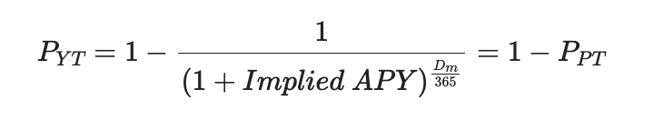
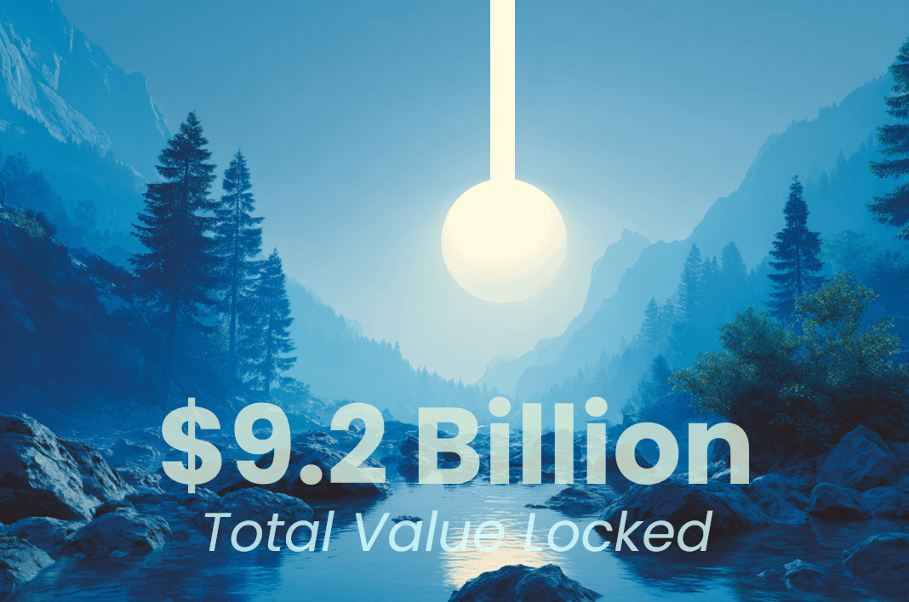
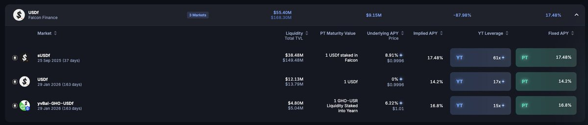
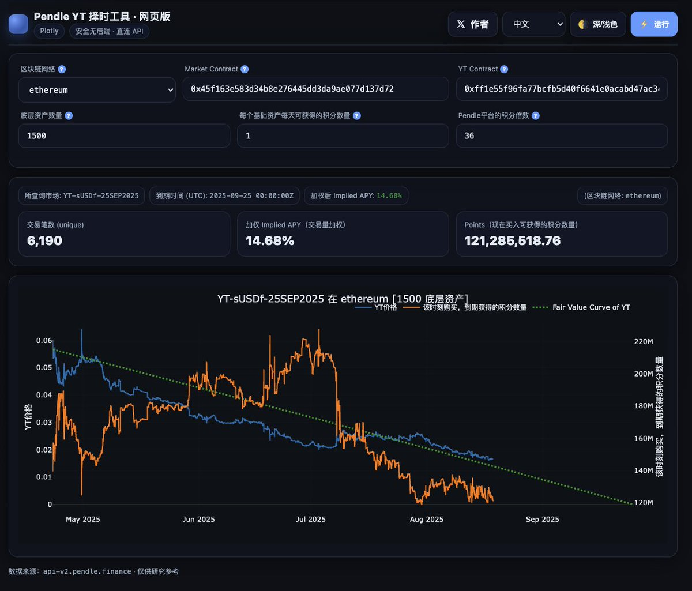

# Pendle YT 時機選擇與 Falcon Finance 策略指南

> **來源**: [@craigyc_eth](https://x.com/craigyc_eth/status/1957436188224376988) | [原文連結](https://quantsheep.com/)
>
> **日期**: Mon Aug 18 13:35:29 +0000 2025
>
> **標籤**: `Pendle` `收益農場` `資本效率`

---

> **來源**: [@craigyc_eth (Craig C.)](https://x.com/craigyc_eth)  
> **日期**: 2026-02-18  
> **標籤**: `Pendle` `YT` `Falcon Finance` `sUSDf` `DeFi`

---

## 前言

首先恭喜 @pendle_fi TVL 再次升破 ATH 達到 9.2B！！！

近期市場的注意力也隨著穩定幣協議的遍地開花更加集中在利率市場上了。

這篇短文將以最近火熱的合成美元協議 @falconfinance 為例，分享一些 Pendle 的入市邏輯,方便各位 DeFi farmer 開源節流、增強收益。

## 1/ Pendle 數學

眾所周知，Falcon 有三個 Pendle 市場，有些朋友就納悶為何 36x 到期日短的 sUSDf 比 60x 到期日長的 USDf 更吃香。

我們完全可以量化的理解這個問題。

因為 PT+YT=SY，所以 YT 定價如圖所示：

（其中 P 為價格，D_m 為到期日）

很顯然，到期日作為指數項對價格的影響更加顯著（尤其是在同錨市場中）：

**到期日越長，YT 價格中 θ 越多，撬動的資金槓桿就越低。**

同時 uAPY 不光對 iAPY 造成影響，產生的收益也會直接影響資金槓桿。

**所以得出結論：USDf 到期日太長啦，還沒有底息導致資金槓桿過低！**

## 2/ 實際操作

在進行 YT 交易時很多朋友只注意到 iAPY 而忽略了價格才是根本數據。

進行 YT 交易的目的是給資金上槓桿，力求最大化資本效率，要考慮的是**成本（X miles/USD）**而不是簡單的買入後拿到到期有多少分。

所以要考慮**底息、資金槓桿率、積分槓桿率**。還可以用**波段、分批掛單接**等多種方式降本增效。

（必須提一下：挂單能省好多費用，能 Maker 就別直接吃。）

在平衡 position 的過程中難免頻繁計算，這時候可以使用 @quant_sheep 羊老師精心製作的 **Pendle 可視化工具** https://t.co/5nTusS8p2o

也能很顯然的看出，到期日對價格影響巨大。

判斷市場定價趨勢一目了然，不用抱著計算器敲了！

謝謝羊老師✋😭✋

**提示**：請靈活使用工具，注意積分結算節點，sUSDf 可不是線性結算積分哦。

## 3/ 總結

理智梭哈，不要上頭，祝大家挖得愉快。

---

## 相關工具

- [Pendle YT Timing Tool](https://pendle-yt-timing.vercel.app/) - @quant_sheep 製作的 Pendle 可視化工具

★ Insight ─────────────────────────────────────

1. **YT 定價核心公式**：到期日作為指數項對 YT 價格影響巨大，到期日越長 → θ 占比越高 → 資金槓桿越低
2. **入市策略思維**：DeFi farmer 應關注「成本（X miles/USD）」而非單純的 iAPY，結合底息、資金槓桿率、積分槓桿率綜合評估
3. **降本增效技巧**：使用 Maker 掛單省手續費、波段操作、分批建倉，並搭配可視化工具輔助決策

─────────────────────────────────────────────────
