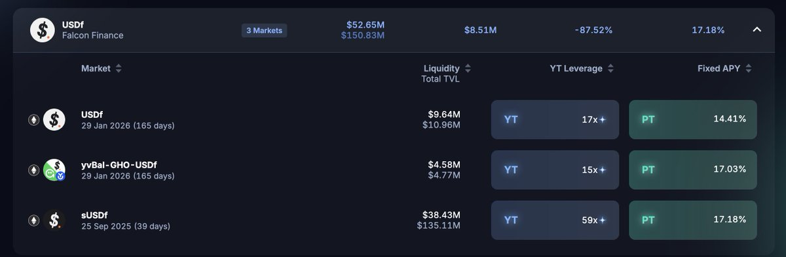

# Pendle Falcon Finance USDe 市場資本效率分析

> **來源**: [@craigyc_eth](https://x.com/craigyc_eth/status/1956709954183930286)
>
> **日期**: Sat Aug 16 13:29:41 +0000 2025
>
> **標籤**: `Pendle` `Falcon Finance` `資本效率`

---

> **來源**: [@craigyc_eth (Craig C.)](https://x.com/craigyc_eth)
> **日期**: 2026-02-18
> **標籤**: `Pendle` `Falcon Finance` `USDe` `資本效率` `DeFi`

---

## 資本效率分析

目前 Pendle Falcon @falconfinance 市場資本效率如下（都是以發文時 iAPY 和 uAPY 為準持有到期計算的）：

| 資產 | 資本效率 |
|------|----------|
| sUSDf | 172.3K/U |
| USDf | 156.3K/U |
| GHO-USDf LP | 232.2K/U |

## 效率分析

USDf 效率低主要原因是：
- 沒有底息
- 到期日長

iAPY 過高都是其次的因素。
