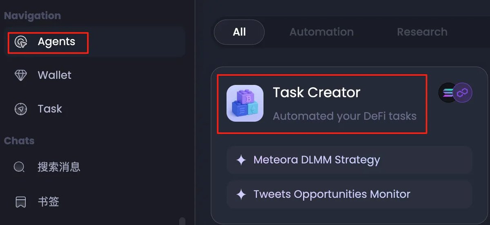
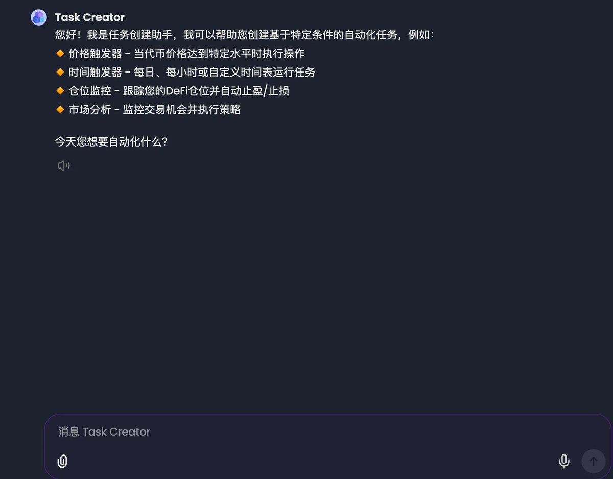
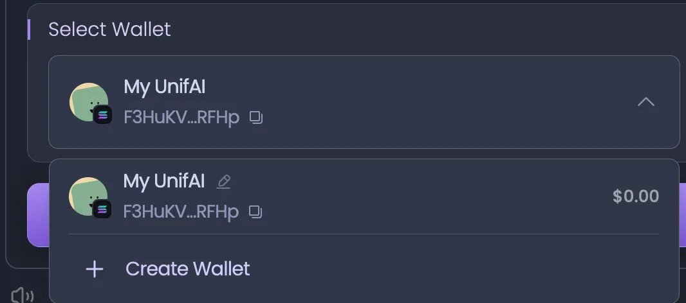
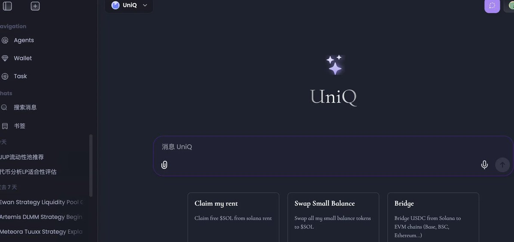

# UnifAI Agent 自動化交易策略：Meteora LP 挖礦競賽指南

> **來源**: [@sunny_unifAI](https://x.com/sunny_unifAI/status/1956722457722925445)
>
> **日期**: Sat Aug 16 14:19:22 +0000 2025
>
> **標籤**: `自動化交易` `流動性挖礦` `DeFi Agent`

---

## 比賽概述

感謝樓哥各種細緻的意見，其實中文區隱藏了很多 Meteora 大佬，S1 的積分已經盆滿缽滿。Meteora 確實是 Sol 上最賺錢，也是玩法最多的池子，有簡單的玩法，也有高級玩法，UnifAi 的 Alphahunt 系列已經介紹過很多玩法。

中文區大佬 @szu_jason @gch_enbsbxbs @0xPoseidon_sol 都寫過很多策略介紹。

UnifAi 現在已經可以做到把大佬們的策略，輕鬆轉化成可執行交易 agent，自動化管理 LP。在測試的策略裡，包括 CJ 的馬丁網格策略、Jason 的策略。

這次活動的目的，一是讓大家可以感受 vibe code trading agent 的樂趣，二是執行效果好的策略，大家可以一鍵跟隨策略，讓策略討論可執行、可量化。

比賽本週開始，持續兩週，歡迎大家都來參加。

除了 meteora，unifai 還完整接入了 Polymarket、pancake、Venus、aave、Pendle、uniswap、drift、Karmino。想自己做 polymarket 上監控尾盤信息的、aave-pendle 循環貸、bn alpha 預警的 agent，都可以嘗試來 UnifAI vibe code 你自己的 agent。

## 比賽獎勵

- **總獎池**：5,000 美元
- **總時長**：2 週
- **結果衡量**：PNL % = 最終資產餘額 / 全部的 deposit - 1（主要比盈利的比例）

雖然有些人可能覺得不是很多，但是在這個過程中，大家可以深度體驗 UnifAI 的 agent，學會自己創造策略，或者複製其他的策略，然後自動執行。這個學會了，對你去刷 Meteora 來說，簡直是神器。

當然，Meteora 只是其中一個場景，還可以使用在 Polymarket 等等。

## 參加方式

1. **註冊 UnifAI**：使用 TG 登錄
2. **創建任務**：點左邊導航欄的「Agents」，再點「Task Creator」
3. **創建錢包**：必須創建一個 Privy 錢包，不然瀏覽器的 Phantom 錢包，沒法自動執行
4. **編寫策略**：用自然語言描述，比如按照什麼條件，在什麼頻率觸發什麼操作

## 官方策略示例

以下是一個針對 Solana 網絡上 DLMM（Dynamic Liquidity Market Making）池的自動化流動性挖礦策略：

### 執行頻率

每 4 小時執行一次

### 第一步：倉位管理（風險控制）

首先檢查現有持倉。若盈虧%（PnL%）≥ +12% 或 ≤ -10%，則撤出流動性，收取手續費並全部轉換為 SOL。

若當前池價格高於持倉最高價格區間 5%，則撤出流動性，收取手續費並轉換為 SOL。

其他任何情況下不得撤出流動性。

**強制平倉條件**：
- **盈虧觸發**：
  - ✅ 止盈：當收益率 ≥ +12% 時獲利了結
  - ❌ 止損：當虧損率 ≤ -10% 時止損退出

- **價格偏離保護**：
  - 當池價格比持倉區間上限高出 5% 時強制退出
  - 防止無常損失進一步擴大

- **退出操作**：
  - 撤出流動性 → 收取累積手續費 → 全部轉換為 SOL

### 第二步：尋找流動性池

篩選符合以下條件的 DLMM 流動性池：

**基礎規模要求**：
- FDV: >= $10,000,000 and <= $300,000,000（市值適中，避免過小或過大項目）
- TVL: >= $5,000（總鎖倉價值）
- liquidity >= $300,000（確保充足流動性）

**收益性指標**：
- 24h fees: >= $5,000（日收益可觀）
- Base Fee: >= 1%（基礎費率）
- 24h fee/tvl >= 1%（年化約 365%）
- 24h volume/liquidity > 1（成交活躍度）

**技術參數**：
- Quote Token: SOL（交易對必須是 XXX/SOL 格式）
- bin step: >=80 and <= 250（價格精度範圍）

**代幣質量篩選**：
- Base Token Age: >= 48 hours（避免全新項目）
- Base Token Price Change% 1h > 0（短期看漲）
- Base Token 1h Volume: >= $100,000
- Base Token 24h Volume: >= $500,000
- Base Jupiter Organic Score: >= 65（權威評級）

**去重規則**：
- 每種代幣僅保留一個池：選擇 24 小時手續費更高的池

只有當全部條件滿足時，才添加流動性，否則跳過。若該代幣已存在當前持倉中，則不再添加。

### 投資執行

若選中池滿足所有條件，且當前持倉數量少於 5 個，則按以下規則添加流動性：

**添加條件**：
- ✅ 所有 15 個條件全部滿足
- ✅ 當前持倉 < 5 個
- ✅ 該代幣未在現有持倉中

**投資參數**：
- 投入金額：1 SOL per 池
- 策略：SOL 單邊池，Bid-ask 策略
- 價格區間：系統默認範圍

## 策略優勢

- **嚴格風險控制**：12% 止盈、10% 止損
- **高質量篩選**：15 個條件確保池子質量
- **分散投資**：最多 5 個池子分散風險
- **自動化執行**：無需人工干預
- **收益導向**：專注高手續費收入池子

## 潛在風險

- **無常損失**：價格波動可能造成相對 SOL 的損失
- **智能合約風險**：DLMM 協議本身的技術風險
- **市場風險**：整體市場下跌影響
- **流動性風險**：極端情況下可能無法及時退出

這是一個相對保守且系統化的 DeFi 自動化策略，通過嚴格的篩選標準和風險控制來獲取相對穩定的手續費收入。

## 使用技巧

### 修改策略

如果你想修改，就把你修改的意見告訴 UnifAI，然後問問怎麼樣。它會給出參考意見。不過有一點要注意，執行的頻率最好一開始就確定好，不然後面不能修改，必須停掉策略，然後重新生成一個，雖然也不費什麼事情。

### 管理任務

點左邊的「Task」，可以看到你建好的 Task，這裡可以修改參數，可以停掉策略。

任務建好之後，記得向你的錢包地址充值。

每次任務執行，都會通過 TG 給你發送報告。

### 查看倉位

在「Wallets」頁面，可以看到你的倉位，以及你的盈利情況。有些單子，你甚至可以手工平掉。
