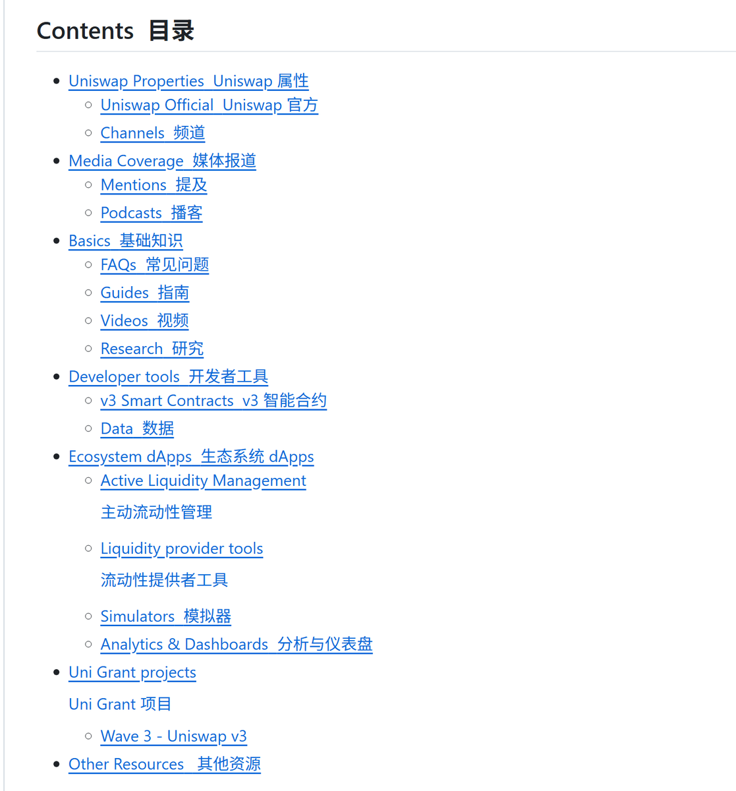

# Awesome Uniswap V3 學習資源匯總

> **來源**: [@0xKaKa03](https://x.com/0xKaKa03/status/1956746877539692821) | [原文連結](https://github.com/GammaStrategies/awesome-uniswap-v3)
>
> **日期**: Sat Aug 16 15:56:24 +0000 2025
>
> **標籤**: `Uniswap V3` `流動性提供` `DEX`

---

> **來源**: [Sliipy⚡ (@0xKaKa03)](https://github.com/GammaStrategies/awesome-uniswap-v3)
> **日期**: 2024-11-20
> **標籤**: `Uniswap V3` `DeFi` `流動性提供` `學習資源`

---

## 概述

Awesome-Uniswap-v3 是一個由社群驅動的專案,旨在幫助人們熟悉 Uniswap v3。這是一份精選的 Uniswap v3 資源列表,涵蓋從基礎教程、工具、儀表板、模擬器到專案的一站式解決方案。

Uniswap v3 是迄今為止最強大的 Uniswap 協議版本,其集中流動性(Concentrated Liquidity)功能為流動性提供者提供了前所未有的資本效率,為交易者提供了更好的執行效果,並為去中心化金融的核心提供了卓越的基礎設施。

## 官方資源

### 核心文檔
- **Uniswap Website** - 官方網站
- **Uniswap v3 Whitepaper** - v3 白皮書
- **Uniswap v3 Smart Contracts** - v3 智能合約
- **Uniswap v3 Periphery Contracts** - v3 周邊合約
- **Uniswap v3 Subgraph** - v3 子圖
- **v3 Documentation** - v3 官方文檔
- **Uniswap App** - 官方應用程式
- **Uniswap Analytics** - 官方分析平台

### 社群頻道
- **Discord** - Uniswap Discord 社群
- **Twitter** - Uniswap 官方推特
- **Reddit** - Uniswap Reddit 社群
- **Blog** - 官方部落格
- **Uniswap Grants** - Uniswap 資助計畫

## 媒體報導

### 主流媒體
- Wall Street Journal
- Yahoo Finance
- Decrypt
- MarketWatch

### Podcast
- **The Scoop** - Fintech Frank
- **Coin Bureau**
- **Crypto Unstacked** - v3 專題
- **Bankless** - v3 專題

## 基礎入門

### 常見問題
- **Official FAQ** - 官方常見問題集

### 使用指南
- **Swap** - 官方交換指南
- **Liquidity Provider & Migration User Guide** - 提供流動性與從 v2 遷移到 v3 的逐步指南

### 影片教學
- **Uniswap v3 - Introduction** by The Defiant - v3 介紹
- **Uniswap v3 - Architecture Explained** by Finematics - 架構解說
- **Noah from Uniswap Explains Uniswap v3 Contracts** - 合約說明

## 研究論文

### 通用協議研究

**市場分析**
- **Uniswap V3's Alchemy** (Nansen) - 對 Uniswap V3 早期興起及其對 DeFi 格局影響的研究
- **Liquidity Mining on Uniswap v3** (Paradigm) - 關於 v3 流動性挖礦的研究
- **The Market Making Landscape of Uniswap v3** - 截至 2021 年 8 月底的典型 LP 行為分析
- **Because not all Uniswap V3 pools are born equally…** - 如何比較不同 Uni v3 池的統計數據

**流動性提供**
- **Liquidity providing in Uniswap v3 (1)** - v3 新功能描述,集中流動性帶來的提升分析
- **Liquidity providing in Uniswap v3 (3)** - v3 收益來源研究
- **On-chain range orders using Uniswap V3** (Auditless) - 範圍訂單研究
- **Expected Price Range Strategies in Uniswap v3** - LP 策略學術研究回顧

**數學與機制**
- **Uniswap v3 Math** - 資本效率公式推導
- **Market Making in DeFi** - DeFi 做市動態描述
- **A Mathematical View of Automated Market Maker (AMM) Algorithms and Its Future** - AMM 數學推導

### 學術研究

**策略與行為**
- **Strategic Liquidity Provision in Uniswap v3** (Harvard) - 哈佛關於策略性流動性提供的研究
- **Behavior of Liquidity Providers in Decentralized Exchanges** (ETH Zurich) - 蘇黎世聯邦理工學院關於 DEX 上 LP 行為的研究
- **On Liquidity Mining for Uniswap v3** - 分析 v3 潛在的流動性挖礦獎勵方案

**數學建模**
- **The Replicating Portfolio of a Constant Product Market with Bounded Liquidity** - 推導複製 Uniswap v3 頭寸的現貨和期權組合
- **Liquidity Math in Uniswap v3** - 關鍵流動性提供公式推導
- **Concentrated Liquidity in Automated Market Makers** - 集中流動性提供的收益分析及策略比較

### 策略模擬與量化分析

**回測與建模**
- **Active Liquidity Management: Trader's Perspective** - v3 量化分析與簡單模擬,最優做市策略建議
- **A 'real-world' framework for backtesting Uniswap V3 strategies** - LP 策略回測框架
- **Uniswap V3: A Quant Framework to model yield farming returns** (DeFi Scientist) - v3 LP 收益建模
- **Realized Strangle** - LP 頭寸與期權策略執行
- **Rebalancing vs Passive strategies for Uniswap V3 liquidity pools** - 頻繁再平衡對 LP 收益的影響分析
- **Quantifying Just in Time Liquidity in Uniswap v3** - Flashbots 對流動性提供收益的影響

### 無常損失研究

**基礎理論**
- **Impermanent Loss in Uniswap V3** (Auditless) - 無常損失研究
- **Impermanent Loss Insurance (Protection Markets) for Uniswap v3 LP's** (Gamma Strategies) - v3 無常損失保險研究
- **Liquidity providing in Uniswap v3 (2)** - 再平衡的無常損失及其複合效應分析
- **Concentrated Divergence Loss** - 在極小 v3 池與主要 v2 池中提供流動性的經驗對比

**數學推導**
- **Impermanent Loss in Uniswap V3** - 無常損失數學推導
- **G3M Impermanent Loss Dynamics** - 幾何平均做市商的無常損失推導與分析
- **Calculating the Expected Value of the Impermanent Loss in Uniswap** - 單一 tick 頭寸預期無常損失分析
- **Single-Position Impermanent Loss of A Single Transaction for Uniswap V3** - v3 頭寸無常損失公式推導
- **Understand LP risks: use Effective Gain/Loss, not Impermanent Loss** - 提出「有效損失」概念,假設初始頭寸為 100% USD 計算淨利潤

### 教學工具

**互動式說明**
- **Basic Constant Product Market Maker Explainer** - x * y = k 市場圖形化說明
- **Introduction of Concentrated Liquidity to a CMM** - 向 AMM 引入範圍訂單
- **Swap-to-add Calculator** - 推導在給定池比率和範圍下,將 100% 資產對存入池所需的交換
- **Impermanent Loss Calculator** - v3 頭寸的無常損失和投資組合組成工具
- **Multiple LP positions example** - 顯示多個集中流動性頭寸在同一池中疊加時的行為

### 期權分析

**理論框架**
- **Synthetic Options and Short Calls in Uniswap V3** - 將 v3 LP 頭寸解釋為合成期權合約
- **Uniswap V3 LP Tokens as Perpetual Put and Call Options** - LP 頭寸作為永續期權的研究
- **Understanding the Value of Uniswap v3 Liquidity Positions** - 使用期權框架評估 LP 頭寸價值
- **How to Create Perpetual Options in Uniswap v3** - 如何將 v3 頭寸實施為永續期權的指南

**策略與定價**
- **A Guide for Choosing Optimal Uniswap V3 LP Positions, Part 1** - LP 頭寸統計分析
- **A Guide for Choosing Optimal Uniswap V3 LP Positions, Part 2** - 「有效流動性」推導,結合預期「在價內」時間與 v3 資本效率
- **Pricing Uniswap v3 LP Positions: Towards a New Options Paradigm?** - 單 tick 頭寸作為期權解釋時的風險回報權衡分析
- **On-chain Volatility and Uniswap v3** - v3 單 tick LP 頭寸隱含波動率推導

### Layer 2 研究
- **Understanding Fees in Optimistic Ethereum: Part 1** - Optimism 交換費用變化研究
- **The Costs of Uniswap v3 Active Management** - LP 成本研究,包括早期 Optimism LP 估算

### 對沖策略
- **Gamma transforms: How to hedge squeeth using Uni V3** - 使用 Uni V3 對沖 squeeth 以實現零 gamma 的研究

## 開發者工具

### SDK 與合約
- **Uniswap v3 SDK** - 官方 SDK,用於在 v3 上構建應用
- **Uniswap library** - 跨 Uniswap 合約共享的 Solidity 庫,專注於安全性和執行 gas 效率
- **The "Tuner", a Uniswap V3 Simulator** - 模擬 Uniswap v3 池的 SDK
- **Contract map** - v3 互動式合約地圖
- **Deployment addresses** - v3 部署地址
- **Business Source License** - 商業許可條款

## 數據與分析

### 數據源
- **Revert Finance** - 追蹤 v3 流動性提供的可操作分析
- **Uniswap v3 Subgraph** - v3 子圖
- **Flipside Crypto** - Flipside Crypto 數據源

### 分析平台
- **Parsec Finance** - v3 特定功能,如歷史池深度和頭寸概覽

## 生態系統 dApps

### 主動流動性管理
- **Visor Finance** - 建立在 NFT 智能金庫上的主動流動性管理協議
- **Gamma Strategies** - 致力於資助「主動 LP」策略和研究的組織,[申請資助](https://gammastrategies.org/)
- **Charm Finance** - Uniswap V3 自動化 LP 金庫

### 流動性提供者工具
- **Sommelier Finance** - 向 Uniswap v3 添加流動性

### 模擬器
- **Flipside Crypto** - Uniswap v3 費用計算器
- **V3.unbound.finance** - Uniswap v3 策略模擬器
- **DeFiLab** - Uniswap v3 策略模擬器
- **Chainvault.io** - Uniswap v3 IL 計算器
- **Vercel App** - Uniswap v3 策略模擬器
- **Ranges.fi** - Uniswap v3 LP 頭寸回測器
- **Revert Finance's Initiator** - Revert.finance 模擬器
- **BearWhale.Crypto** - LP 收益數據和模擬器

### 分析儀表板
- **Uniswap v3 volume and fees collected** (Dune by Gamma Strategies) - v3 交易量和費用數據
- **Uniswap v2-to-v3 ramp up** (Dune by Michael Silberling) - v2 與 v3 對比
- **Uniswap v3 usage** (Dune by Michael Silberling) - v3 交易使用、增長和競爭分析

## Uniswap 資助專案

### Wave 3 - Uniswap v3
- **UNIFest** - 由 UNI 社群通過輕量級治理共同製作的虛擬音樂會
- **Team Secret sponsorship** - 電競團隊贊助
- **v3 python wrapper** - v3 開源 Python 包裝器,支援自動交易合約/策略
- **Rari Capital - Nova contracts external audit** - OpenZeppelin 對 Rari Capital Nova 合約的審計(支援 L1-L2 互操作交換)
- **John Palmer - UI & tools for UNI governance** - UNI 治理工具和介面
- **Omar Bohsali - v3 LM incentive contracts** - v3 流動性挖礦激勵合約的創建和審計
- **Rabbit Hole - v3 onboarding** - 為 UNI 新手提供的激勵學習模組
- **Timothy Luke - UGP Headless Branding** - 品牌專家的無頭品牌練習
- **v3 Analytics Bounties** (Flipside & Dune Analytics) - RFP
- **Other Internet Community Study** - RFP

*Wave 1 和 Wave 2 的其他受資助者可在此處找到: [Wave 1](https://www.notion.so/unigrants/Uniswap-Grants-Program-1dfae5e5c5c54b6f9e5e1c3c1a1e1e1e) | [Wave 2](https://www.notion.so/unigrants/Wave-2-1dfae5e5c5c54b6f9e5e1c3c1a1e1e1e)*

### Wave 4 - Uniswap v3
*(詳細專案列表待補充)*

## 其他資源
- **Resources** - 其他 Uniswap 資源官方頁面
