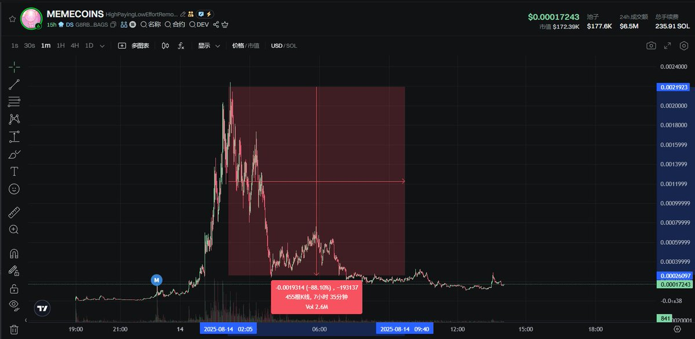

# Meteora DLMM LP 區間策略：-80%±10% Poseidon 高效區間

> **來源**: [@0xPoseidon_sol](https://x.com/0xPoseidon_sol/status/1955873690798973251) | [原文連結](https://twitter.com/0xPoseidon_sol/status/1955873690798973251/photo/1)
>
> **日期**: 
>
> **標籤**: `DLMM` `LP策略` `Meteora`

---

> **來源**: [@0xPoseidon_sol](https://twitter.com/0xPoseidon_sol)
> **日期**: 2026-02-18
> **標籤**: `Meteora` `DLMM` `LP策略` `Meme幣` `區間設置`

---

## 策略概述

《用 Meteora LP 策略玩轉 Meme》第二彈：高效且相對安全的區間選擇。

## Poseidon 區間設置

**-80%±10% Poseidon 區間**看起來效果不錯。

這個區間設置在 Meteora DLMM (Dynamic Liquidity Market Maker) 中表現良好，適合用於 Meme 幣的流動性提供策略。
