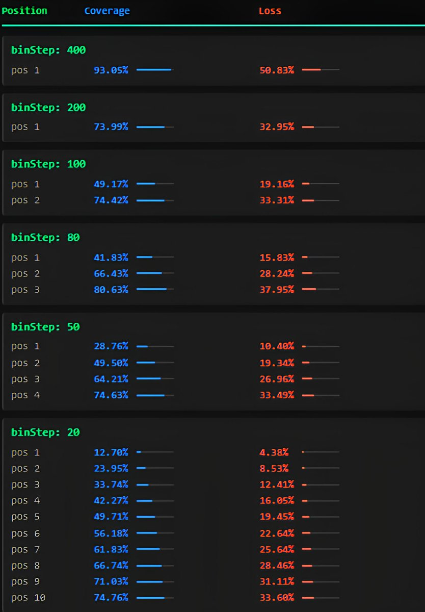

# Meteora 無常損失計算器

> **來源**: [@0xMrBeefman](https://x.com/0xMrBeefman/status/1955594086259228825)
>
> **日期**: Wed Aug 13 11:35:38 +0000 2025
>
> **標籤**: `LP策略` `無常損失` `Meteora`

---

> **來源**: [@0xMrBeefman (Mr. Beefman 🥩)](https://x.com/0xMrBeefman)
> **日期**: 2026-02-18
> **標籤**: `Meteora` `無常損失` `DLMM` `流動性` `工具`

---

## 工具簡介

這是一個更新版的超詳細 Meteora 無常損失計算器，涵蓋所有熱門池和不同的買賣價差設定。

現在可以更輕鬆地預測當代幣價格跌到你的價格區間底部時，你會承受多少無常損失。

## 功能特色

- 支援 Meteora 所有熱門池
- 可調整不同的 bid-ask 設定
- 詳細計算價格下跌至區間底部的損失

## 工具連結

完整計算器的 Google Sheets 連結請參考原推文。
