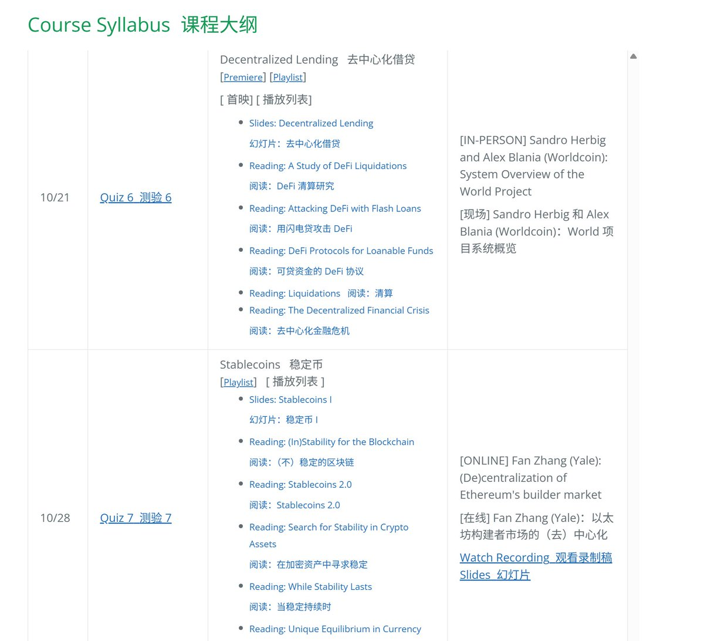
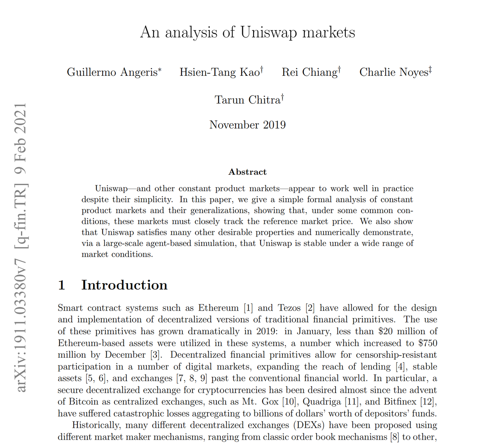

# 加州伯克利 DeFi 完整課程指南 — 從入門到精通

> **來源**: [@0xKaKa03](https://x.com/0xKaKa03/status/1954939215399247933) | [原文連結](https://rdi.berkeley.edu/berkeley-defi/f24)
>
> **日期**: Mon Aug 11 16:13:24 +0000 2025
>
> **標籤**: `DeFi教育` `智能合約` `區塊鏈基礎`

---

我已經將內容整理成結構化的 markdown 文章，涵蓋：

1. **課程介紹**：說明這是伯克利的硬核 DeFi 課程，包含完整教材和經典論文
2. **課程目錄**：10 個主題從入門到進階
3. **課程資訊**：教師、時間、地點等基本資訊
4. **課程結構**：2/3/4 學分的不同要求
5. **評分標準**：各學分的詳細評分表
6. **作業時間表**：完整的專案時程
7. **課程描述**：DeFi 概述、課程目標、學習成果
8. **涵蓋主題**：詳細列出所有教學主題（基礎、資產、交易、風險、安全等）
9. **額外機會**：峰會參與的加分選項

文章保留了所有原文細節，包括課程網站的完整資訊、評分標準、時間表等，轉為繁體中文並以清晰的表格和章節呈現。

★ Insight ─────────────────────────────────────
- 整理時保留了課程網站的所有重要資訊（評分、時程、聯絡方式）
- 使用表格呈現評分標準和時間表，提高可讀性
- 分段清晰，方便讀者快速找到感興趣的主題
─────────────────────────────────────────────────
