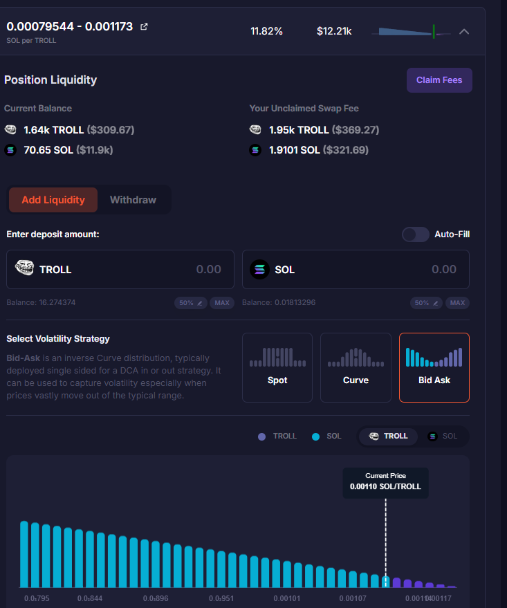

# $TROLL-$SOL DLMM 流動性池位策略與收益分析

> **來源**: [@IClaimThings](https://x.com/IClaimThings/status/1953229696134431137) | [原文連結](https://twitter.com/IClaimThings/status/1953229696134431137/photo/1)
>
> **日期**: Wed Aug 06 23:00:23 +0000 2025
>
> **標籤**: `DLMM流動性池` `收益farming` `Meteora`

---

> **來源**: [@IClaimThings](https://x.com/IClaimThings)
> **日期**: 2025-02-18
> **標籤**: `Meteora` `DLMM` `流動性挖礦` `收益策略` `TROLL`

---

## 池位配置

在 $TROLL-$SOL 100/2% DLMM 流動性池中，選擇配置 40 個 bins，而非完整的 69 bins。

## 收益表現

過去數小時的觀察數據：
- **預估日收益率**：11-15% 之間波動
- **收益評價**：表現相當不錯

## 風險管理

當前策略希望 $TROLL 價格能在設定的流動性範圍內停留更長時間，以持續獲取交易手續費收益。
