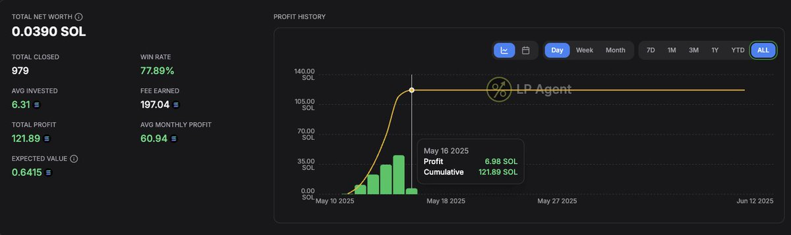

# Meteora DLMM 一週內 121% 收益策略分享

> **來源**: [@0xMrBeefman](https://x.com/0xMrBeefman/status/1952757659905446276) | [原文連結](https://twitter.com/0xMrBeefman/status/1952757659905446276/photo/1)
>
> **日期**: 
>
> **標籤**: `Meteora` `DLMM流動性挖礦` `SOL收益`

---

> **來源**: [@0xMrBeefman (Mr. Beefman 🥩)](https://x.com/0xMrBeefman)
> **日期**: 2026-02-18
> **標籤**: `Meteora` `DLMM` `Solana` `LP策略` `高收益`

---

## 收益概況

使用 @MeteoraAG 在 6 天內獲得 +121.89 SOL 收益。

| 項目 | 數值 |
|------|------|
| 初始資金 | 100 SOL |
| 最終資金 | 221.89 SOL |
| 收益 | 121.89 SOL |
| 收益率 | 121.89% |
| 時間 | 不到一週 |

## 策略說明

作者表示將分享此次操作的完整策略細節（具體策略內容在後續推文中）。

---

**注意**: 這是一個高收益案例分享，實際收益會受市場波動、時機選擇等多重因素影響。
