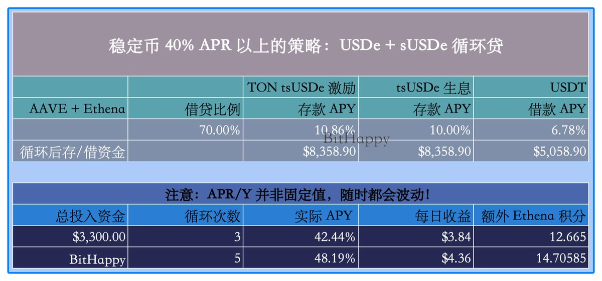
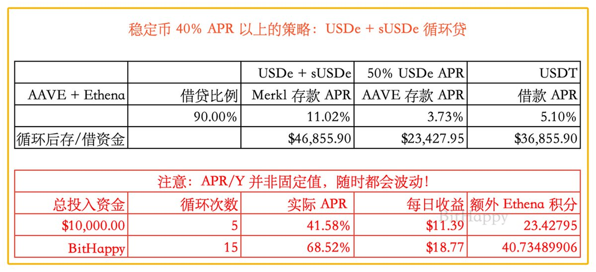

# USDe 循環貸策略 - TON 鏈 3 倍 APY 42.44%

> **來源**: [@BitHappy](https://x.com/BitHappy/status/1952318157164859562) | [原文連結](https://x.com/BitHappyX/status/1947583308369625339)
>
> **日期**: Mon Aug 04 10:38:15 +0000 2025
>
> **標籤**: `循環貸` `USDe` `TON 鏈`

---

> **來源**: [@BitHappy (BitHappy)](https://twitter.com/BitHappy)
> **日期**: 2026-02-18
> **標籤**: `USDe` `循環貸` `TON` `sUSDe` `EVAA` `DeFi`

---

## 策略概述

小礦 & 循環貸：USDe 循環 3 次 APY 42.44%！

在以太坊主網 AAVE + Ethena 上循環策略，需要的 Gas 還是有點高的，5 次循環即使 Gas 低於 0.5 Gwei 也要燃燒接近 8U。

感謝 @Deep0000Cls 昨天在評論中的策略，讓小資金也能更好的參與 USDe 的循環貸！

這個策略的核心與主網基本相同，只不過補貼的 10% 是 TON 的活動，所以算上 tsUSDe 自帶的生息大概有 20% 左右。

## 操作流程

**0️⃣ 錢包需要通過 TG 需要驗證 TON ID**

**1️⃣ 在 TON 鏈，使用 USDT 兌換並鑄造 sUSDe**

**2️⃣ 存入 EVAA**

**3️⃣ 借出 USDT**

**♾ 循環 1️⃣ 2️⃣ 3️⃣ 步驟**，直到自己不想循環，3 次左右 APY 增幅還不錯，不過 TON 的 Gas 低，拉到 5 次也行。

## 策略限制

此策略的單地址容量最高只有 10,000 tsUSDe，大概是 $12,000。

## TON ID 驗證方案

之前提到的 TG 錢包存 USDT 有 20% 的 APR 激勵，但是因為錢包與 TG 綁定並且需要 KYC，而且如果被盜或被封後比較麻煩的問題，也可通過驗證 TON ID 解決。

通過 Ethena 官網跳轉到 StonFi，可以在 TON 兌換或鑄造 USDe/tsUSDe，驗證 TON ID 在這裡也可以找到入口。

## 風險提示

提示：以上僅為信息分享，非投資建議，請自行做好研究！

DeFi 愛好者：BitHappy
