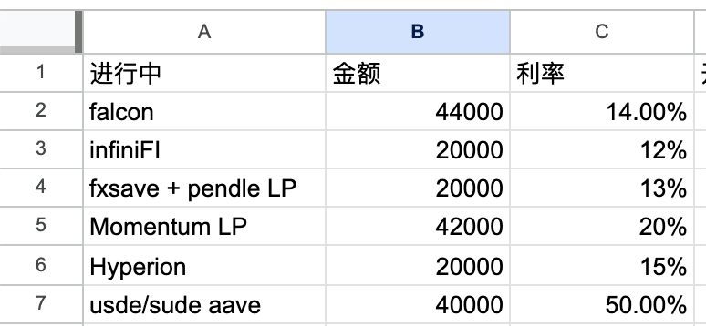
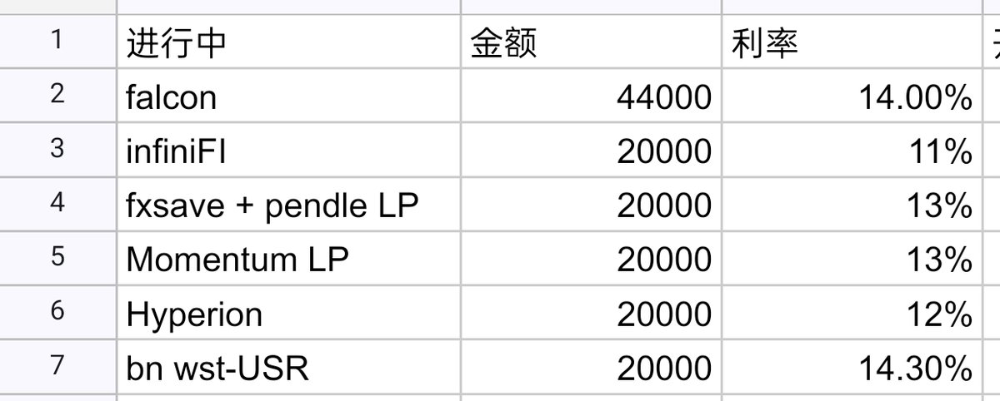

# USDE/sUSDe 槓桿借貸策略與多鏈 DeFi 部位調整

> **來源**: [@cishangjia19674](https://x.com/cishangjia19674/status/1952028063921037740)
>
> **日期**: Sun Aug 03 15:25:32 +0000 2025
>
> **標籤**: `槓桿借貸` `穩定幣策略` `收益優化`

---

> **來源**: [@cishangjia19674 (cishangjia)](https://twitter.com/cishangjia19674)
> **日期**: 2026-02-18
> **標籤**: `DeFi` `sUSDe` `USDE` `Aave` `循環貸` `槓桿策略` `穩定幣收益`

---

## 本週操作總結

這週操作非常多。貸了 4 萬 U,年化 3% 等於送錢🐶。總共理財部分達到 18.5 萬 U。

## 倉位調整明細

### Aave USDE/sUSDe 循環貸

- 槓桿倍數：約 5 倍
- 理論收益：約 50% 年化
- 補貼期限：僅到月底

### OneKey x MMT 合作產品

- 需求：升級 OneKey 最新版才能看到
- 底層資產：USDT/USDC LP
- 穩定性：穩得不行
- 剩餘容量：目前大概還有 120 萬 U

### 撤出 BN-WSR 倉位

- 原因：收益已經完全沒法看了🐶
- 說明：收益完全和資金費率掛鉤

## Day21 記錄

啥操作都沒有。感覺已經穩定下來了,不用做太多的操作才是常態。

### 考慮參與 Nemo Protocol

- 項目：@nemoprotocol
- 收益：穩定幣顯示有 21% 年化
- 定位：Sui 鏈上的 Pendle 仿盤

### 對 Sui 鏈 DeFi 的信心

經過 @cetusprotocol 被盜事件,官方的處理、項目方的態度(反觀 Resupply),我對 Sui 上面的 DeFi 項目有強烈的安全感。
