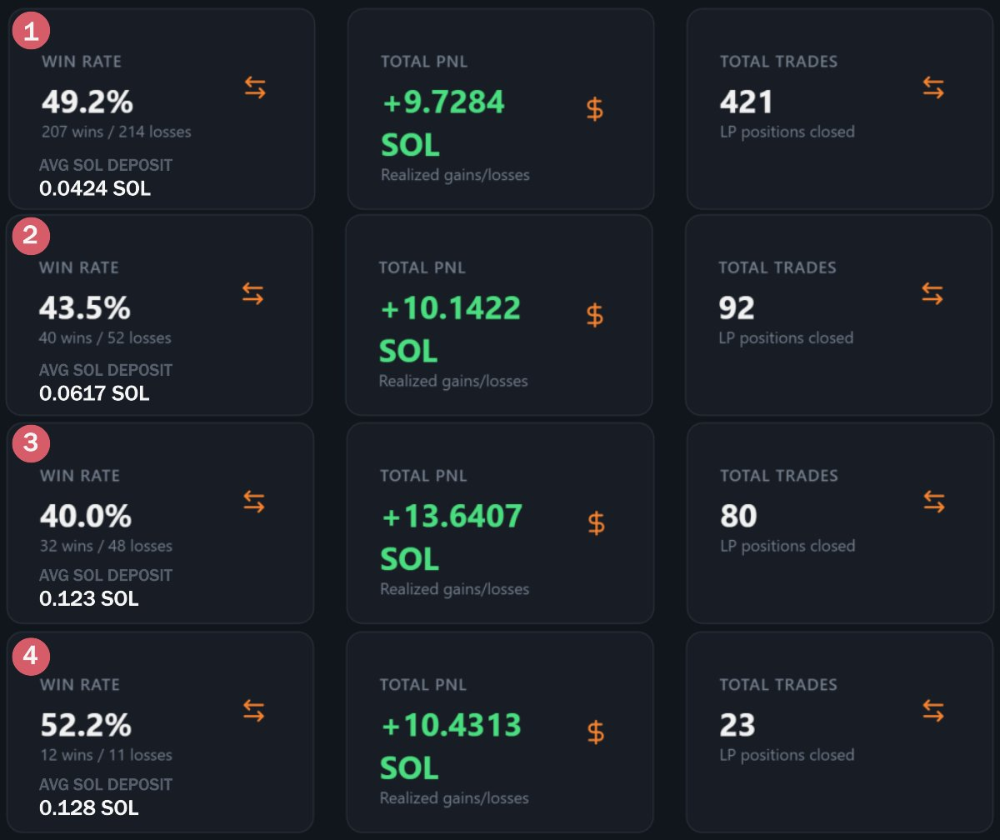
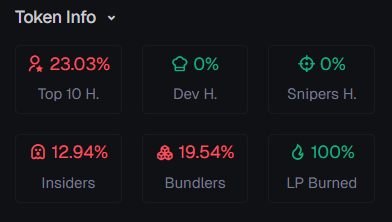
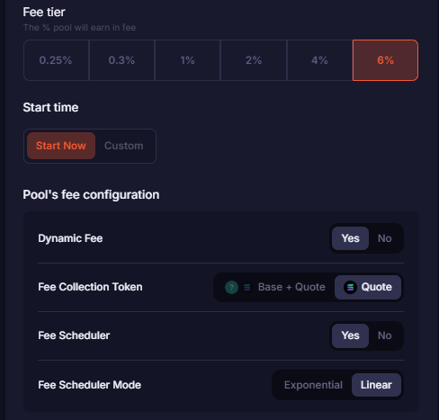
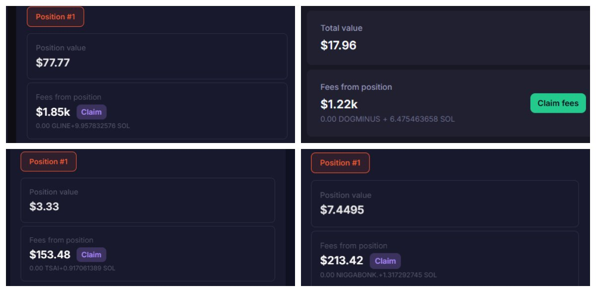

# Meteora DAMM V2 流動性挖礦策略：30 天從 0.3 SOL 賺取 44 SOL

> **來源**: [@AtreoxCrypto](https://x.com/AtreoxCrypto/status/1951328826446823814) | [原文連結](https://axiom.trade/)
>
> **日期**: Fri Aug 01 17:07:00 +0000 2025
>
> **標籤**: `DAMM V2` `流動性挖礦` `MEV 套利`

---






> **來源**: [@AtreoxCrypto (Atreox)](https://twitter.com/AtreoxCrypto)  
> **日期**: 2025-07-31  
> **標籤**: `Meteora` `DAMM-V2` `流動性挖礦` `Solana` `MEV` `LP策略`

---

## 核心成果

30 天內從 0.3 SOL 賺取 +44 SOL PnL，使用 Meteora 的 DAMM V2 策略。

## DAMM V2 基礎原理

### 運作機制

DAMM V2 專為從高滑點交易中獲利而設計——這類交易通常會吸引 MEV 機器人。

**MEV 機器人的運作方式**：  
它們在大額交易周圍操縱價格,迫使交易者以更差的價格買入/賣出。使用 DAMM V2 時,這些交易在池內進行,不是讓 MEV 機器人獲利,而是獎勵流動性提供者。

## 實戰策略流程

### 起步過程

2025 年 7 月 1 日,考試結束回到家,開始思考如何用錢包裡剩下的 0.3 SOL 從 DAMM V2 賺錢。重新研究 DAMM V2,用非常小的金額開設池子,嘗試理解系統運作方式和當前的 DAMM V2 meta。每天累積增長餘額,1 個月後達到 44 SOL PnL。

### 1. 如何找到合適的代幣

#### 篩選工具

使用 [Axiom](https://axiom.xyz) 尋找代幣(也可使用 gmgn 等其他網站)。在 Axiom 上通常使用 trending 分頁,不加任何額外過濾檢查熱門代幣。

**最重要的檢查項目**：
- 代幣的 launchpad
- 右下角「Token Info」部分的資訊

#### Token Info 篩選條件

| 指標 | 偏好範圍 | 說明 |
|------|----------|------|
| Top 10 Holder | 10%-40% | 前十大持有者佔比 |
| Dev | 0% | 開發者不持有代幣 |
| Sniper/Insider | <10-15% | 狙擊手和內部人持有 |
| Bundler | 5%-20% | 打包者持有 |

⚠️ **重要提醒**：因為我們做的是 DAMM V2,不太在意代幣價格的上漲。因此像 20% bundler 和 15% insider 這樣對我來說合適的數值,在正常情況下可能不合適。這些數值僅用於降低被 rug 的可能性,請自行研究(DYOR)。

#### 流動性考量

代幣的流動性也很重要。有些代幣流動性很高,有些很低(<$1k)。

**給初學者的建議**：不要進入低流動性代幣。因為在低流動性代幣上進行 swap 時,很可能會被 MEV 並造成損失。選擇高流動性代幣。

**額外技巧**：有時在使用 Axiom 時,pulse 分頁也很有用,特別是 final stretch 部分,配合一些過濾使用。

### 2. 如何判斷代幣是否適合 DAMM V2

前往 [Meteora](https://meteora.ag) 的 Dynamic Pools V2,在搜尋欄貼上所選代幣的 CA。

#### 搜尋結果處理

- 如果出現多個池子：點擊 TVL 最高的
- 如果沒有池子出現：自己創建池子(見後文最佳設置)

#### 池子頁面左側關鍵指標

**✅ Fee Scheduler（費用調度器）**

費用調度器顯示池子給出的費用,有兩種類型：
- **Linear（線性）**
- **Exponential（指數）**

兩者都從 50% 開始,下降到池子創建者選擇的基礎費用。由於指數型池子的費用下降更快,我們通常偏好線性池子。

⚠️ **必須有費用調度器**：我不會進入沒有費用調度器的池子。

**✅ Fee Scheduler 的當前費用 %**

點擊 Fee Scheduler 選項旁的 linear/exponential,可在打開的圖表中看到當前費用 %。

📌 **篩選標準**：如果低於 15%,我不會選擇進入。

**✅ Total Value Locked (TVL)**

對我們來說,低 TVL 總是更好,因為你獲得的費用與你在池子中的份額成正比。如果池子裡 TVL 低,我們可以用少量資金擁有高百分比。但在某些情況下,我也會向高 TVL 的代幣添加流動性。

#### 最佳池子創建設置

📌 （作者提到會說明但原文未展開細節）

### 3. 檢查池子產生的費用

#### 使用 DexTools 查看費用

使用 [DexTools](https://dextools.io) 查看池子產生多少費用：

1. 從 Meteora 池子的 URL 複製池子地址  
   `https://app.meteora.ag/pools/[池子地址]`
2. 將複製的地址貼到 DexTool  
3. 查看池子中已經發生的 MEV（buy 和 sell 交易）

✅ **準備進池**

審查完以上所有內容後,你就可以進入池子了。如第 1 張圖所示,我的平均 $SOL 存款金額相當低。如果你之前沒有太多機會嘗試 DAMM V2,我建議添加小額資金。

### 費用計算公式

#### 如何計算從 DexTools 出現的 buy/sell (MEV) 中賺取多少費用

**計算方法**：  
如果有費用調度器,用費用調度器中顯示的 % 乘以 DexTool 中出現的 MEV 金額。這個結果顯示池子中產生的費用。

要找出你能獲得多少費用：  
```
你的費用 = MEV 金額 × 費用調度器 % × (你的倉位價值 / TVL)
```

#### 實例計算

**假設條件**：
- 向 TVL 為 90 美元的池子添加 10 美元
- 我們擁有池子的 1/10
- 從 DexTool 看到有 100 美元 MEV 進入
- 池子剛開,費用調度器在 50%

**計算**：  
```
來自池子的費用 = 100 × (50/100) × (1/10) = 5 美元
```

從這個池子賺取 5 美元費用。

## 關鍵建議

### 1. Meta 不斷變化

我們需要意識到 meta 在不斷變化。

**Meta 變化實例**：  
2025 年 7 月第一週有 bonk meta,因為 bonk 代幣有炒作。但這個 meta 短時間後就結束了。當不同的 launchpad 出現時,DAMM V2 可能有新機會,我們應該意識到這一點,不斷更新自己的 DAMM V2 策略。

### 2. 避免過度追求費用

我認為,不要為了賺取費用而進入我們可能遭受無常損失(IL)的幣。長期來看這對你有利。

### 3. 動態調整倉位

如果你添加流動性的池子相對於你添加的流動性產生了良好的費用,你可以增加倉位規模。在不過度增加風險的情況下增加你在池子中的份額,是一個非常合理的選擇。

由於照片限制,我無法添加示例,但我的 Twitter 頁面上有許多示例。

## 為什麼使用 DAMM V2

💰 **最重要的原因**：對我來說答案很簡單——你可以用低餘額賺取非常高的利潤。下面照片中包含了我的一些收益示例。

## 實用工具

### 1. Jayow Trades

🔗 https://jayow.io  
📝 可使用此網站查看你的 DAMM V2 錢包統計數據

### 2. Metlex

🔗 https://metlex.app  
📝 可從此網站獲取 DAMM V2 倉位的 PnL  
📌 **使用方法**：關閉倉位後,從 Solscan 找到 claim position fee 交易並貼到 metlex

## 社群資源

- 加入 [@MetturkTR](https://twitter.com/MetturkTR) Discord 伺服器 - Meteora 第一個也是最大的區域社群
- 如有問題,可在 MetturkTR 聊天室或 LP Army Discord 伺服器的 degen-damm 頻道標記我

---

★ Insight ─────────────────────────────────────

**DAMM V2 的核心創新**：傳統上 MEV 機器人透過搶跑交易獲利,讓散戶承受滑點損失。DAMM V2 將這個機制內化到流動性池中,讓原本被 MEV 機器人掠奪的價值重新分配給 LP 提供者。這是一個「化敵為友」的設計——不是對抗 MEV,而是讓 LP 成為 MEV 的受益者。

**小資金高槓桿效應**：在低 TVL 池子中,即使只投入 0.3 SOL,也能獲得池子較高比例的份額。當高滑點交易發生時,費用分配按比例計算,這讓小資金也能捕獲可觀的絕對收益。這種策略特別適合資金量小但願意承擔風險、密切監控市場的交易者。

**動態 Meta 追蹤**：作者強調要跟隨市場熱點(如 bonk 熱潮),這本質上是「流動性跟著交易量走」的策略。高交易量帶來高滑點機會,而費用調度器確保 LP 能從中獲利。成功的關鍵是快速識別新興趨勢並在早期進入,在 meta 轉換前退出。

─────────────────────────────────────────────────
