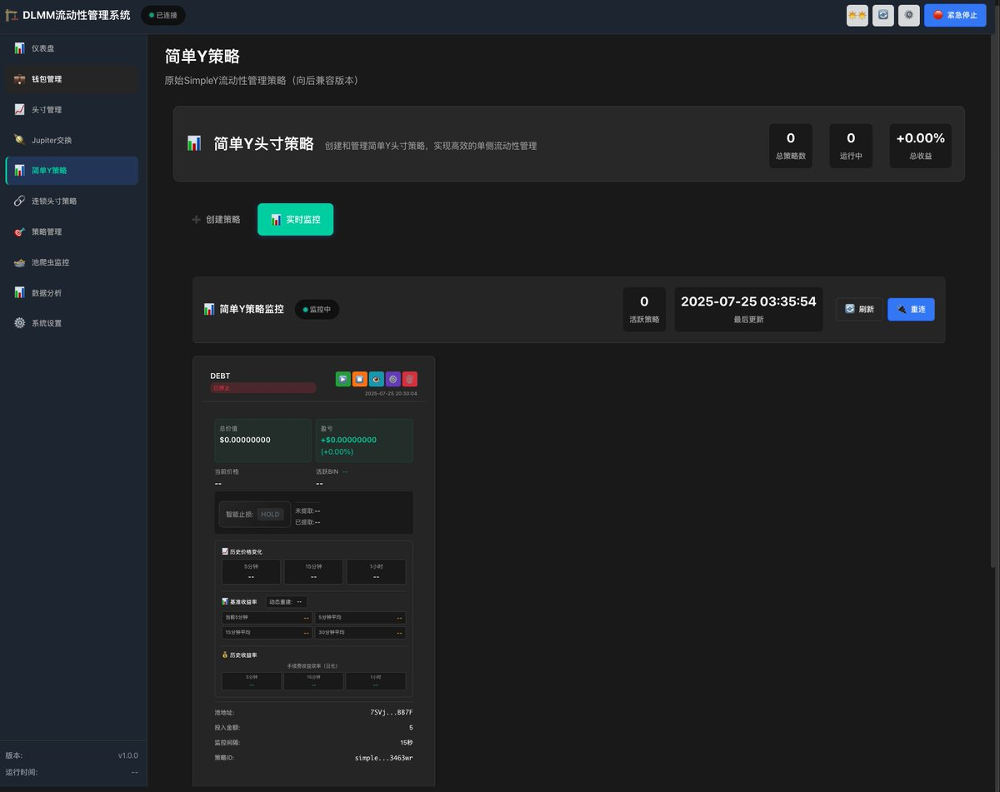
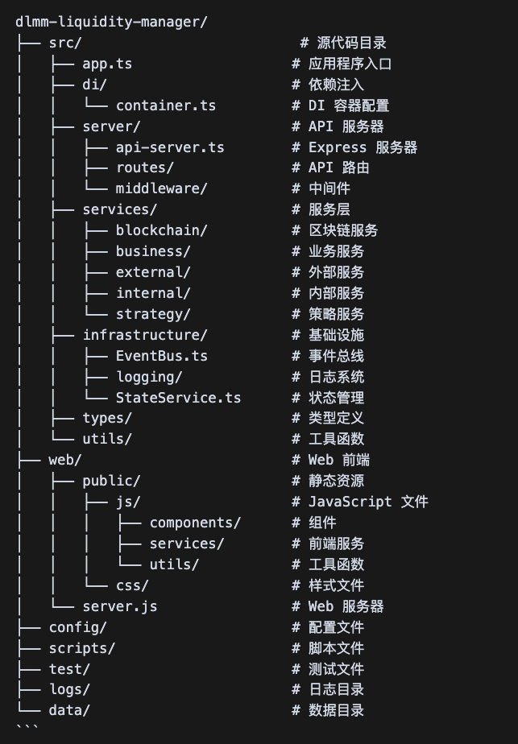
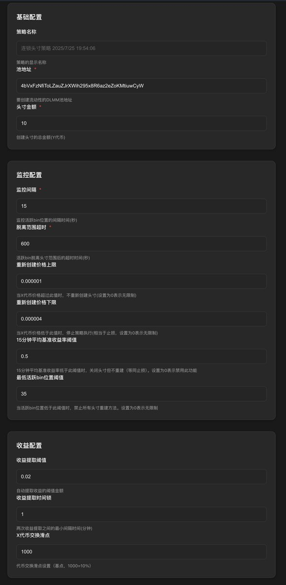

# Meteora DLMM 串聯池流動性自動化管理系統

> **來源**: [@gch_enbsbxbs](https://x.com/gch_enbsbxbs/status/1948733203566789056) | [原文連結](https://github.com/cryptocj520/meteora)
>
> **日期**: Fri Jul 25 13:12:56 +0000 2025
>
> **標籤**: `DLMM流動性管理` `自動化策略` `Solana`

---





★ Insight ─────────────────────────────────────
- 這是 Meteora DLMM 串聯池流動性自動化管理系統的開源專案
- 核心是實現 BidAsk 模型：價格上方流動性升序、下方降序，自動調整不符合的頭寸
- 技術亮點：微服務架構 + 依賴注入 + REST API，26 個自定義參數，超過 10 萬行代碼
─────────────────────────────────────────────────

---

## 專案背景

作者因 Meteora 官方活動決定開源此自動化管理工具，這是基於上一版本的重構版本。主要改進包括：

- **架構重構**：採用依賴注入 + REST API + 微服務架構
- **策略調整**：加入複雜的分析功能和自定義參數
- **參數系統**：共 26 個參數，包含 2 個頭寸策略、1 個止損策略、4 個重建策略
- **開發成本**：前後端代碼超過 10 萬行，花費超過 120 小時，Cursor AI 使用費超過 200 美元

系統採用模組化設計，即使不懂程式碼，只要會用 AI 也能修改策略參數。專為土狗 LP 打造，內含自訂的收益率算法。

> ⚠️ **RPC 節點注意事項**：專案預設掛載作者的 RPC，使用者需自行購買 Solana RPC 節點並替換，SOL 鏈沒有免費好用的 RPC。

---

## 核心功能

### 1. 動態池子管理

- **自動發現池子**：啟動時自動掃描並識別用戶的所有 DLMM 池子頭寸，無需手動配置
- **多池子串聯管理**：支援同時管理多個串聯的 DLMM 流動性池，確保協同工作
- **頭寸數據實時分析**：持續收集和分析每個頭寸的 bin 數據和流動性分布

### 2. BidAsk 模型合規性檢查

- **流動性分布驗證**：檢查每個頭寸的流動性分布是否符合 BidAsk 模型要求
- **升序/降序分布檢測**：高於當前價格的區域應為升序分布，低於當前價格的區域應為降序分布
- **合規性報告**：生成詳細的頭寸合規性報告，顯示不符合要求的具體原因

### 3. 自動調整策略

- **流動性移除**：對不符合 BidAsk 模型的頭寸自動移除 100% 流動性
- **重新添加流動性**：使用正確的 BidAsk 策略重新添加流動性，確保符合模型要求
- **漸進式調整**：系統會一次調整一個頭寸，確保調整過程平穩進行

### 4. 實時價格監控

- **活躍 Bin 監控**：持續監控每個池子的活躍 Bin 變化
- **價格變動檢測**：實時檢測 X/Y 代幣價格變動
- **池子交叉檢測**：當價格跨越不同頭寸範圍時自動觸發檢查

### 5. 安全與私鑰管理

- **私鑰加密存儲**：支援使用密碼加密私鑰，提高系統安全性
- **多級私鑰加載**：支援從加密文件或配置文件加載私鑰
- **用戶身份驗證**：在操作關鍵功能前進行身份驗證

### 6. 交易優化

- **優先級費用設置**：支援設置交易優先級費用，提高交易成功率
- **交易自動重試**：遇到臨時錯誤時自動重試，最多嘗試 5 次
- **計算單元優化**：可配置計算單元限制，優化交易執行

### 7. 可視化與日誌

- **終端實時顯示**：在終端實時顯示池子狀態和調整過程
- **詳細日誌記錄**：記錄系統的每一步操作，便於問題排查
- **狀態消息更新**：直觀顯示當前系統狀態和操作進度

---

## 系統架構

採用簡化的模組化架構設計：

```
dlmm-chain-pools-manager/
├── src/
│   ├── models.ts      # 數據模型定義
│   ├── services.ts    # 核心服務功能
│   ├── utils.ts       # 工具函數
│   ├── logger.ts      # 日誌模組
│   ├── display.ts     # 顯示模組
│   ├── config.ts      # 配置文件
│   └── index.ts       # 主程式入口
├── package.json
└── tsconfig.json
```

### 核心模組說明

| 模組 | 功能 |
|------|------|
| `models.ts` | 定義核心數據結構（池子、頭寸、池子鏈），包含 BidAsk 模型合規性檢查基礎函數 |
| `services.ts` | 整合所有核心業務邏輯，包括連接管理、錢包服務、池子發現、價格監控、流動性調整算法 |
| `utils.ts` | 提供通用輔助功能（錯誤重試、數據格式化、時間和計算工具） |
| `logger.ts` | 管理全系統日誌記錄，支援多級別日誌（DEBUG, INFO, WARNING, ERROR） |
| `display.ts` | 負責終端界面顯示和用戶交互，實現池子狀態和操作進度的可視化 |
| `config.ts` | 集中管理所有系統參數和設置（網絡連接、監控、調整策略配置） |
| `index.ts` | 系統入口點，協調各模組工作並實現主要工作流程 |

---

## 安裝指南

### 前置要求

- Node.js v14.0.0 或更高版本
- npm v6.0.0 或更高版本
- 一個有效的 Solana 錢包（用於管理流動性）

### 安裝步驟

1. **克隆專案**

```bash
git clone https://github.com/cryptocj520/meteora.git
cd dlmm-chain-pools-manager
```

2. **安裝依賴**

```bash
npm install
```

3. **配置系統**

編輯 `src/config.ts` 文件，設置關鍵參數：

```typescript
// 基本配置
export const CONFIG = {
  RPC_ENDPOINT: "https://api.mainnet-beta.solana.com",
  REFRESH_INTERVAL_MS: 10000,
  DISPLAY_ENABLED: true,
  LOG_LEVEL: "info",
};

// 錢包配置
export const WALLET_CONFIG = {
  PRIVATE_KEY: "你的私鑰",
};

// 交易配置
export const TRANSACTION_CONFIG = {
  ENABLE_PRIORITY_FEE: true,
  PRIORITY_FEE_MICROLAMPORTS: 200000,
};
```

4. **編譯專案**

```bash
npm run build
```

---

## 使用方法

### 開發模式

```bash
npm run dev
```

### 生產模式

```bash
npm run build
npm start
```

### 退出程式

按 `Ctrl+C` 安全退出程式。

---

## 工作流程

系統遵循以下工作流程：

### 1. 初始化

- 加載配置文件
- 連接到 Solana 網絡
- 初始化錢包
- 掃描並發現用戶的所有 DLMM 頭寸

### 2. 監控

- 定期輪詢活躍 Bin 和價格變動
- 當檢測到活躍 Bin 變化時，觸發池子交叉檢測
- 檢查相鄰頭寸是否符合 BidAsk 模型要求

### 3. 調整

- 對不符合 BidAsk 模型的頭寸，移除其全部流動性
- 根據 BidAsk 模型重新添加流動性
- 刷新頭寸數據，確保調整生效

### 4. 顯示

- 實時更新終端顯示，展示當前狀態
- 記錄詳細日誌，以便後續分析

---

## 配置項說明

### 主要配置參數

| 配置項 | 說明 | 預設值 |
|--------|------|--------|
| `RPC_ENDPOINT` | Solana 網絡 RPC 端點 | `https://api.mainnet-beta.solana.com` |
| `REFRESH_INTERVAL_MS` | 數據刷新間隔（毫秒） | `10000` |
| `DISPLAY_ENABLED` | 是否啟用終端顯示界面 | `true` |
| `LOG_LEVEL` | 日誌級別 | `info` |
| `PRIORITY_FEE_MICROLAMPORTS` | 優先級費用（microLamports） | `200000` |
| `MAX_RETRIES` | 交易最大重試次數 | `5` |

---

## BidAsk 模型說明

BidAsk 模型是一種優化流動性分布的策略，核心理念是：

### Ask 側（高於當前價格）

流動性呈**升序**分布：

- bin 100 有 10 個代幣
- bin 101 有 20 個代幣
- bin 102 有 30 個代幣
- ...

### Bid 側（低於當前價格）

流動性呈**降序**分布：

- bin 99 有 30 個代幣
- bin 98 有 20 個代幣
- bin 97 有 10 個代幣
- ...

這種分布方式確保流動性集中在最可能被交易的價格區間，提高資本效率。

---

## 私鑰加密

為了提高系統安全性，本專案支援對私鑰進行加密存儲，避免在配置文件中明文保存私鑰。

### 加密私鑰步驟

1. **運行加密命令**

```bash
npm run encrypt-key
```

2. **按提示輸入私鑰和密碼**

```
請輸入需要加密的私鑰 (Base58格式): <輸入你的私鑰>
請設置加密密碼: <輸入密碼>
請再次輸入密碼確認: <再次輸入密碼>
```

3. **確認加密文件創建成功**

成功後，系統會創建加密的私鑰文件（預設保存在 `.key` 文件中），並自動修改 `config.ts`：

```typescript
export const WALLET_CONFIG = {
  USE_ENCRYPTED_KEY: true,
  PRIVATE_KEY: "",
  KEY_FILE_PATH: "./.key"
};
```

### 使用加密私鑰

啟動程式時，系統會提示輸入密碼：

```bash
npm start
# 系統會提示：請輸入密碼解鎖私鑰:
```

輸入正確密碼後，系統會解密私鑰並繼續啟動流程。

---

## 安全注意事項

### 私鑰安全

- ❌ 不要在配置文件中存儲明文私鑰
- ✅ 考慮使用環境變數存儲私鑰
- ✅ 定期更換私鑰
- ✅ 密碼應足夠複雜（包含大小寫字母、數字和特殊符號）
- ✅ 加密文件 (`.key`) 包含敏感資訊，請勿分享或提交到版本控制系統
- ✅ 建議將加密文件添加到 `.gitignore` 中

### 權限控制

- 為流動性管理創建專用錢包
- 不要在該錢包中存儲大量資金

### 網絡安全

- 使用可靠的 RPC 端點
- 避免在不安全的網絡上運行程式

---

## 故障排除

### 常見問題解決方案

#### 連接錯誤

- 檢查 `RPC_ENDPOINT` 配置是否正確
- 確認網絡連接正常
- 嘗試使用備用 RPC 端點

#### 交易失敗

- 增加優先級費用值
- 檢查錢包餘額是否足夠
- 查看日誌了解詳細錯誤資訊

#### 配置加載錯誤

- 確認 `config.ts` 文件存在且格式正確
- 檢查文件權限

### 日誌分析

系統日誌包含詳細的操作記錄和錯誤資訊：

- `[INFO]` - 一般資訊，正常操作
- `[WARN]` - 警告資訊，可能需要注意
- `[ERROR]` - 錯誤資訊，需要排查
- `[DEBUG]` - 除錯資訊，包含詳細內部操作

---

## 專案連結

- **GitHub 倉庫**：https://github.com/cryptocj520/meteora
- **上一版本**：https://t.co/cddri1Lqnr
- **授權**：MIT License
