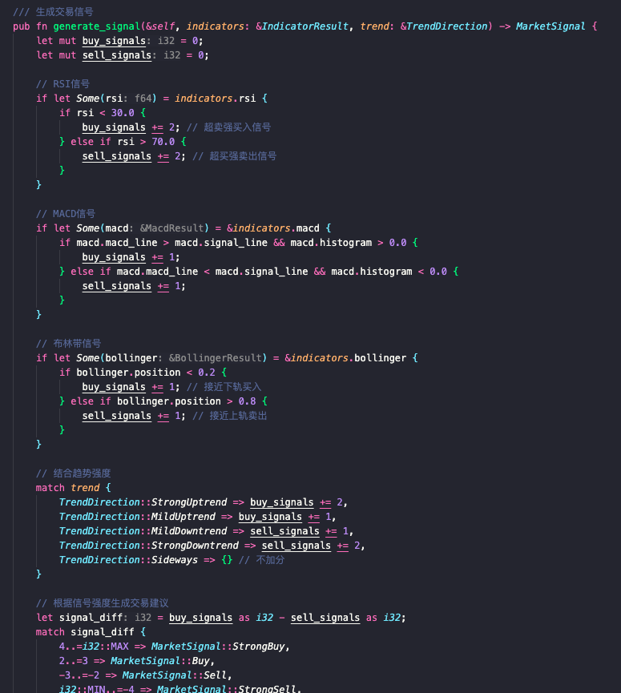
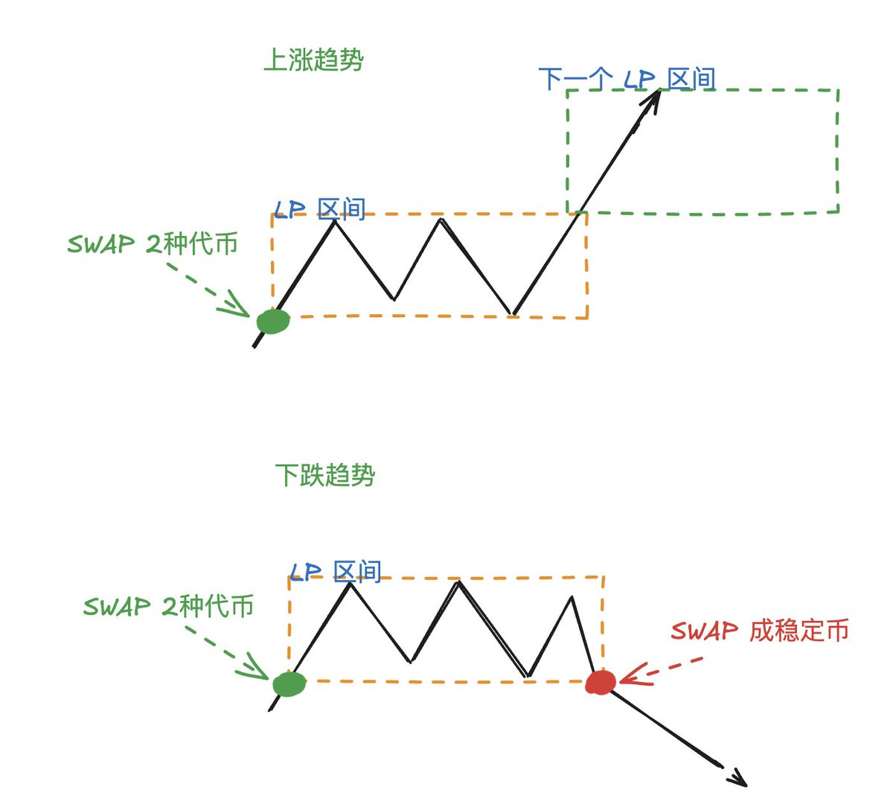
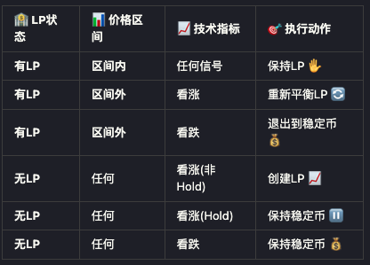
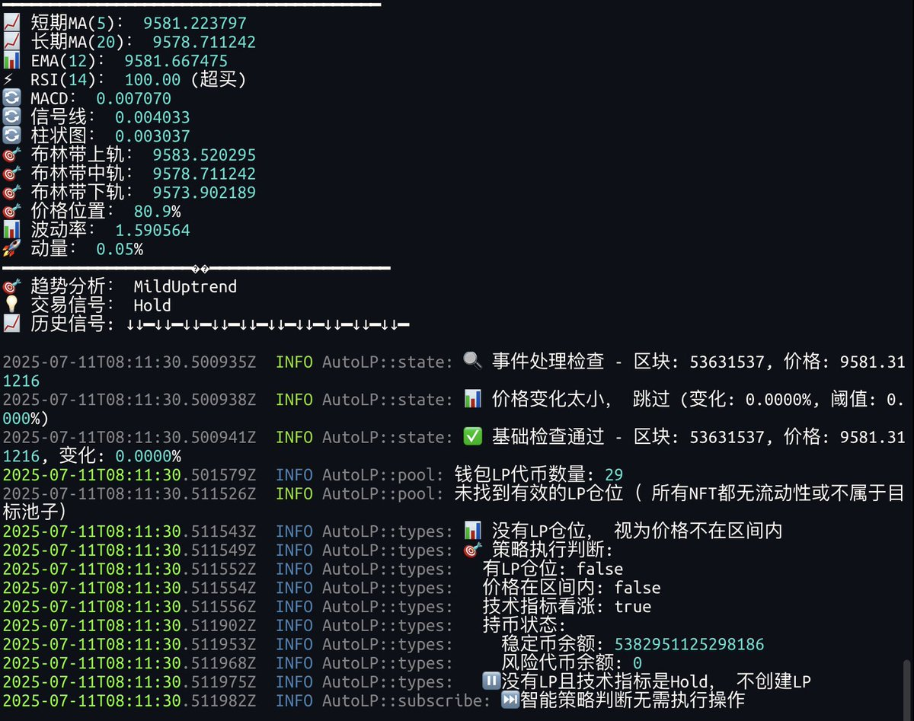

# AutoLP 學習筆記：量化指標在流動性管理中的應用

> **來源**: [@0xmomonifty](https://x.com/0xmomonifty/status/1943591470562419065)
>
> **日期**: Fri Jul 11 08:41:31 +0000 2025
>
> **標籤**: `LP策略` `量化交易` `風險管理`

---

> **來源**: [@0xmomonifty (0xMomo🕊️)](https://twitter.com/0xmomonifty)
> **日期**: 2026-02-18
> **標籤**: `AutoLP` `量化交易` `流動性管理` `技術指標` `DeFi`

---

## 背景與動機

上一次考慮到單純頻繁的鑄造、撤出 LP 存在價格暴跌的無償風險,那麼結合之前我玩過二級量化的經驗 (只是小白玩家級別),加入了 MA、RSI、MACD 等指標作為量化因子,來測試一下能否減少價格下跌帶來的損失。

## 使用量化因子來判斷趨勢

目前引入了 MA、RSI、MACD 等指標,訂閱池子的 Log 計算出每筆交易的價格,每 30 秒為週期進行採樣快取,達到能夠計算指標的數值後來進行積分判斷,根據積分強度來判斷看漲、看跌、HOLD。

### 技術指標說明

- **MA (Moving Average)**: 移動平均線
- **RSI (Relative Strength Index)**: 相對強弱指標
- **MACD (Moving Average Convergence Divergence)**: 指數平滑異同移動平均線

### 採樣與計算流程

1. 訂閱池子的交易日誌
2. 計算每筆交易的價格
3. 每 30 秒進行一次價格採樣
4. 累積足夠數據後計算技術指標
5. 根據指標進行積分判斷
6. 輸出交易信號:看漲、看跌、HOLD

## 使用趨勢來管理 LP 的狀態

有了看漲看跌技術指標後,就可以根據趨勢情況來管理 LP。

### 管理邏輯

1. **優先判斷當前價格是否在區間內**
   - 如果在區間內且是賣出信號 → 不變動 LP
   - 如果超出區間 → 根據信號操作下一個 LP 或者 swap 成穩定幣

2. **無持倉時的策略**
   - HOLD 信號 → 不做 LP
   - 下跌信號 → 不做 LP
   - 目的:減少價格下跌帶來的損失

### LP 狀態管理表格

| 當前狀態 | 價格位置 | 信號 | 操作 |
|---------|---------|------|------|
| 有 LP | 區間內 | 賣出 | 不變動 |
| 有 LP | 區間外 | 看漲 | 調整 LP 位置 |
| 有 LP | 區間外 | 看跌 | Swap 成穩定幣 |
| 無 LP | - | HOLD | 不做 LP |
| 無 LP | - | 看跌 | 不做 LP |
| 無 LP | - | 看漲 | 鑄造新 LP |

## 核心策略思路

透過技術指標量化判斷市場趨勢,動態調整 LP 倉位:
- **上漲趨勢**: 積極提供流動性賺取手續費
- **下跌趨勢**: 退出 LP 避免無常損失
- **震盪行情**: 保持現有部位或觀望

這種方法結合了傳統量化交易的技術分析與 DeFi 流動性管理,試圖在賺取手續費收益的同時降低無常損失風險。
