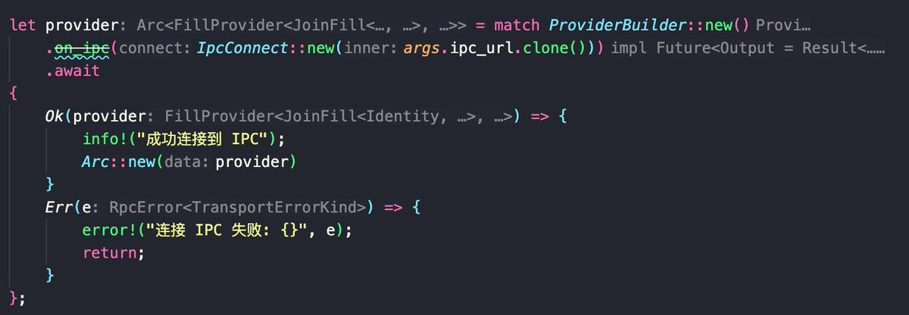
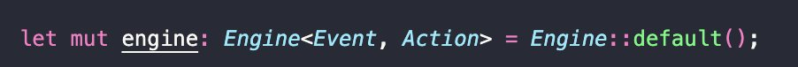
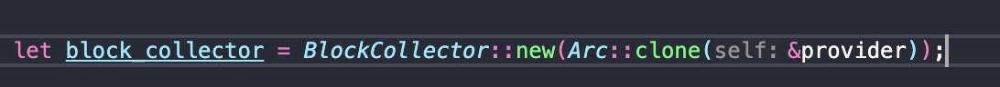
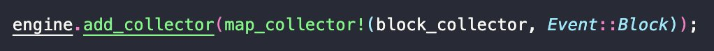

# AutoLP 機器人設計與實現指南 - Alloy MEV 框架應用

> **來源**: [@0xmomonifty](https://x.com/0xmomonifty/status/1943140383522984388)
>
> **日期**: 
>
> **標籤**: `LP自動化` `MEV框架` `區塊監聽`

---

> **來源**: [@0xmomonifty](https://x.com/0xmomonifty)
> **日期**: 2025-01-15
> **標籤**: `AutoLP` `MEV` `Alloy` `DLMM` `機器人開發`

---

## 前言

【 AutoLP 學習筆記 - ② 】

最近簡單的嘗試寫了一下 AutoLP，測試下來有一定的可行性，但是還需需要考慮的更多因素，不然會虧損的非常嚴重，比如今天的 $BR 暴跌 50%。

## LP BOT 設計邏輯

LP BOT 設計邏輯其實非常清晰：

1. 監聽區塊
2. 獲取池子在新區塊的狀態（比例/價格/流動性/tick）
3. 計算自己 LP 價格及區間狀態
4. 判斷是否需要調整 LP

在調整 LP 動作中，新手期可以先設計成直接暴力平衡 Token0 和 Token1 比例為價值的 5:5 再 Mint 成 LP。

## 開始實現

這次在 Github 找到一位科學家 Fork paradigm/artemis 並用了最新的 alloy 1 的 MEV 框架【burberry】（貼連接限流，大家自行搜索哈），所以接下來就用這個框架和 alloy 來寫。

### 主程序邏輯

首先創建 provider 連接節點，這裡我是用的是 IPC (Geth 的本地通信機制)，一般不做數據分析可以直接使用 http/ws 的 rpc，公共或者付費都可以。

步驟如下：

1. 創建引擎
2. 創建過濾器，監聽 block 事件
3. 將 block 事件添加到收集器中

至此已完成上期提到的 _Collectors_（收集器）部分，即最新區塊產生事件（也可以理解為訂閱新區塊產生）。
