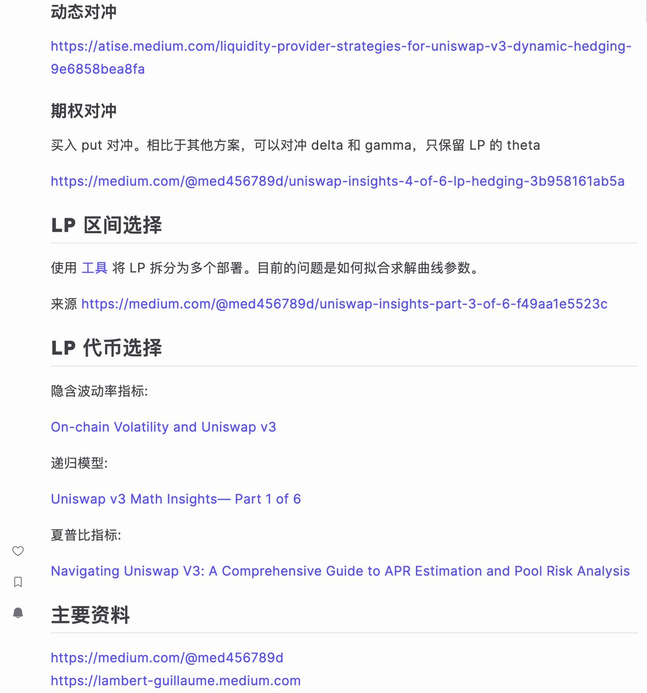

# Uniswap LP 流動性提供策略完全指南

> **來源**: [@wong_ssh](https://x.com/wong_ssh/status/1938921060587675827) | [原文連結](https://twitter.com/wong_ssh/status/1938921060587675827/photo/1)
>
> **日期**: Sat Jun 28 11:22:58 +0000 2025
>
> **標籤**: `LP策略` `Uniswap` `風險對沖`

---

> **來源**: [@wong_ssh](https://twitter.com/wong_ssh)
> **日期**: 2025
> **標籤**: `uniswap` `lp` `amm` `流動性提供` `對沖策略`

---

今年年初在研究 AMM 時打算做有關 AMM LP 的協議，所以花了幾天搜集了一些相關資料。這些資料一直被私下發送給一些對 LP 有興趣的朋友，今天準備公開出來。

其實內部沒啥 alpha，只是系統闡述了 LP 的各種性質並存在一些實操對沖手段。

**注意**：此處只收集了 Uniswap 有關的 LP，DLMM 等沒有在討論範圍。

## 文檔連結

完整的 Uniswap LP 策略指南文檔請參考原作者分享的資源。
