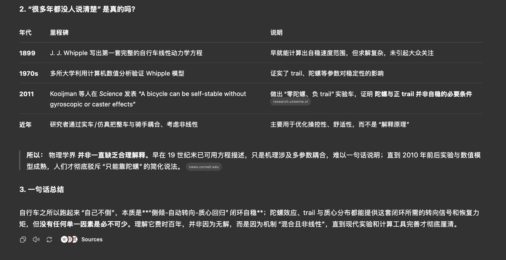
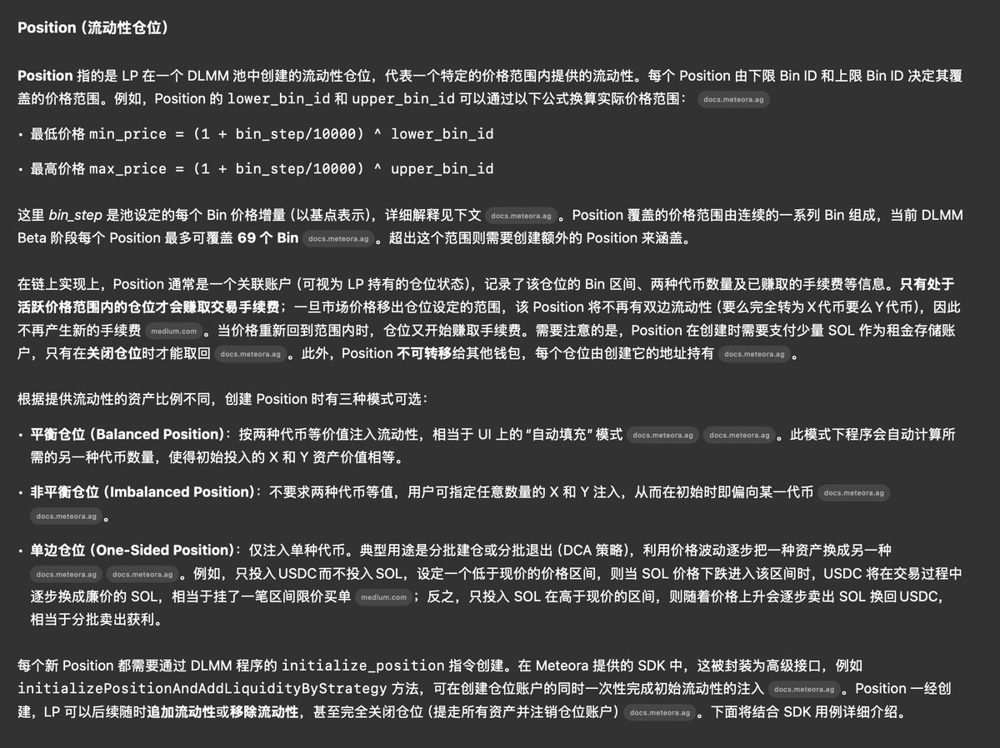
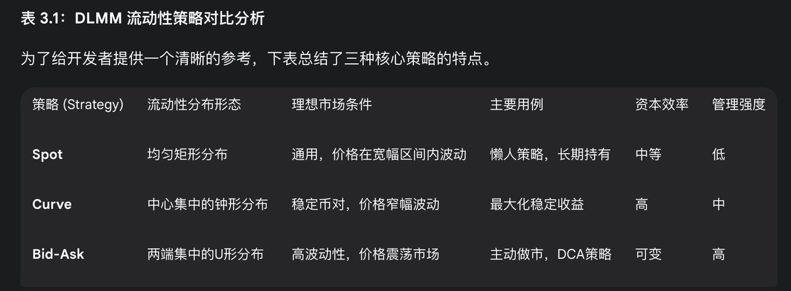
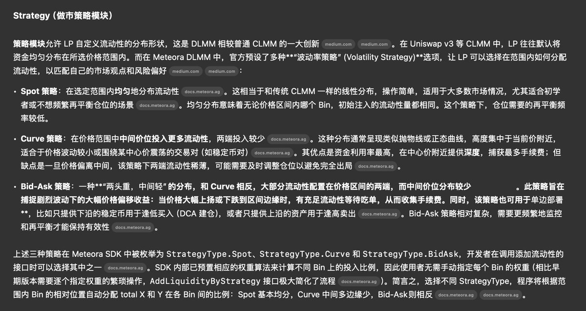

# DLMM 核心機制深度解析：三大 AI 模型對比研究

> **來源**: [@gm365](https://x.com/gm365/status/1934486762413519284)
>
> **日期**: Mon Jun 16 05:42:39 +0000 2025
>
> **標籤**: `DLMM` `流動性提供` `做市策略`

---

## 三大 AI 集體深入解讀 DLMM 機制

任何東西都一樣，如果只是日常使用，你並不需要知道底層技術原理。

就像絕大多數人相信都會騎自行車，但真要解釋自行車為什麼不會倒，這個問題科學界花了 100 多年還在給出不同的解釋。

DLMM 同理。

之前起碼用了一年半以上，透過網站前端，無非也就是選擇池子、費率、流動性策略等。

不懂底層原理，照用無誤。

但最近想要透過程式來接入 DLMM，自動化增減流動性，那麼很有必要仔細探究一番。

## 研究方法

面對這類技術性、原理性問題，深度解讀的話，使用各大 AI 模型的 Deep Research 那就恰如其分了。

研究問題：需要深入理解 DLMM 的底層運作原理，尤其是要如何接入其 SDK、選擇價格區間、選擇流動性策略等。

選擇的工具：

1. Gemini 2.5 Deep Research
2. OpenAI O3 Pro Deep Research
3. Claude Opus 4 Research

同樣的問題，讓三大 AI 工具分別深入探索，給出各自的報告。

## 核心發現

基於三大報告，更新了不少陳舊的認知：

### 1️⃣ DLMM 幾個核心概念

1. Position（流動性倉位）
2. Bin（價格桶）
3. Fee（手續費模型）
4. Strategy（做市策略模組）

### 2️⃣ Position

每個 Position 就是你部署的一個流動性範圍。

可選：

1. 平衡倉位
2. 非平衡倉位
3. 單邊流動性倉位

這點確實比 UniSwap V3 靈活、自由。實際使用體驗來看，也確實很為 LP 著想。

### 3️⃣ DLMM 的 Bin

Bin 的設計，有幾點創新（其實深受 Trader Joe 的流動性帳本 Liquidity Book 模型啟發）：

1. 單一 Bin 內使用公式 x+y = L⋅P
2. 單一 Bin 內代幣兌換零滑點
3. 只有 Active Bin 的流動性才能獲取交易費用
4. 只有 Active Bin 才有兩種代幣（其他非活躍 Bin 都只是單邊流動性）

### 4️⃣ Fee

這裡的手續費有基礎費用 (base fee) 和動態費用 (dynamic fee) 之分。

固定的基礎費用，加上根據波動性大小動態調節的 dynamic fee，為了補償 LP 的無常損失。

### 5️⃣ Strategy

重新審視了這三個策略，修正了一直以來的偏見（總覺得 Spot、Curve 才是做市策略的正途，Bid-Ask 是邪路 😳）

其實不然，可以這麼說：Bid-Ask 是一種混合了做市策略和量化交易策略的東西。

什麼場景、如何用好它，看你功力。

## 總結

一番報告閱讀下來，不得不說，@MeteoraAG 在 LP 這件事上，確實是動了腦筋、下了功夫的。
