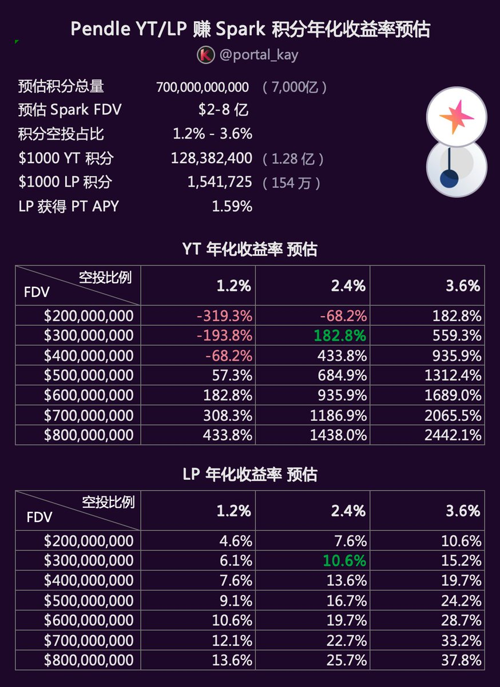

# Pendle YT/LP 賺取 Spark 積分年化收益精算

> **來源**: [@portal_kay](https://x.com/portal_kay/status/1932651002030678504) | [原文連結](https://x.com/ViNc2453/status/1923705383392248235)
>
> **日期**: Wed Jun 11 04:08:00 +0000 2025
>
> **標籤**: `Pendle` `Spark 積分` `DeFi 收益`

---

## 簡介

本文針對 Pendle 平台上透過持有 USDS 的 YT（Yield Token）和 LP（流動性池代幣）賺取 Spark 積分的年化收益進行精算分析。

研究穩定幣必然繞不開 @SkyEcosystem 和 $USDS，其前身為 MakerDAO 和 DAI —— 首創去中心化超額抵押穩定幣模式。而 Sky 生態的借貸協議 @sparkdotfi 與 @pendle_fi 合作推出了 YT/LP 賺取 Spark 積分的活動。

**核心結論**：
- LP 年化預估：10.6%
- YT 年化預估：182.8%（存在虧損風險）

## 精算背景

### $SPARK 代幣情況

- 發行總量：100 億
- 首年空投量：16.25 億
- 已分配空投：3.91 億
- 首年剩餘空投：12.34 億

### Spark Points 活動

- 活動時間：2025/05/14 - 2025/08/14（注意不是 8/31）
- 活動連結：https://app.spark.fi/points/

## 如何在 Pendle 上賺取 Spark 積分

### 買入 USDS-YT

- 當前時間：06/10；距離結束剩餘 64 天
- 持有一枚 YT 最終可得積分：25 分/天 × 64 天 = 1,600
- 當前 YT 價格：$0.01246
- $1,000 可購 YT：80,239
- $1,000 可得積分總額：80,239 × 1,600 = 128,382,400（1.28 億）

### 買入 USDS-LP

- LP 的組成：80% USDS + 20% USDS-PT
- 積分規則：只有其中 USDS 可以獲得 25 分/天，PT 無法獲得積分；開啟 "Keep YT Mode" 可以再獲得一小部分 YT
- 當前 LP 價格：$2.6
- $1,000 可購 LP：384.124（外加 163.578 YT）
- $1,000 可得積分總額：(1,000 × 80% + 163.578) × 1,600 = 1,541,725（154 萬）

## YT/LP 年化收益預估

### Spark FDV 和積分空投比例預估

要預估買入 YT、LP 的年化收益，最重要的是 3 個數據：Spark 積分總數、Spark FDV 和積分活動空投比例。

**Spark 積分總數**：
- 當前積分：677 億
- 每日新增：80-100 億（參與資金越多，後面積分的增速越來越快），保守取 95 億/天
- 至截止積分總數：677 + 95 × 64 = 6,757 億，保守一點算 7,000 億

**Spark FDV**：
- 這部分最難預估，與流通比例、項目熱度、TGE 時間節點、項目方操盤手段關聯度太高
- 即使對標同類的 AAVE（FDV $48.87 億）和 Compound（FDV $5.39 億）意義也不大
- 勉強給一個區間：$2-8 億

**積分空投占比**：
- 首年剩餘空投：12.34 億
- 扣除 SparkLend、AAVE 等其他渠道的空投數量 50%，剩餘 6.17 億
- 再扣除分給 @cookiedotfun 及其他各種合作渠道的 20%-40%
- 則 Spark 積分空投數量：1.2 億 - 3.6 億之間，占比 1.2% - 3.6%

### YT/LP 年化收益率預估

通過上面分析，最難預估的是 Spark FDV 和積分空投占比。具體計算時，將 FDV 拆分為 $2-8 億的 7 段，將空投比例分為 1.2%、2.4%、3.6% 3 段。

**YT 預估說明**：
- 會出現虧損的情況，這部分折算成年化其實不太合適，因為無論如何也不可能虧損超過 100%
- 不按年化只按實際盈亏來算，購買 YT 的虧損在 12%-56% 之間

**LP 預估說明**：
- 購買 LP 還會獲得 20% 左右的 PT，這部分雖然沒有積分，但也會有一些收益
- 按照 Pendle 的顯示大約為 1.59%

**個人預期**：
更傾向於認為空投比例在 1.2%-2.4% 之間，TGE 之後 FDV 不會太高，3 億左右。因此最接近個人預期的數值為：
- YT APY：182.8%（雖然這部分很高，但市值或空投比例稍微偏低，就有可能虧損）
- LP APY：10.6%

## 總結

這是第一次做這種類型的「精算」，計算複雜程度倒不算高，只是依賴於太多假設條件，對這些假設條件預估的準確性要比計算能力來得重要。
