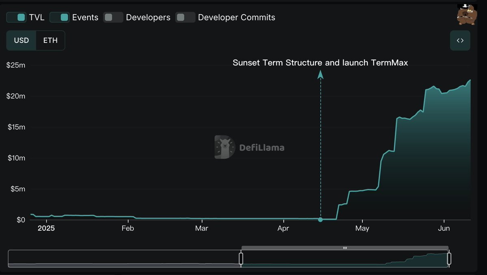
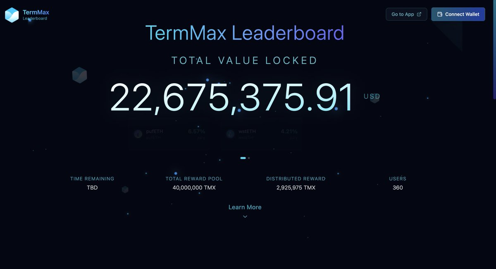

# TermMax DeFi 挖礦策略與早期佈局指南

> **來源**: [@jimcurrywang](https://x.com/jimcurrywang/status/1932748191243644955) | [原文連結](https://app.termmax.ts.finance/?ref=JNE4MX)
>
> **日期**: Wed Jun 11 10:34:12 +0000 2025
>
> **標籤**: `DeFi協議` `流動性挖礦` `代幣經濟`

---

> **來源**: [@jimcurrywang (RJ ♣️)](https://x.com/jimcurrywang)
> **日期**: 2025-06-10
> **標籤**: `DeFi` `TermMax` `挖礦` `Pendle` `收益策略`

---

## DeFi 敘事大轉向

SEC 主席拋出創新豁免政策 Innovation Exemption，瞬間點燃整個 DeFi 市場情緒，一線協議幣像是 $AAVE、$PENDLE 全面暴漲。甚至連 CZ 都親自轉發稱「6/9 是 DeFi 紀念日」。這次不只是短期情緒而已，整體敘事結構正在大轉向。

短期雖然主流幣反應最強，像 $AAVE $PENDLE，但建議不要只追大幣，鏈上 DeFi 生態更值得趁勢卡位。

## TermMax Premine 進度與 TGE 時程

目前整體池子已經分配超過 290 萬枚 $TMX，差不多是總預估排放量的 7%。換句話說，還有 93% 的獎勵還沒發出來，對早期參與者來說，現在的挖礦效率是最甜的階段。

根據進度觀察，Q3～Q4 有機會看到 TGE，一旦時間接近，排放速度預期也會加快但人應該會更多。所以越早卡位、倉位開得越大，拿到的數量會差非常多。

## 多鏈擴張與 Pendle 生態連結

TermMax 團隊的推進節奏值得關注：

- **上幣效率很快**
- **和 Pendle 社區的整合度非常高**
- **官網已經預告會支援 BNB Chain**，代表機會點會擴大不少

如果有在關注鏈上機會，這種早期階段可以先佈局關注，等到新市場一開、new deal 上線，往往是最好撿便宜的時候。

> 作者註：光上個月個人成功刷了 100k 以上的低利貸款

## Mindshare 系統（創作者挖礦即將上線）

TermMax 即將開放 Mindshare 功能：

- 只要你有寫文章、創作內容，未來都可以直接拿 $TMX 獎勵
- 還會計入 Leaderboard 分數

這系統很可能是他們自己優化設計的算法，也有可能會找像 @cookiedotfun ft. @sparkdotfi / Kaito 這類平台合作，拉高內容熱度的擴散力。

## Leaderboard 正式開放，邀請機制有甜頭

現在 Lend、Vault 都已經可以產出 $TMX，還加上排行榜機制，讓參與不只是單純拿收益，而是可以看到自己的挖礦表現。

### 邀請制度設計

- 起始 3%，最多高到 10% referral 分潤
- 目前只有 Lend 和 Vault 倉位會計入 TMX 獎勵
- 但 GT (Gearing Token) 後續也會分配到排放

邀請碼：**JNE4MX**  
連結：https://t.co/KFQEDXmvmw

## 佈局建議

可以先卡位，哪怕只放個 1000 USDC 小額佈局也好，不排除有像 @humafinance OG 加成，先埋伏等放大機會出現。
