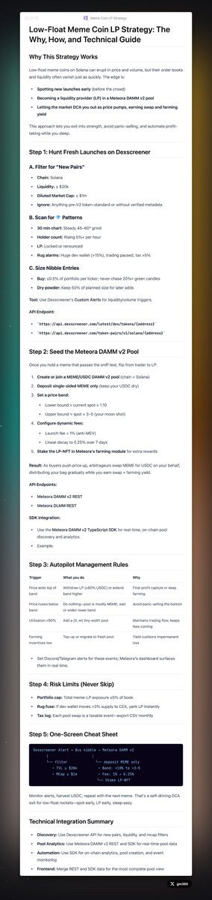
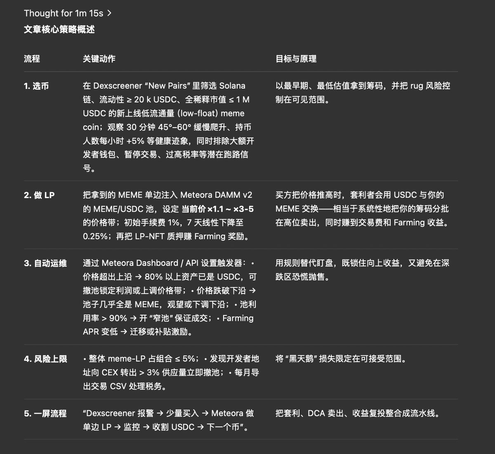
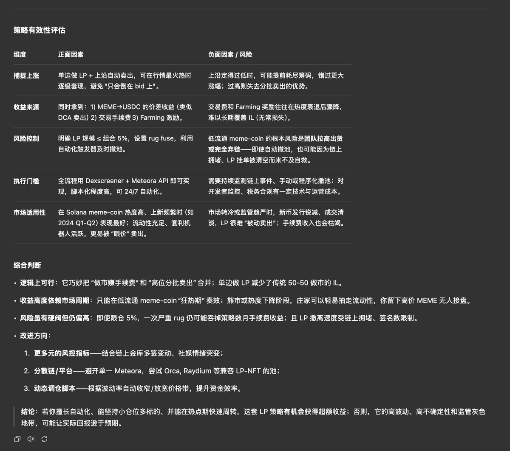

# 低流動性 Meme 幣 LP 策略分析

> **來源**: [@gm365](https://x.com/gm365/status/1932719049689227449)
>
> **日期**: Wed Jun 11 08:38:24 +0000 2025
>
> **標籤**: `LP策略` `Meme幣` `自動化`

---

> **來源**: [@gm365](https://twitter.com/gm365)
> **日期**: 2026-02-18
> **標籤**: `Meme 幣` `LP 策略` `自動化交易` `流動性挖礦` `DCA`

---

## 策略概述

在 GitHub 無意間搜到一篇文章，講了一個 Meme LP 策略。

雖然文章中有不少細節性錯誤（比如單邊 DAMM v2 無法實現等），但整體策略依然有值得借鑑的地方。

## 策略整體流程

1. **選幣**：流動性 >= 20K, FDV <= 1M
2. **單邊 MEME LP**
3. **自動運維**：根據規則自動提取 LP 等
4. **風控**
5. **全自動流程**：自動篩選、加 LP、提取 LP

## 策略有效性與思路分析

1. 在 MEME 爆發前建倉
2. 單邊 LP，邊漲邊賣，類似 DCA 出貨 + 收取交易手續費
3. 有效的風控，避免佔用過多資金、下跌過多清倉
4. 自動化執行（全天 24 小時自動運作）

## 文章中的錯誤

1. DAMM V2 不支援單邊注入流動性
2. 無法設置 7 天的線性遞減手續費率（最長 1440 分鐘）
3. Stake Farming NFT 獎勵是基本沒有的

根據以上這三條事實性錯誤，我很懷疑這整個文章怕不是 AI 幫他杜撰的，而且還是一個幻覺比較嚴重的 AI 😳。

## 總結

如果你擅長自動化，可以考慮整合下面這個完整流程：

- 代幣發現
- 添加流動性
- 撤出流動性

這樣就能 24 小時自動 print money 了。
