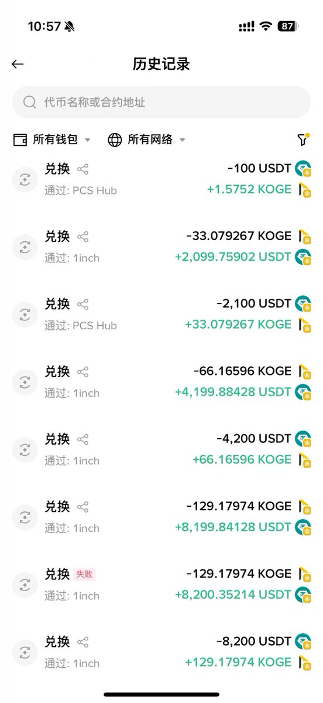
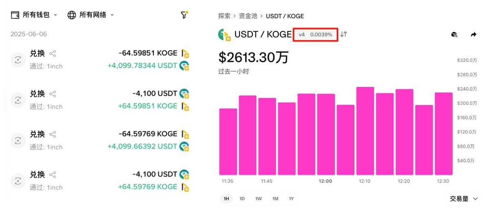

# KOGE/USDT 交易對低磨損最優解：大額單筆交易測試

> **來源**: [@ai_9684xtpa](https://x.com/ai_9684xtpa/status/1931186025759670538)
>
> **日期**: Sat Jun 07 03:06:42 +0000 2025
>
> **標籤**: `LP策略` `滑點優化` `Uniswap V4`

---

> **來源**: [@ai_9684xtpa (Ai 姨)](https://twitter.com/ai_9684xtpa)  
> **日期**: 2026-02-18  
> **標籤**: `Uniswap V4` `KOGE` `低滑點交易` `幣安 Alpha` `LP 策略`

---

## 實測 KOGE/USDT 交易對低磨損最優解

透過實際測試發現，在 KOGE/USDT 交易對上，使用**大額單筆交易 + 0.01% 滑點**設定可達到最低磨損：

| 交易金額 | 損耗金額 | 損耗率 |
|---------|---------|--------|
| 8200U 單筆 | 0.16U | 萬分之 0.19 |
| 4100U 單筆 | 0.12U | 萬分之 0.29 |
| 2100U 單筆 | 0.24U | 萬分之 1.1 |
| 100U 單筆 | 0.02U | 萬分之 2 |

**注意事項**：
- 不需要手動選擇路由
- 可能會受到幣價波動的影響，這個無法避免

## 幣安 Alpha 刷分新標的：超低手續費競爭

KOGE 成為幣安 Alpha 刷分的新標的，手續費競爭已經從**萬分之一 (0.01%)** 進化到**十萬分之四 (0.004%)**。照這個趨勢，刷分甚至不需要科技手段都能零擼。

早上發現 $KOGE 在 Uniswap V4 上增加了一個 0.005% 手續費的池子，到家一看已經卷到 0.0039%。事實上還有一個 0.004% 的 LP 剛撤走，估計是要硬剛到更低。

**背景資訊**：KOGE 是 BSC 上 48 Club 的治理代幣（@48ClubIan @48Club_Official）。
