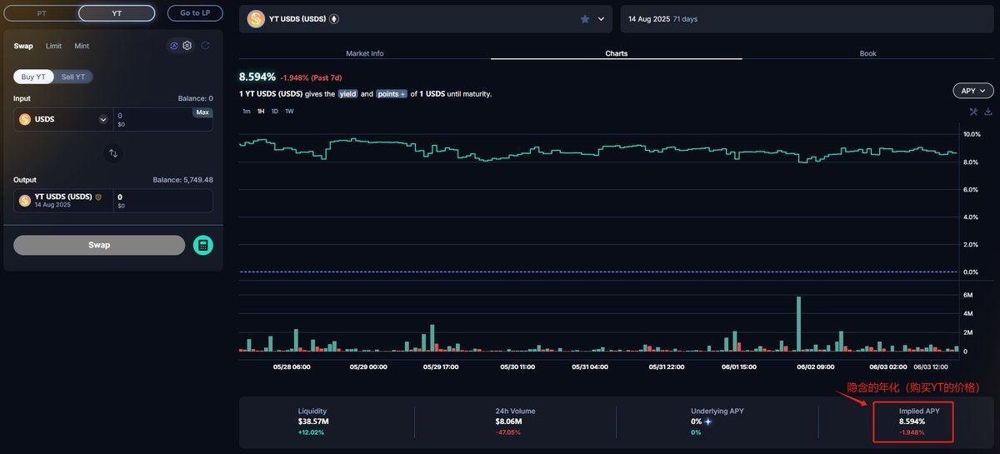
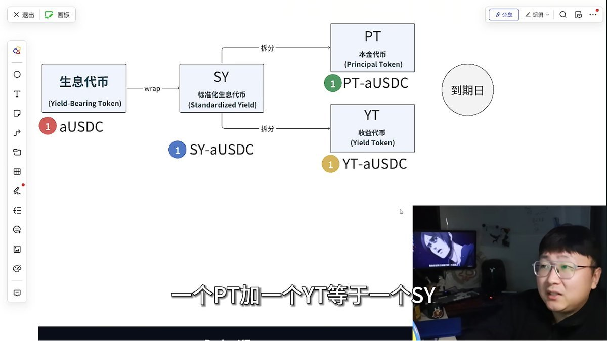
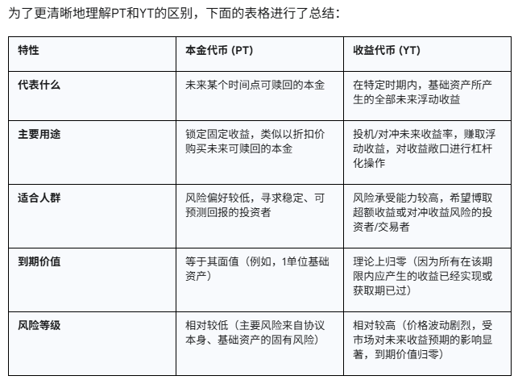
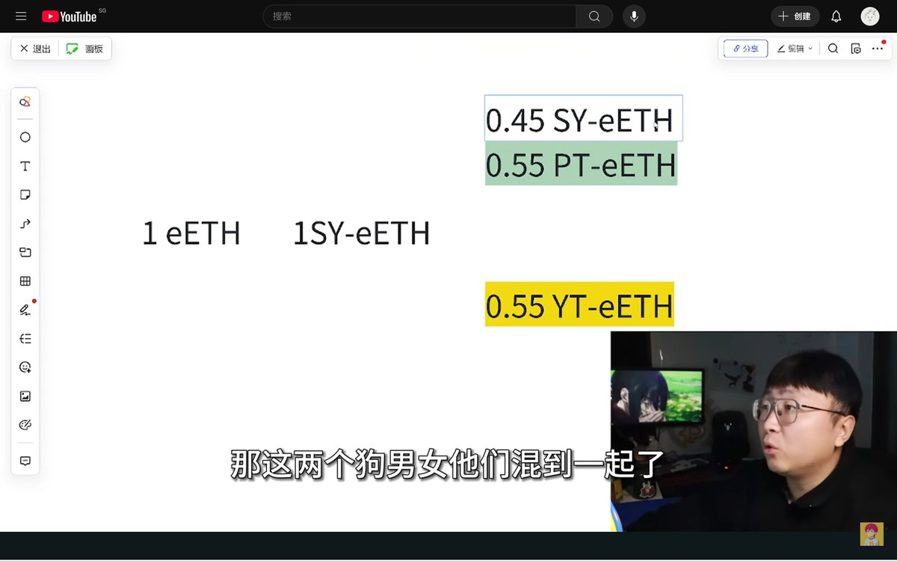
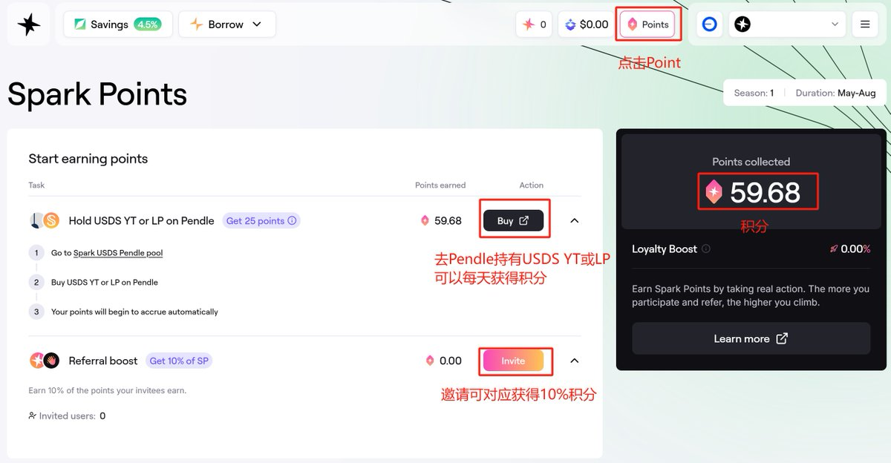
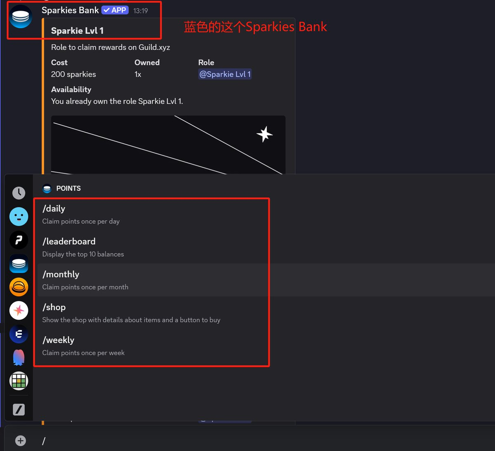
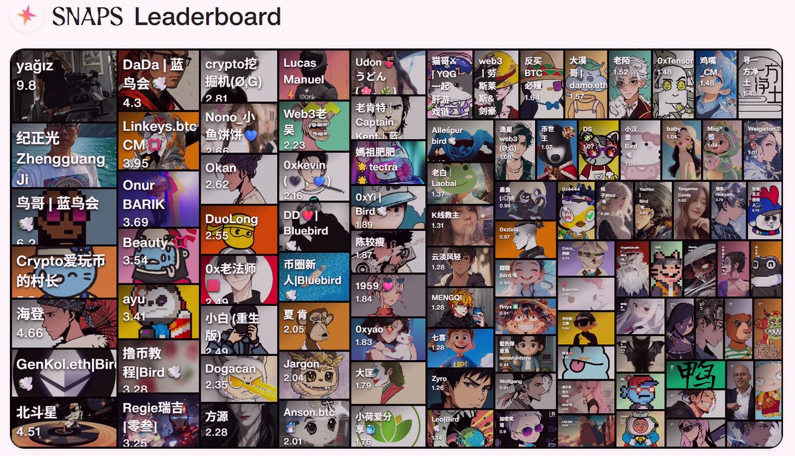

# Pendle 完全指南：DeFi 收益代幣化與固定收益策略

> **來源**: [@Alfredfuuu](https://x.com/Alfredfuuu/status/1929856798548230339) | [原文連結](https://pendle.notion.site/Pendle-1b2567a21d3780168a83dc0028731413)
>
> **日期**: 
>
> **標籤**: `收益代幣化` `PT與YT` `DeFi策略`

---

我將為您整理這篇關於 Pendle 的文章。這是一篇詳細介紹 DeFi 收益代幣化協議的內容，包含了 Pendle 的核心機制和實戰應用。

★ Insight ─────────────────────────────────────
- 這篇文章介紹了 DeFi 中的「收益剝離」概念，將傳統金融的債券分拆機制引入區塊鏈
- PT 和 YT 的設計類似零息債券和利率衍生品，讓 DeFi 用戶能夠交易「未來收益」本身
- 文章提到了與 Spark 積分系統的結合應用，展現了 Pendle 在空投挖礦中的實戰價值
─────────────────────────────────────────────────

以下是整理好的文章正文：

---

> **來源**: [@Alfredfuuu (Alfred⚙️)](https://twitter.com/Alfredfuuu)
> **標籤**: `Pendle` `DeFi` `收益代幣化` `固定收益` `Spark`

---

Pendle 大揭秘：DeFi 新手也能玩的固定收益和利率遊戲？

有兩三天沒有 yapping 了，昨天打開 @sparkdotfi 發現質押 USDS 後 #SPARK 積分漲的很慢😂，仔細看了看，發現了問題所在，於是有了這一篇內容，或許裡面有財富密碼呢？

之前也或多或少有聽到過 @pendle_fi，作為一個對 Defi 沒什麼概念的新手，我先在這裡列一些 Pendle 的實用學習資源，強烈建立收藏，收藏即學會🫡

## 學習資源

1. Pendle 官方新手入門：https://t.co/TWkNyX3Diq

2. 強烈建議關注 @pendle_fi 中文社區大使 @ViNc2453，並且加入官方中文 TG 頻道：https://t.co/4INdWBN507
   💰關注加頻道⏫有財富密碼（有大佬耐心指導）

3. @22333D 老師的視頻教程（沒耐心看文字教程的直接看這個視頻）：https://t.co/QHG6m3B8cq

## 一、初識 Pendle —— DeFi 收益還能這麼玩？

想像一下，DeFi 世界中的各種生息資產所產生的收益，就像一杯成分複雜的「混合果汁」，味道誘人但具體包含哪些水果、每種水果的比例如何，往往難以精確掌握，其整體的甜度（收益率）也時常變化。

而 Pendle，則像一個神奇的「榨汁機」或「分子料理廚房」，它能將這杯「混合果汁」中的「果肉」（即本金）和「純果汁」（即未來產生的收益）巧妙地分離開來，並分別進行管理和交易。

Pendle 的出現，實際上是將傳統金融中已經相對成熟的「收益剝離」（Yield Stripping）概念，以一種去中心化、無需許可的方式引入到了 DeFi 生態中。

### Pendle 為你打開了怎樣的新大門？

Pendle 不僅解決了 DeFi 用戶長期以來的幾個痛點，還提供了全新的策略選擇：

**🚧 痛點 1：收益不穩定，預測困難**
DeFi 中大多數收益是浮動的，受市場行情和協議調整影響巨大，難以預判。

**✅ 機會 1：提前鎖定固定收益**
通過購買 PT，用戶可以以折價方式買入將來可贖回的本金，實現類似「定期存款」的體驗。

**🚧 痛點 2：資本效率低下**
在傳統 DeFi 模式中，鎖倉期間的未來收益無法動用或交易，限制了策略的靈活性。

**✅ 機會 2：交易「未來收益」本身**
Pendle 把收益也代幣化（YT），用戶無需持有大量本金即可投機或管理這部分未來收益。

## 二、拆解 Pendle 魔法：PT 和 YT 是什麼？

你可以把 Pendle 看成是幫助你把「會下金蛋的鵝」（生息資產）拆成「鵝」（PT）和「未來金蛋」（YT）的工具。

操作上，你將原始生息資產（如 stETH）存入 Pendle，獲得一種叫 SY（Standardized Yield Token）的包裝資產。SY 再被拆分為：

- **PT**：本金代幣
- **YT**：收益代幣

這一步叫「收益代幣化」（Yield Tokenization）——將未來收益單獨拆出並賦予交易性，是金融工程在 DeFi 中的一次漂亮轉譯。

### 2.1. PT（本金代幣）：你的 DeFi「定期存款單」🧾

PT（Principal Token）代表你未來可贖回的本金。到期後，1 個 PT 可兌換回 1 單位的原始資產（比如 1 USDC）。

📉 比如，你用 0.95 USDC 買入一個將在未來到期的 PT，屆時可贖回 1 USDC，相當於你鎖定了一個 5% 的無風險收益。

💡 你其實就像是用折價買下了一張未來兌現的「定存收據」——只不過這一切都在鏈上完成，無需許可。

隨著到期日臨近，PT 的價格會自然向其面值（1:1）靠攏，其隱含的年化收益率（APY）反映了市場對無風險利率的定價。

🧾 簡而言之，PT 就是 DeFi 世界的「零息債券」，適合保守型、追求穩定收益的參與者。

### 2.2. YT（收益代幣）：你的「未來利息權」💰

YT（Yield Token）代表的是你對某項資產未來收益的所有權。只要資產在這段時間裡有收益，這部分利息就歸你。

但 YT 的魅力和風險也正來自它的槓桿屬性：

📈 **看漲利率？** 買 YT 就像下注「未來收益會升」，你能用較小的本金捕捉到超額回報。

📉 **收益下行？** 則 YT 價格會迅速下跌，甚至歸零，因為它代表的是時間有限的「未來收益權」。

⚠️ 到期後，YT 的價值趨近於 0 —— 不因為「歸零」而歸零，而是代表它所捕捉的收益期已經結束。

YT 是一個高度波動、高風險、高回報的產品，更適合有明確市場觀點的高級玩家。

🎯 在傳統金融中，它類似「利率互換（IRS）」或「遠期利率協議（FRA）」的鏈上版本，但更輕便、更可組合。

### 2.3. Pendle AMM：專為時間價值設計的交易平台⚙️

Pendle 內建了專屬的 AMM，用於交易 PT 和 YT。這不是傳統的 Uniswap 式 x*y=k，而是一個內含「時間衰減函數」和「收益率曲線建模」的特殊算法。

為什麼？因為：

- ⏳ PT 的價值會自然趨近於面值
- ⏳ YT 的價值會隨著收益期耗盡而歸零

這就需要 Pendle 的 AMM 能精準估算時間價值並保持流動性，才能讓 PT 和 YT 的價格有效反映市場預期，同時讓用戶隨時買賣、退出或部署策略。

## 三、Pendle 新手上路小貼士

1. **從小額開始**：熟悉 Pendle 界面和操作流程，可以使用 Arbitrum 等 gas 費低的鏈來走一遍操作流程，只投入少量自己完全能夠承受損失的資金進行嘗試。

2. **做足研究（DYOR - Do Your Own Research）**：不要盲目相信任何人（包括任何教程、KOL 或朋友的推薦）的投資建議。在投入真金白銀之前，花時間自己去學習和研究項目。獨立思考，形成自己的判斷。

3. **不懂就問，善用社區資源**：前面給大家列舉的 Pendle 中文 TG 群裡，就有專門的頻道來提問和交流。

4. **理解你正在交互的基礎資產**：在購買某個 PT 或 YT 之前，花時間去了解其對應的基礎生息資產是什麼，如果不懂就不玩。對基礎資產的理解，是判斷其 PT/YT 價值和風險的前提。

## 四、說回 SPARK

最前面我提到積分沒怎麼漲的問題，其實就是購買了 LP，這裡小資金不建議買 LP，因為收益可能覆蓋不了主網 gas😂另外購買的話，可以選擇開啟 Keep YT Mode（可以避免磨損）。

如果直接購買 YT 的話，YT 可以博取未來的積分和未來空投收益，所以積分會加的比較多，但是同時也會帶來磨損和風險，需要自己衡量。

另外就是 SPARK 的 TG 群裡，給我誤判成機器人，即使擁有對應角色，依然只能在有限的頻道裡發言。🙃 跟管理人員溝通後，無法人為調整，只能繼續提升等級，獲得更多角色了才能恢復，有人成功解決過類似問題嗎？

我該怎麼獲得真人角色？？？@SparkIntern

## SPARK 背景與操作指南

### Spark 背景

@sparkdotfi（以下簡稱 #SparkFi）是一個去中心化金融（DeFi）協議，專注於穩定幣借貸和流動性管理。其核心目標是打造 DeFi 中最強的收益引擎，通過融合現實世界資產（RWA）和 DeFi 流動性來實現這一願景。SparkFi 由 MakerDAO 支持，並與 Aave 等領先 DeFi 平台深度集成，旨在為用戶提供高效的借貸服務和優化的流動性解決方案。

### 1⃣ 存入 USDS

通過存入穩定幣 USDS，每天可以獲得 Spark Point 和利息，根據昨天的官推 @sparkdotfi 的消息，現在已經支持使用 USDT 直接存款 USDS，無需手動 Swap，設置滑點即可，十分方便。

🔗 https://t.co/NQsaHLN9bp
👆 邀請好友也可對應獲得獲得積分

**優勢：**
1. **隨存隨取**：第一賽季將持續到 8 月，期間隨時可以取出，積分不會減少
2. **零風險**：存入的是穩定幣，無需擔心價格波動，適合不想操心的用戶

### 2⃣ Discord

通過在 Spark 官方的 Discord 群組（https://t.co/YCHwh3B3V5）互動可以獲得對應的角色身份。

1. 通過在 `/general` 頻道發言，同時在 `/humor-hub` 發圖片和 `/tweets-and-content` 頻道發推文，都可以獲得 coins，發一條消息能獲得 5-7 積分左右。

2. 目前通過 coins 可以購買 3 個角色：
   - 🌟「Un-Banked Rookie」for 350 coins
   - 🌟「Un-Banked Memoor」for 650 coins
   - 🌟「Yield Chaser」for 925 coins
   
   👆 通過在 `/bot-commands` 頻道中，使用 `!coins` 命令可以查看當前的等級。使用 `!shop` 命令，查看可購買的角色。使用 `!buy` 命令購買

3. 目前通過發言聊天，提升等級可以對應獲得 3 個角色：
   - 🌟「Spark Initiate」for Level 3
   - 🌟「Sparkie」for Level 6
   - 🌟「Spark Crew」for Level 10
   
   👆 通過在 `/bot-commands` 頻道中，使用 `!rank` 命令可以查看當前的等級

4. 通過在 `/engage` 頻道參與點讚轉發等活動，可獲得 points（目前任務均已過期，關注我後續有新的任務，第一時間分享給大家）。同時在 `/marketplace` 頻道中可以使用 Points 購買角色。
   - 🌟「Social Sparkster」for 700 Points

5. 積極關注並參與 `/community-events` 頻道中的活動，可以獲得對應的活動角色：
   - 🌟「Sparkster」for Sparky's Unbanked Friends

6. 通過在 `/streak` 頻道，進行每日/每週/每月簽到，可以獲得對應的 sparkies，使用 `/daily` 和 `/weekly` 和 `/monthly` 進行簽到打卡。
   - 🌟「Sparkie Lvl 1」for 200 sparkies
   - 🌟「Sparkie Lvl 2」for 250 sparkies
   - 🌟「Sparkie Lvl 3」for 300 sparkies
   - 🌟「Sparkie Lvl 4」for 350 sparkies
   - 🌟「Sparkie Lvl 5」for 400 sparkies
   
   👆 通過在 `/streak` 頻道中，使用 `/shop` 命令可以進行購買。

7. 加入公會（https://t.co/yGV3LJHy0t），完成社區任務，獲取 Sparkles 積分，部分社區任務需要在 Discord 中解鎖角色才能完成，完成後可以獲得 Sparkles 等獎勵。也可以選擇 Mint 工會徽章，目前 NFT 和 Spark OG 角色均已過期。

### 3⃣ 持續輸出內容 & 互動

持續輸出優質內容，積極與大家保持互動，❤️ 一起擴大 #cookie 中文區的影響力

**相關推特：**
- COOKIE 官推：@cookiedotfun，創始人推特：@fwielanier
- SparkFi 官推：@sparkdotfi，創始人推特：@RuneKek
