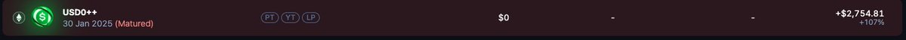
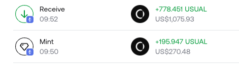
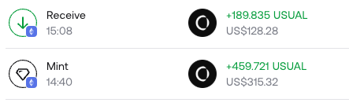

# Pendle YT AMM 無風險套利策略：10天賺4000U

> **來源**: [@807743450Li](https://x.com/807743450Li/status/1927299765651263867) | [原文連結](https://twitter.com/807743450Li/status/1927299765651263867/photo/1)
>
> **日期**: 
>
> **標籤**: `Pendle` `AMM機制` `無風險套利`

---

> **來源**: [@807743450Li (LI HD)](https://twitter.com/807743450Li)
> **日期**: 2024-12
> **標籤**: `Pendle` `YT` `AMM` `套利` `無風險套利` `USUAL`

---

## 策略概述

我在去年12月份的時候利用 Pendle 的 AMM 機制無風險得到 3000u YT 收益和 1000 多個 USUAL 代幣（當時價值 1000 多 u）。

## Pendle AMM 機制特性

Pendle 為提高 LP 的使用效率，會給每個池子一個下限和上限，當 YT 價格超過上限的時候，只能通過掛單的方式進行成交。
