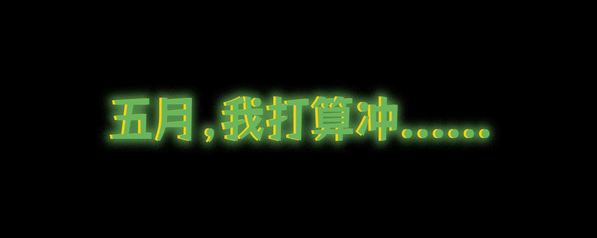

# DeFi 投資組合月度進展：六月目標與持續挖礦策略

> **來源**: [@BitHappy](https://x.com/BitHappy/status/1929043341263647182) | [原文連結](https://x.com/BitHappyX/status/1927279753679065542)
>
> **日期**: Sun Jun 01 05:12:27 +0000 2025
>
> **標籤**: `投資組合管理` `DeFi 挖礦` `空投策略`

---

> **來源**: [@BitHappy](https://twitter.com/BitHappy)
> **日期**: 2025-06-01
> **標籤**: `DeFi` `投資組合` `挖礦策略` `空投` `月度管理`

---

又到了每月一次的：沖什麼時間！

五月整體還挺忙的，希望六月能對其中一些進行收尾！

## 新增項目

### 1. Spark (@sparkdotfi)

- 通過 @cookiedotfun 發現，在研究和社區大戶的提醒後成為了重點
- 玩法簡單：通過 Pendle 存幣就好
- 傳言回報 300%+
- 空投與操作建議：https://t.co/93zy9YqxyR

### 2. Virtuals (@virtuals_io)

- 還在質押中，策略上是套保後先回本
- 前天發帖提醒大家套保，也算是在人聲鼎沸時給大家提了個醒
- 套保策略：https://t.co/NwbC2v6dKi

## 繼續挖礦

### 1. Hyperion (@hyperion_xyz)

- 動作越來越多了，最近就靠它撐起 @Aptos 了
- 最近接連和 OKX 推出兩期活動，其中一期還是配合 @okxchinese 新推出的 xBTC
- 緊接著，它的 UI 也進行了更新
- 繼續挖吧，至少有穩定幣礦和空投預期，收益也還不錯
- 傳言六月 TGE

### 2. Shadow (@ShadowOnSonic)

- 在 Alpha 之後沒能延續強勢
- 但好在 @SonicLabs 的很多礦還是可以繼續在上面挖的
- Shadow 的核心 x33 介紹：https://t.co/OMfUU4N20S

### 3. Infrared Finance (@InfraredFinance)

- 和 Shadow 的情況差不多，不過它還在 Pre TGE 階段
- 可以從礦和空投兩個方面接著玩，機會還是有的
- 希望 @berachain 能振作一點
- 套保挖礦策略：https://t.co/E6Lglh1EI2

### 4. MMT Finance (@MMTFinance)

- 發展勢頭也挺不錯
- 前幾天進行了大規模的市場營銷：
  - 一方面是 Cetus 出事，MMT 想爭一下 Sui 的頭部 DEX
  - 另一方面也是為 @SuiNetwork 挽回一波信任
- 社區巨鯨提到：採用 ve(3,3) 的項目空投極有可能是 veToken，也就是說空投可能會鎖倉
- 傳言 TGE 在 8 月之前

### 5. Lista DAO (@lista_dao)

- 推出抵押 sllisBNB 可以委託 clisBNB 獲得 BNB 權益後
- slisBNB-BNB 池子一直處於有額度就被搶光的狀態，大家真挺猛的
- 基於 Lista 的循環貸策略也有很多，建議大家多關注一下
- BNB 循環貸策略：https://t.co/E9qQcwvQUF

### 6. Aster DEX (@Aster_DEX)

- 我也存了一些錢，不過暫時沒啥大動作
- 好像 CZ 也嫌棄 Aster 進度太慢

### 7. StandX (@StandX_Official)

- 有推出 NFT，大概率是有空投份額的
- 去 DC 多聊天也可以獲得，大家可以參與一下

### 8. Cygnus Fi (@CygnusFi)

- 對協議版圖進行了一些擴張，又和新增一些項目的合作
- 我也把一些資金從協議本身移到了 @pendle_fi 上

## 收尾項目

### 1. Huma Finance (@humafinance)

- 基本結束了
- 但是套保 $JUP 出來投票獲得的額度還要等三個月解鎖，JUP 本身也要一個月解鎖
- 還好對 $HUMA 進行了套保，不然人麻了

### 2. 幣安 Alpha

- 除了每日積分外，新增的玩法就是 LP 了
- 不過操作起來難度較高，需要盯著或者使用自動化來保證利潤
- 如何組 LP 賺錢：https://t.co/ozk8SJqxmz

### 3. 日常礦池輪換

- 日常的老礦換新礦就沒多說了
- 一些有些風險的礦，每天 1WU 產出 100U，基本是沒問題的

---

最後，特別感謝社區小夥伴提供的信息、機會和技巧，讓大家能更好地賺錢！

**DeFi 愛好者：BitHappy**
