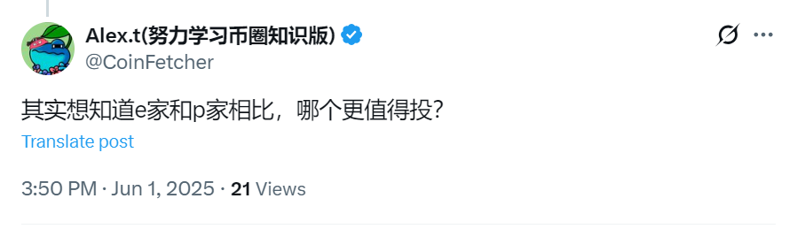
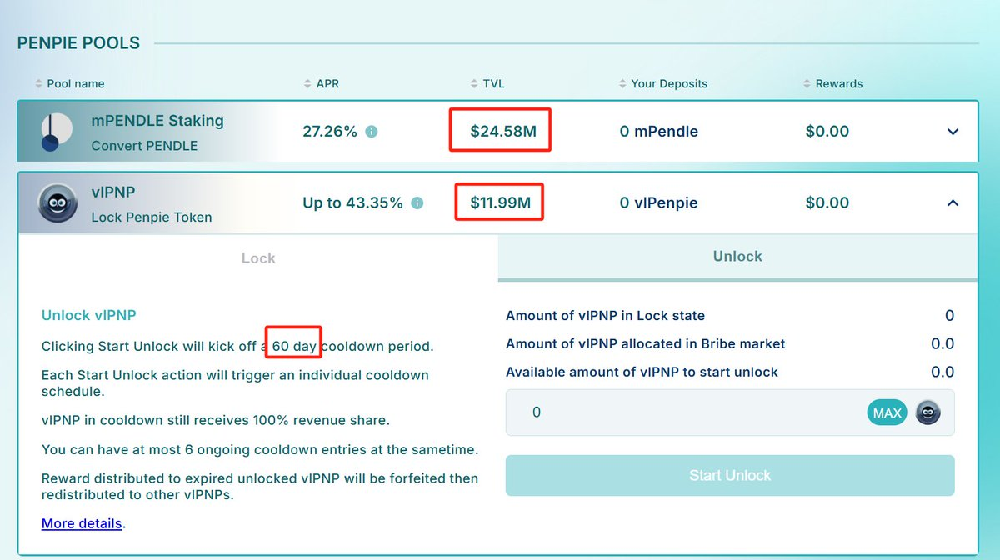
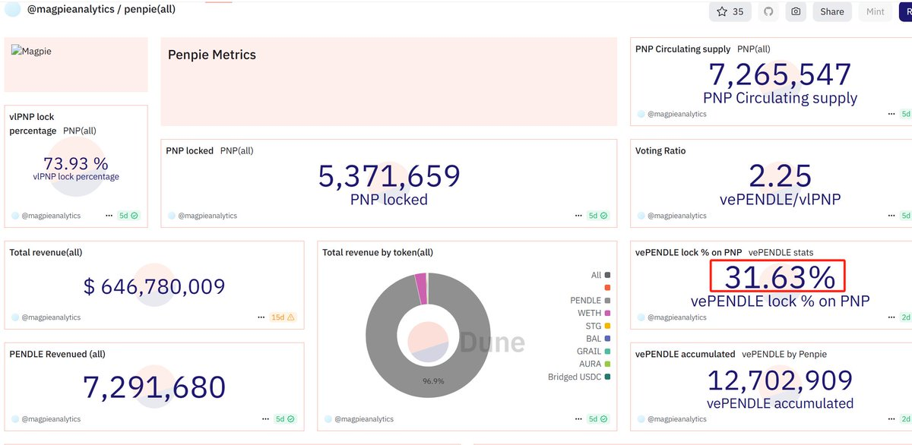
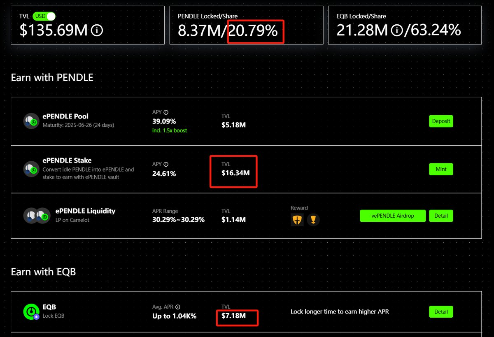
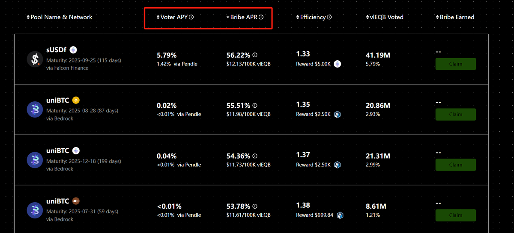
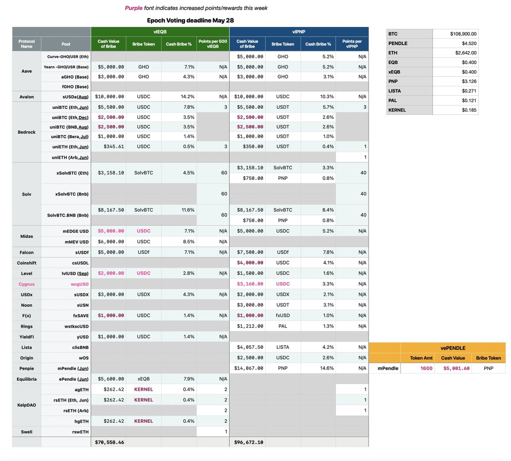

# Pendle vs Penpie vs Equilibrium：DeFi 收益策略對比分析

> **來源**: [@Eason_2099](https://x.com/Eason_2099/status/1929102109687050456) | [原文連結](https://x.com/ViNc2453/status/1927659687928856908)
>
> **日期**: Sun Jun 01 09:05:58 +0000 2025
>
> **標籤**: `Pendle` `收益優化` `DeFi 策略`

---

> **來源**: [@Eason_2099 (愛DEFI的大米)](https://twitter.com/Eason_2099)
> **標籤**: `Pendle` `Penpie` `Equilibrium` `DeFi` `收益策略`

---

## 核心問題

玩轉 Pendle，P 家（Penpie）和 E 家（Equilibrium）哪家更強？

@CoinFetcher 在評論區問了個好問題：「其實想知道 e 家和 p 家相比，哪個更值得投？」

## mPendle VS ePendle

### mPendle 數據
- 目前所持 vePendle 占總量：31.63%
- 對應的 mPendle 質押 TVL：24.58M
- **每 1M USD 成本的 mPendle 能獲取 1.2868% vePendle 的收益**

### ePendle 數據
- 目前所持 vePendle 占總量：20.79%
- 對應的 ePendle 質押 TVL：16.34M
- **每 1M USD 成本的 ePendle 能獲取 1.2723% vePendle 的收益**

### 結論
在當前價格下，**mPendle 相比 ePendle 稍微有一點點性價比優勢**。

## PNP VS EQB

### 基本數據
- 鎖定的 PNP TVL：11.99M
- 鎖定的 EQB TVL：7.18M

### 本週賄選投票數據

根據 V 佬 @ViNc2453 投票天書的統計（https://t.co/6GzwuhpOAf）：

- vlPNP 的 Bribe reward 總金額：96.6K USD
- vlEQB 的 Bribe reward 總金額：70.5K USD

### 投票 ROI 計算

假設所有 vlPNP 和 vlEQB 持有者都參與投票：

- **vlPNP 的投票 ROI**：96.6K / 11.99M = 0.805%
- **vlEQB 的投票 ROI**：70.5K / 7.18M = 0.981%

### 各項對比

#### Bribe 效率
在 Bribe 方面，**vlEQB 相比 vlPNP 的效率更高一點**。

#### Point Reward
根據以往的投票觀察，一般來說 **E 家在 Point reward 方面的空投積分獲取效率也要比 P 家更高一點**。

#### 解鎖時間
- **vlPNP 解鎖**：只要 60 天
- **vlEQB 解鎖**：如果一直是最大槓桿操作 52 週，那解鎖得等待 52 週

在解鎖方面，**PNP 更勝 EQB 一籌**。

## 總結

P 家和 E 家綜合來說各有優勢，小孩子才做選擇，**成年人當然是全都要**。

我個人是兩邊都參與了，**E 家參與的比例稍微更高一些**。

## 數據對比表

| 項目 | Penpie (P家) | Equilibrium (E家) |
|------|-------------|------------------|
| vePendle 占比 | 31.63% | 20.79% |
| 質押 TVL | 24.58M | 16.34M |
| 每 1M USD 收益效率 | 1.2868% | 1.2723% |
| 治理代幣 TVL | 11.99M (PNP) | 7.18M (EQB) |
| 本週 Bribe Reward | 96.6K USD | 70.5K USD |
| 投票 ROI | 0.805% | 0.981% |
| 解鎖時間 | 60 天 | 52 週（最大槓桿） |
| Point Reward 效率 | 較低 | 較高 |
