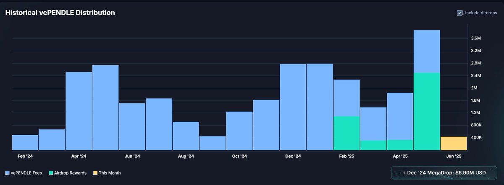
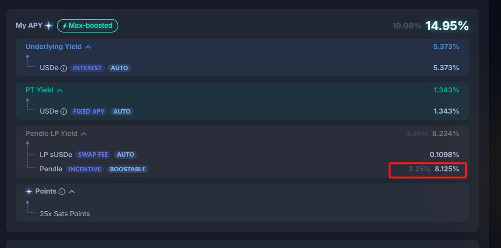

# 玩轉 Pendle：Equilibria 上的 Alpha 利器 EQB 和 ePendle

> **來源**: [@Eason_2099](https://x.com/Eason_2099/status/1929048031187579176)
>
> **日期**: Sun Jun 01 05:31:05 +0000 2025
>
> **標籤**: `Pendle收益` `Equilibria協議` `流動性挖礦`

---

> **來源**: [@Eason_2099 (愛DEFI的大米)](https://twitter.com/Eason_2099)
> **日期**: 2025-02-18
> **標籤**: `Pendle` `Equilibria` `EQB` `ePendle` `DeFi` `Yield-Farming` `vePendle`

---

這兩天看到 @807743450Li 和 @block_dam 兩位 DEFI 專家都分享了持有 YT-mPENDLE 及 PNP 所獲得高 APY 收益。大米做為 @pendle_fi 的超級粉，那也來分享一下 Pendle 衍生的另外一個應用協議 Equilibria 上面的 Alpha 利器：**EQB 和 ePendle**。

## Equilibria 的市場地位

E 家 @Equilibriafi 目前鎖定了 8.34M 個 Pendle（佔 vePendle 總份額的 20.65%），和 P 家 @Penpiexyz_io 一樣都是持有 vePendle 的機構大戶，因此 E 家也隨著 Pendle 的發展，走上了飛輪之路。

那這些 Pendle 相關的高收益究竟是怎麼來的？可能很多 degen 還並不清楚。俗話說的好，如果投資一個標的，你不知道它的收益來源，那你一定就是它攫取的收益。

## vePendle 的收益來源

讓我們抽絲剝繭，先看看 vePendle 的收益來源及組成是什麼：

### 1. Base Reward
從所有 YT 收益抽頭 5%，和到期未贖回 PT 收益

### 2. Voter Reward
vePendle 投票到對應的池子，這些池子產生的交易費的 80% 會給到 vePendle 持有者

### 3. Airdrop Reward
從 2025 年 2 月開始，每月向 vePendle 持有者發放空投，可以從下圖中看到空投佔 vePendle 持有者總收益也是挺高的

### 4. LP Boosting Reward（額外收益）
如果 vePENDLE 持有者同時也是所投票池的流動性提供者（LP），還可以直接獲得該池的 PENDLE 獎勵（作為 LP 的份額）。享受 LP boosting Reward（最高 250%，取決於 vePENDLE 持有量），這會進一步放大他們的 PENDLE 獎勵。

**注意**：這部分 PENDLE 獎勵是基於他們的 LP 身份，而不是 vePendle 投票者身份。

## 為什麼需要 Equilibria？

既然 vePendle 收益不錯，作為個人投資者，你可以直接購買 Pendle，然後鎖倉成 vePendle，從而享受穩穩的收益，但是你得付出犧牲一定流動性的代價。

因此為了解決 vePendle 的流動性問題，應需而生了 Penpie 和 Equilibria 兩大協議，簡稱 P 家和 E 家。

## E 家體系的兩大 Alpha 利器

E 家體系中有兩個很重要的工具：

1. **ePendle**：流動性版本的 vePendle
2. **EQB**：投票治理工具

### 工具一：ePendle 的收益組成

#### 1. Base Reward
- E 家將從 Pendle 獲得的 Base APY 的 **80%** 分配給 ePendle 持有者
- 大約每 4 到 5 週分配一次

#### 2. Vote Reward
- E 家將從 Pendle 獲得的 Voter APY 的 **40%** 分配給 ePendle 持有者
- 大約每 4 到 5 週分配一次

#### 3. LP Boosting Reward
具體來說，在 Pendle 上參與那些項目生成的 LP，如果存到 Equilibria 上，由於 Equilibria 持有的大量 vePendle 讓個人用戶無需自己鎖倉 Pendle 就可以獲得激勵，這樣這些 LP 可以獲得來自 Pendle 官方最高係數 **250%** 的 Pendle 獎勵。

而 Equilibria 作為服務方將抽取其 **22.5%** 的收益，並將 22.5% 中的收益：
- **12.5%** 給到 ePendle 持有者
- **7.5%** 給到 EQB Treasure

分配頻率：大約每幾天分配一次

#### 4. Airdrop Reward
從 2025 年 2 月開始，Pendle 每月向 vePendle 持有者，包括類似 Penpie 和 Equilibria 這樣的機構持有者發放空投。

Equilibria 會把其獲得的空投：
- **90%** 再分發給 ePendle 持有者
- **10%** 給到 ePendle 的 LP

### 工具二：EQB 的收益組成

**注意**：光持有 EQB 不行，你得首先質押鎖倉成 **vlEQB**，參與投票後，才能獲取收益。

#### 1. Vote Reward
- E 家將從 Pendle 獲得的 Voter Reward 的 **60%** 分配給到 vlEQB 持有者
- 大約每 4 到 5 週分配一次

#### 2. Bribe Reward
上了 Pendle 的項目方為吸引 Equilibria 持有的 vePendle 投票給它，使其 LP 可以獲得 Pendle 官方更多的 Pendle 激勵，從而提升其 LP 的 APY，因此每週會拿出額外的獎勵，給到擁有 Equlibria 治理權的 vlEQB 持有者。

- 通常每週有幾十 K 刀以上的投票獎勵，比如本週就有 **70K 刀**的投票獎勵
- 從現金流角度來說，這塊的獎勵是非常不錯的，經常達到 **50% 以上的 APY**
- 基本每週分配

#### 3. Point Reward
某些項目方還會把自己的空投積分作為獎勵。一般來說 vlEQB 獲得積分的效率要比直接存錢到那些項目方的積分要高出不少，經常是幾倍、幾十倍甚至到一兩百倍的積分獲取效率。

而且相比 YT 這種消耗性的高效積分獲取方式，這種投票獲取積分完全是無損的。

**歷史變化**：曾經有段時間大部分的投票都會往積分效率最高的項目傾斜，但自從 Corn、Pumpbtc 這種積分型項目在 TGE 時候耍賴，以及 Lombard 把 Eqb 上的投票獲得的積分硬生生事後縮水 50 倍以後，Degen 們大都開始放棄這種具有不確定性的遠期收益，而是更看中第二種更直接的、每週可領取的 Bribe reward 了。

**投票建議**：這裡要特別再說一下，每週三投票要看 V 佬 @ViNc2453 的投票天書。

## 飛輪效應

複製一下 D_Block 大佬關於 mPendle 和 PNP 兩個飛輪子在 P 家體系的協同運作描述，我覺得基本上可以複製到 E 家：

**ePENDLE 吸引 PENDLE 存入，擴大 EQB 控制的 vePENDLE 規模** → **規模的擴大增強了 EQB/vlEQB 在 Pendle 治理和賄賂市場中的話語權和盈利能力** → **盈利能力的提升又會吸引更多人持有 EQB 並參與治理，同時也會間接提升 ePENDLE 的價值**

---

**So, Keep fighting, Pendle! Keep fighting, Penpie & Equilibrium! You are the future of DEFI!**
