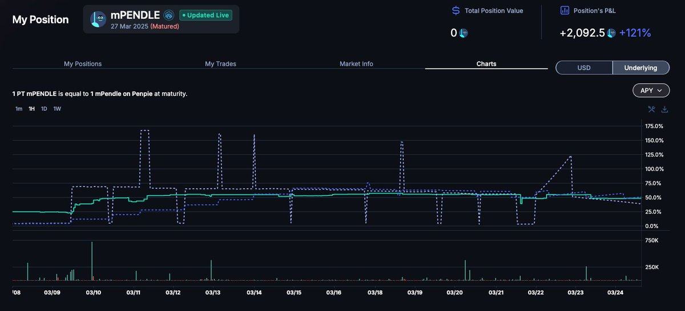
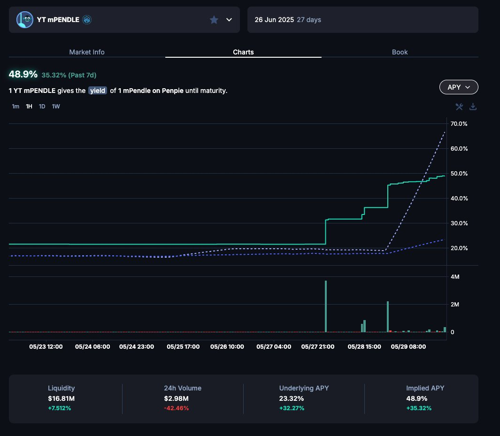
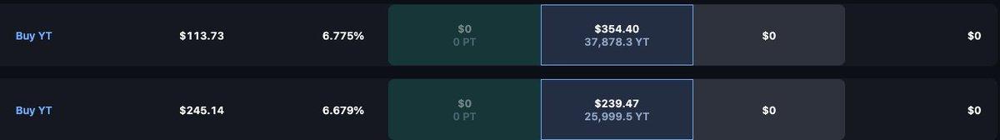

# Pendle YT 套利策略：三個月 1400U 變 14000U 案例分析

> **來源**: [@807743450Li](https://x.com/807743450Li/status/1928153381346103397) | [原文連結](https://twitter.com/807743450Li/status/1928153381346103397/photo/1)
>
> **日期**: 
>
> **標籤**: `Pendle` `YT 池` `收益套利`

---

> **來源**: [@807743450Li (LI HD)](https://twitter.com/807743450Li)
> **日期**: 2024-03-27
> **標籤**: `Pendle` `YT套利` `收益代幣` `DeFi策略`

---

## 案例概述

這是一個透過 Pendle YT (Yield Token) 池子實現高倍數收益的實戰案例，在三個月內將 1400U 增長至 14000U，投資報酬率約 10 倍。

## 策略執行細節

### 使用的池子

本次套利透過兩個 mpendle 池子完成：

1. **3月27日到期的 mpendle 池子**
2. **6月26日到期的 mpendle 池子**（進行中）

### 資金分配

使用兩個錢包分別操作：

- **錢包 1**：初始投入 770U
- **錢包 2**：初始投入 600U + 額外 250U

總計初始投入約 1400U，最終達成 14000U 的資產規模。

## 重點說明

- 此策略利用 Pendle 的 YT 機制進行收益放大
- 透過不同到期日的池子進行組合操作
- 三個月內實現 10 倍收益
