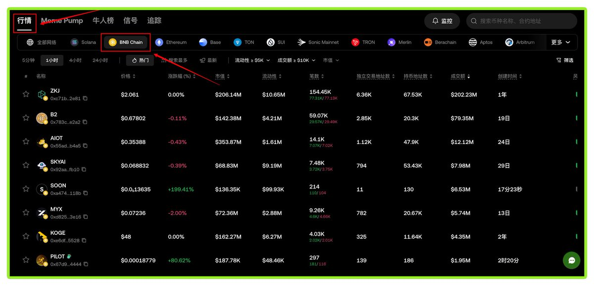
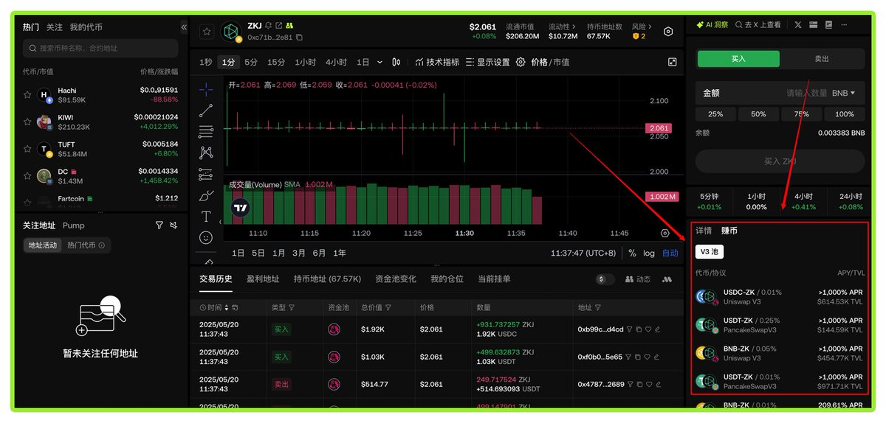
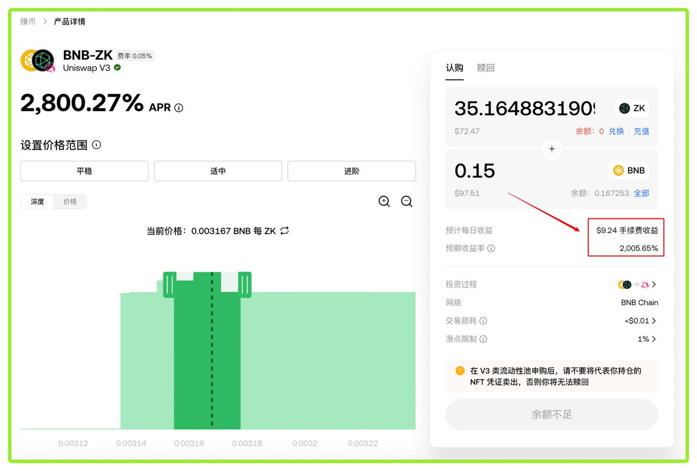
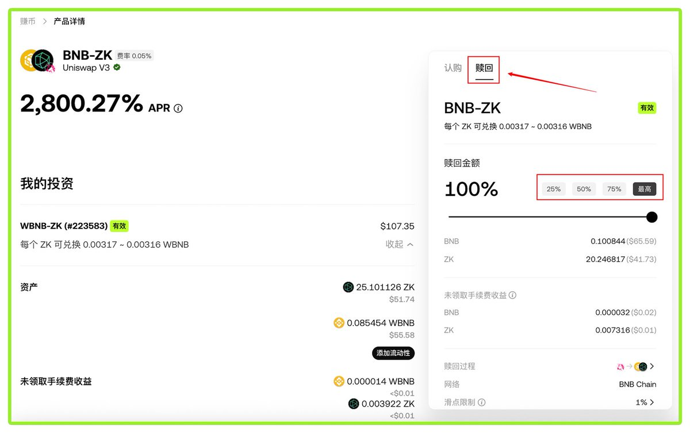
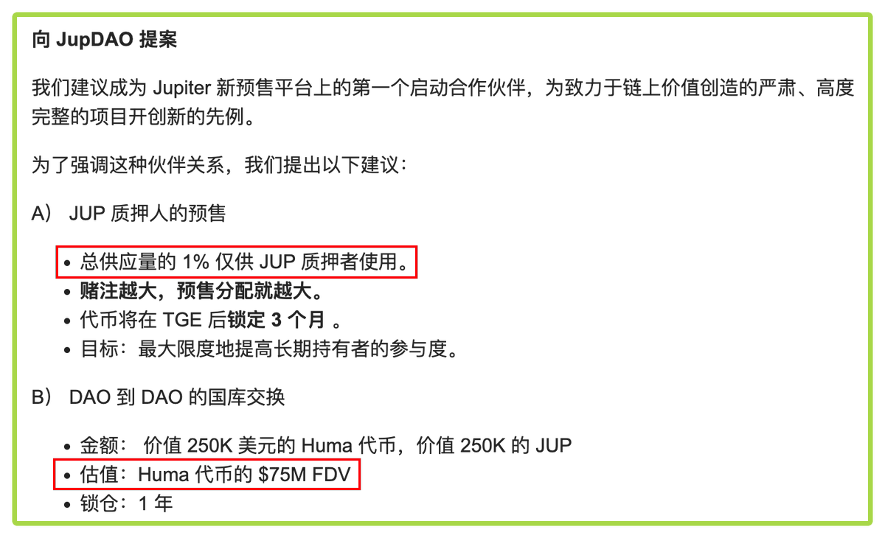

# OKX Alpha 代幣 LP 挖礦指南與 Huma 預售套利機會

> **來源**: [@BitHappy](https://x.com/BitHappy/status/1924690522784071991)
>
> **日期**: 
>
> **標籤**: `LP挖礦` `高收益` `DeFi套利`

---

> **來源**: [@BitHappy](https://twitter.com/BitHappy)
> **日期**: 2025-05-18
> **標籤**: `OKX` `LP挖礦` `DeFi` `Huma` `JUP` `套利`

---

## OKX Alpha 代幣 LP 挖礦教學

聽說給 Alpha 代幣加池子很賺錢？年化 5000%+？以下說明如何查看年化收益、如何加池子獲取收益、以及如何退出。

### 如何查看代幣擁有超高 APR

1. 打開 OKX Web3 行情頁面
2. 點擊「BNB Chain」
3. 隨便選擇一個眼熟的 Alpha 代幣,比如 $ZKJ
4. 點擊右下角「賺幣」
5. 超過 1000% 以上的 APR 就在眼前

### 如何添加 LP 並且賺錢

1. 挑選一個高收益的池子,比如 BNB-ZK
2. 輸入你計劃投入代幣量(如果只有一種代幣,不要急著買)
3. 根據自己想要的 APR 和預計代幣價格相對漲跌幅,設置代幣的價格區間
4. 調整好區間,能看到 LP 需要的兩個代幣的數量,補足兩種代幣後,點擊「認購」
5. 已開始 LP 的自動挖礦,比如圖中投入 170U 左右,一天預計可挖 9.24U

### 如何贖回代幣

1. 打開之前的認購界面
2. 點擊「贖回」
3. 選擇百分比或「最高」
4. 點擊「授權」,再點擊「贖回」

### 注意事項

1. 教程中的代幣僅為演示,所選擇的 LP 也不是 APR 最高的
2. 添加 LP 有風險,代幣價格不在區間後,無法獲得收益,且會產生無常損失
3. 借貸或套保代幣出來挖礦,可減少無常損失,借貸可考慮鏈上或交易所

---

## Huma 預售套利機會分析

大家都猜 Huma 是大毛,所以幾次開放存款的額度很快就沒了,但現在還有一個套利的機會!

### 官方公告信息

以下信息來自 Jup DAO 與 Huma 公告:

1. Huma 代幣總供應量的 1%,分配預售額度給 $JUP 的質押者
2. Huma 代幣的 $75M FDV
3. 投票時間為四天: 5 月 18 日 - 5 月 22 日

### 補充信息

0. 質押 JUP 的解鎖時間為 30 天
1. 根據 Huma 盤前的價格計算,FDV 為 1B
2. 1B / 75M = 13.33,即 JUP 質押者參與預售後,推測可得 13 倍回報

### 邏輯分析

0. 質押 JUP 參與投票(好像不投票也有)
1. 沒有 JUP,可通過借貸或者合約套保獲得 JUP,並質押
2. 在 OKX 支付 10% 利息借 JUP(這是我對比我已知的交易所和鏈上協議的借貸利率和借貸比例的最優選)
3. 投票時間 4 天,大家猜測紛紛大概率在 6 月份 TGE,那麼時間成本可能只有 11 天和解質押的 30 天,共 41 天
4. 41 天時間的實際需支付 10% / 365 * 41 = 1.12% 的利息
5. 只有分配的額度在質押金額的 1.12% / 13 = 0.086% 以下,才會虧

### 注意事項

13 倍只是預估,但 Huma 的市場情緒和盤前情況都很不錯,Huma 也有空投份額分配給 @KaitoAI。

### 操作步驟

在 OKX 抵押閒置資產借出 JUP,提現到 OKX 錢包後,質押到 Jup DAO 中,最後參與投票等待後續額度分配!

---

**DeFi 愛好者**: BitHappy
