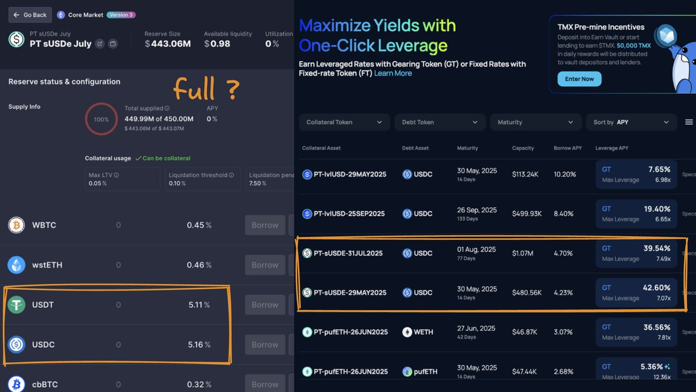

# Pendle x AAVE 槓桿風險與 TermMax 固定利率策略

> **來源**: [@jimcurrywang](https://x.com/jimcurrywang/status/1923693989078892927)
>
> **日期**: Sat May 17 10:56:02 +0000 2025
>
> **標籤**: `槓桿風險` `固定利率` `收益農場`

---

> **來源**: [@jimcurrywang (RJ ♣️)](https://x.com/jimcurrywang)
> **日期**: 2026-02-18
> **標籤**: `Pendle` `AAVE` `槓桿風險` `TermMax` `固定利率`

---

## 核心觀點

最近 Pendle x AAVE x Ethena 成長炸裂，巨鯨們狂做 PT loop。但如果行情繼續看漲，可能出現槓桿玩家被榨乾的風險循環。相比之下，TermMax 提供固定利率策略，可避免 squeeze 風險。

## Pendle x AAVE 的潛在風險

目前觀察到的風險循環：

1. **行情看漲** → sUSDe 底層利率上升
2. **借貸利率上升** → 出現 yield short squeeze
3. **PT、借貸利率再被推高** → Pendle 多頭自己榨爆自己

這種場景在 Morpho USD0++ MEV vault 上發生過，槓桿開太重的玩家最後直接被獻祭，繳貸款榨乾。因此這波還是要謹慎上槓桿。

## TermMax：低調的穩健選擇

@TermMaxFi 近期發展迅速，提供更穩健的替代方案：

### 產品優勢

- ✔ 上了不少池子
- ✔ 70 天的固定利率約 5%
- ✔ 不用搶流動性、不怕被 squeeze
- ✔ 完全避免未來行情大熱被 squeeze 的風險

### 定位評價

- 沒找到機會 loop 的人可以考慮來這邊
- 70 幾天的 5% 利息，佛心公司，根本不用人擠人
- **現在在我心中直接碾壓 Euler、Aave、Morpho，是我放 PT Loop 的首選**

### 背景資訊

- 近期不斷上新幣，表現完全不負期待
- 參加了 BNB Chain Demo Day
- 背後有 Cumberland、HashKey Capital、Decima Fund 等機構加持
