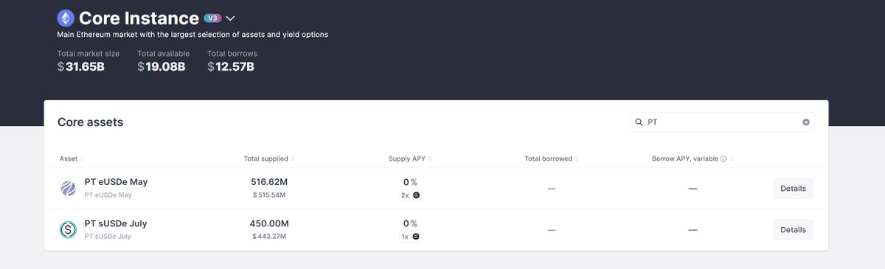
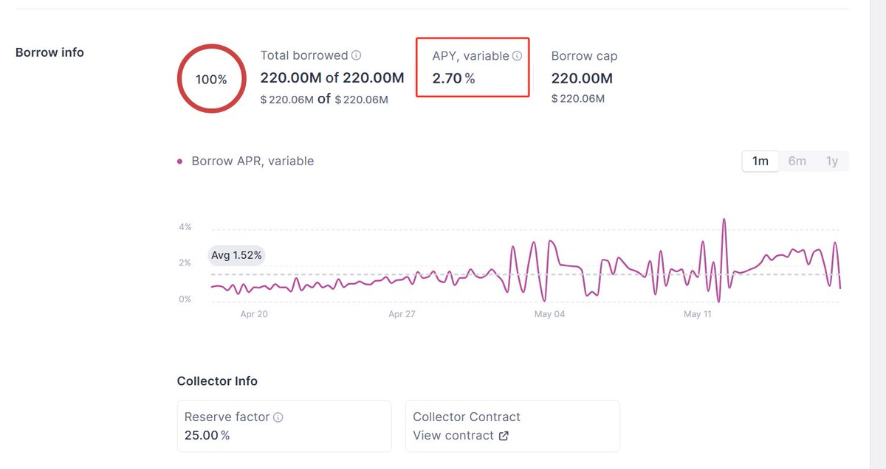
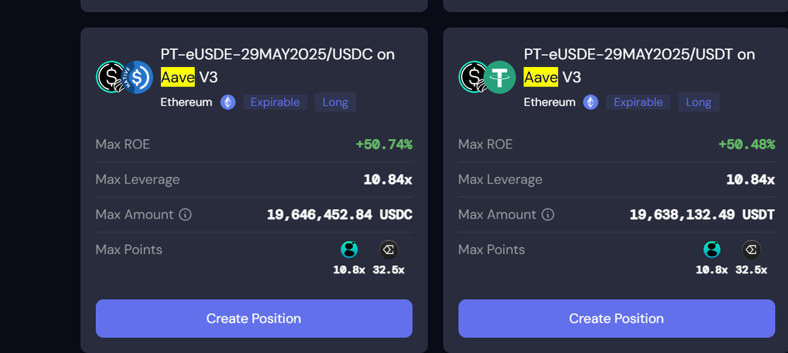

# PT 循環貸策略：AAVE + Pendle + Ethena 的 DeFi 套娃創新

> **來源**: [@Cody_DeFi](https://x.com/Cody_DeFi/status/1923909635091857874)
>
> **日期**: Sun May 18 01:12:56 +0000 2025
>
> **標籤**: `PT 循環貸` `Pendle` `Ethena`

---

> **來源**: [@Cody_DeFi (Cody)](https://twitter.com/Cody_DeFi)
> **標籤**: `PT 循環貸` `Pendle` `AAVE` `Ethena` `DeFi 套娃` `零息債券` `USDE`

---

## 背景觀察

之前寫過兩篇小白系列，意外的反響還不錯，嘗試繼續寫寫。

這次介紹 PT 循環貸的原因，主要是觀察到，自從幣圈最大的 DEFI 協議 @aave 上了合成美元 @ethena 在 @pendle_fi 的 PT 作為抵押品。然後整個 PT 循環貸的規模滾得非常快，直接滾到了 10 億美金。

## PT 循環貸為何能快速成長？

DEFI 套娃一直都被詬病為高風險的策略，尤其是循環貸，之前因為脫鉤爆倉的情況也不少，但是為什麼 AAVE+PENDLE+ETHENA 這個規模起得這麼快？

我覺得主要就是 **AAVE 認可了 PT 作為一個抵押品的合理性**。

### PT 的特性：零息本金債券

PT 的金融術語是「零息本金債券」，具有低波動的風險特徵，適合作為抵押品。但是，還有更重要的一點，就是傳統金融世界裡面，即便是零息本金債券，非國債發行人，也具有違約風險。因為債券發行人需要償還法定貨幣，如果他的抵押品或者信用，無法獲取法幣，那麼也會具有違約和脫鉤的風險。

### DEFI 的創新：同幣種閉環

但是 DEFI 的世界不一樣，在 DEFI 裡面，人人都可以發行穩定幣，就比如 ETHENA 的 USDE-PT 產品，**最終償還的是 USDE，而非 USDC 之類的穩定幣**。

所以，DEFI 的 PT 循環貸策略，可以始終在 USDE 這個體系裡面循環，比如：

**持有 USDE → 買入 PT-USDE → 抵押 PT-USDE → 借入 USDE**，循環

這樣的話，就會**抹除抵押品和借貸產品之間的脫鉤風險**。

## 收益空間分析

所以，在 AAVE 的借貸池裡面，2 億多的 USDE 全部被借空了，而且即便是借空了，整體的借貸成本也才 **2.7%**，而現在 USDE 的相關 PT 收益在 **10% 左右**，直接拉開 **8 個點的收益區間**。

倘如把 PT 循環貸策略的槓桿拉滿的話，年化收益率能夠拉到 **50%**。

## 風險評估

這個策略的風險高嗎？

我覺得真的是見仁見智，首先只要在預言機沒出問題的情況下，USDE 和 PT-USDE、SUSDE 一類代幣的價格是綁定浮動的，**不會出現清算風險**。

其次，合成穩定幣 ETHENA 應該是目前規模最大，托管相關最安全的代幣之一，這**抹除了一些托管風險**。

最後就是 AAVE\PENDLE 這兩個協議都是久經考驗的智能合約協議，相對的**黑客代碼風險也降低了**。

我覺得綜合這三個因素，才造就了 PT 循環貸高達十億規模的現狀吧，以太坊主網上的巨鯨機構們都在參與。

## PT 的戰略意義

我覺得 PT 應該是這個週期，DEFI 生態比較重要的發明之一，真的辛苦了 PENDLE 在後面辛苦的算積分，然後給 YT 玩家創造機會。🤣

而這類策略，應該會在後面繼續擴充到其他資產種類的上，比如 BTC\ETH STAKING 或者山寨幣 STAKING 之類的。

## 項目方應用方向

對於幣圈的項目發行方來說，把自己的項目融入 DEFI 最直接的兩個手段：

1. 基於 STAKING 模式的循環貸
2. 基於 PT/YT 的收益互換

而現在這兩個產品，還可以繼續疊加套娃。

## 核心觀點

我一直覺得幣圈的 DEFI 創新，就是金融產業在資金層面的創新，**資金的創新，就是用更少的抵押品，獲取更多的槓桿，提高資金的利用效率**。

**DEFI 就是套娃，套娃就是 DEFI**。
