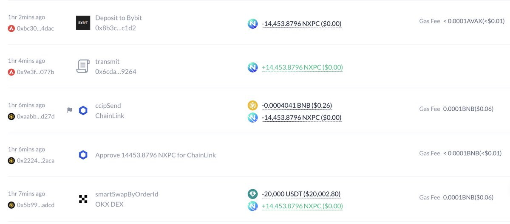
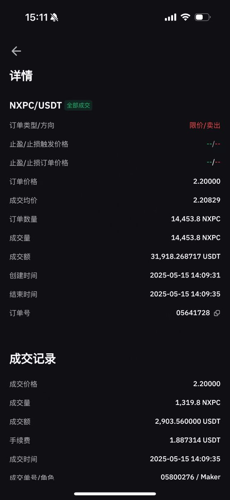

# 跨鏈橋接套利策略：Chainlink CCIP 與 LayerZero OFT

> **來源**: [@xiangxiaoping1](https://x.com/xiangxiaoping1/status/1922912858846679454) | [原文連結](https://twitter.com/xiangxiaoping1/status/1922912858846679454/photo/1)
>
> **日期**: 
>
> **標籤**: `跨鏈套利` `DeFi策略` `流動性`

---

> **來源**: [@xiangxiaoping1 (xiangxiaoping.eth)](https://x.com/xiangxiaoping1)
> **日期**: 2026-02-18
> **標籤**: `跨鏈套利` `Chainlink CCIP` `LayerZero OFT` `搬磚策略`

---

## 策略核心

提前做好準備工作，賺確定性的錢，很香。

## 跨鏈工具體驗

目前體驗下來，以下兩個跨鏈方案都挺絲滑：

- **Chainlink CCIP**（Cross-Chain Interoperability Protocol）
- **LayerZero OFT**（Omnichain Fungible Token）

下次有機會一定猛猛幹。
