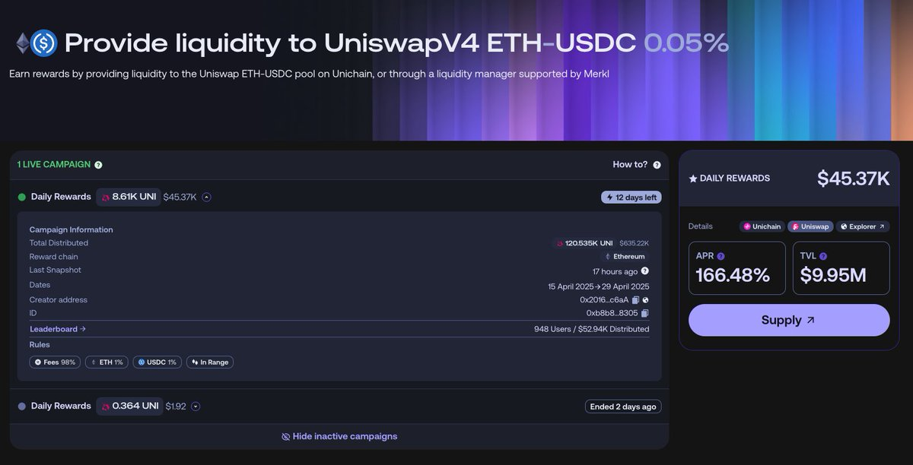
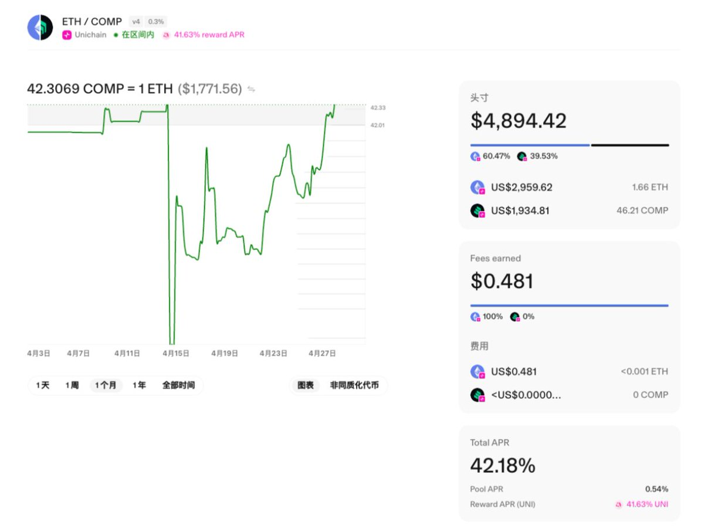

# Unichain 年化 1000% UNI 套利：補貼杠杆與快照機制攻略

> **來源**: [@DefiFarmerYue](https://x.com/DefiFarmerYue/status/1920453853763477955) | [原文連結](https://uniscan.xyz/address/0xCcB6DA699b37a3fd76a6857cfA72019C86b6B15e#tokentxns)
>
> **日期**: 
>
> **標籤**: `UNI 補貼` `流動性挖礦` `套利策略`

---

> **來源**: [@DefiFarmerYue (阿越真的很严格)](https://x.com/DefiFarmerYue)
> **日期**: 2025-08-31
> **標籤**: `Unichain` `DeFi` `套利` `流動性挖礦` `補貼機制`

---

## 核心發現：年化 1000% 的 UNI 補貼套利

薅來的 UNI 賣出去了,有時間複盤一下我是如何擼到年化 1000% 的 UNI 了。

Unichain 的補貼大戰剛開始時,就有 DeFi OG 挖到穩定幣對頭礦+創建低費率池子賺交易費,@Super4DeFi @Cody_DeFi @cmdefi 給了我這個 DeFi 小學生深深的震撼。在佩服之餘,我也開始研究 Unichain 的補貼邏輯和方法。

## 補貼機制解析

在一位神級 i 人的指點下,我發現了 Unichain 的補貼有 **98% 是基於地址獲得的交易費來分成**。換句話說,只要你拿到的交易費占比夠大,那麼你就能拿到大部分的 UNI 補貼。

### ETH-COMP 池子案例

我們以 ETH-COMP 這個池子為例:
- Fee 的 APR 是 0.54%
- UNI 補貼的 APR 是 41.63%

假設某時間段內的交易費是 1 塊,也能獲得 UNI 大約 1k 的補貼!

**粗糙算下來,手續費撬動的補貼槓桿至少有 77 倍!!**

## 套利策略

根據測試發現,Unichain 發放補貼的形式是**每四個小時快照一次**。

### 操作方法

1. 在快照前,加入最窄區間的流動性
2. 刷點交易量
3. 在沒有其他人進場的情況下,就能夠以極低的無償損失+少量的費用損耗,獲得超高年化的 UNI 補貼

**剛開始賺到我頭暈目眩,日化 10%!!**

## 博弈升級

可惜,後來也有人發現了這個 bug,開始進場博弈,刷量遊戲慢慢變成了**最後一小時的控 fee 大戰**。

比如被我扒到的這個地址: [0xCcB6DA69...C86b6B15e](https://t.co/K7UFgMJSUQ)

從鏈上數據可以看到:
- 大量的 Execute Swap 交易
- 集中在快照前的時間窗口
- 每筆交易都在爭奪手續費占比

我們刷量太多,以至於**最後一小時的交易量顯著上漲**,最後可能被官方發現,最終香香礦只維持了 5 天,就改了規則。

## 總結

真正玩轉 DeFi 的人,甚至可以不在乎資金大小,就能以極低的風險獲得極高的收益。

想在賭場賺錢,除了成為頂級玩家外,也可以嘗試:
1. 借給用戶錢
2. 薅賭場、項目方羊毛

**畢竟後者,才是穩穩的幸福。**
