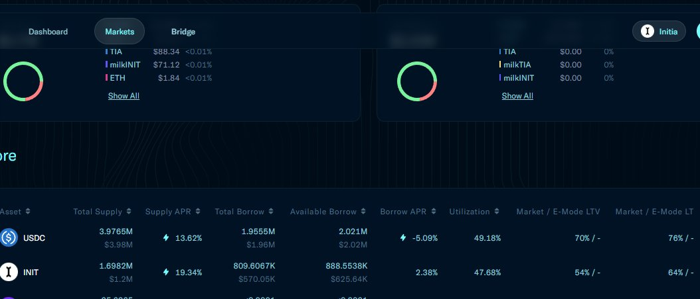
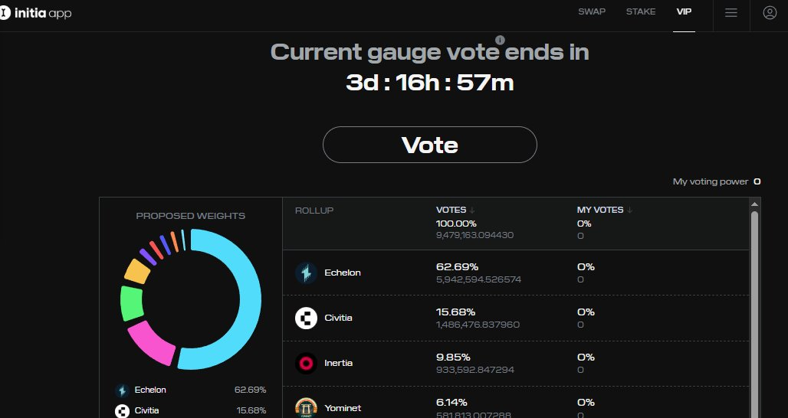
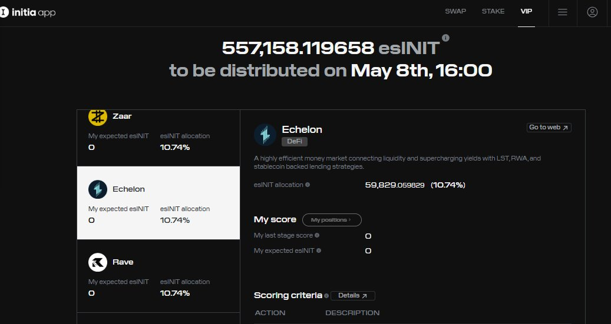

# Echelon 在 Initia VIP 機制中的收益機會分析

> **來源**: [@0xFreudog](https://x.com/0xFreudog/status/1918695927914881384)
>
> **日期**: Sat May 03 15:55:31 +0000 2025
>
> **標籤**: `DeFi 借貸` `Initia 生態` `收益農場`

---

> **來源**: [@0xFreudog (0x佛洛依德狗)](https://x.com/0xFreudog)
> **日期**: 2026-02-18
> **標籤**: `Echelon` `Initia` `VIP機制` `收益機會` `DeFi`

---

## 潛在 DeFi 機會分析：Echelon on Initia

Echelon (@EchelonMarket) 玩 DeFi 的老 OG 可能多少都接觸過,它最早起源在 Aptos 鏈上,最近這個借貸協議開始在 Initia (@initia) 上提供流動性,根據我的分析,近期在 Init 上給它存錢可能是一個不錯的選擇。(@22333D @bithappy)

## Initia VIP 機制

這裡要提到的是 Initia 獨特的 VIP (Vested Interest Program) 機制,你可以理解為類似 CRV 等很多協議採取的投票,每兩週為一個 Epoch,程序化分配 $esINIT 獎勵。

看下附圖,這個 Epoch 內,Echelon 獲得了 10.74% 約 59.8k 的 esINIT 分配,目前在協議上顯示的 USDC 和 INIT 的借出年化分別為 13% 和 19%。

而在下一個 Epoch 內（大約 3 天內結束）,Echelon 目前獲得了 62.69% 的 vote,對應分配的 esINIT 約為 5.9m=5900k 的分配！

如果按這個結果的話,那麼預期未來兩週,Echelon 在 Initia 上會獲得一個很好的 APR。

## Initia 代幣提現方式

### CEX 提現
目前 Initia 代幣在幣安、Bybit 等交易所有現貨,但是要關注在其主網上是否暫停提現。

### 鏈上橋接
- **方法一**：使用 Initia 官方橋從 ETH 主網跨鏈 USDC 到 Initia 鏈
- **方法二**：使用 Initia 官方橋從 Noble 跨鏈 USDC
- **方法三**：@SkipProtocol 等部分第三方橋可支持 EVM 二層跨鏈 USDC

後續我會對這個機會繼續測試。
