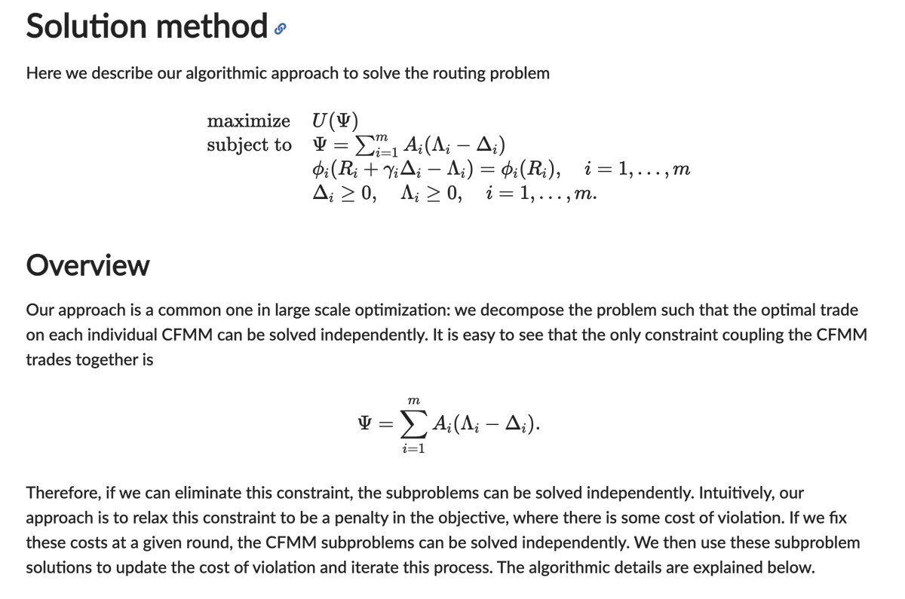
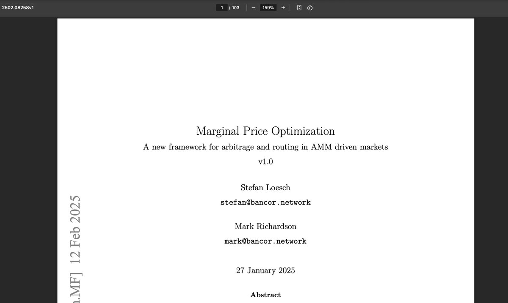

# AMM 路由算法：從圖論到凸優化問題

> **來源**: [@wong_ssh](https://x.com/wong_ssh/status/1918627817790881936) | [原文連結](https://twitter.com/wong_ssh/status/1918627817790881936/photo/1)
>
> **日期**: Sat May 03 11:24:52 +0000 2025
>
> **標籤**: `AMM路由` `凸優化` `Bancor`

---

> **來源**: [@wong_ssh (WongSSH)](https://twitter.com/wong_ssh)  
> **日期**: 2026-02-18  
> **標籤**: `AMM` `路由算法` `凸優化` `圖論` `DEX`

---

## AMM 路由算法的研究方向

花了一點點時間閱讀關於 AMM 路由算法的論文。之前一直以為技術上路由算法應該是圖算法的天下，但我讀的論文內認為這是一個凸優化問題，並使用 Julia 開發了一套路由求解工具。

## 閱讀建議

目前來看，先讀一下 Julia 實現的文檔然後讀論文體驗更好。

## Bancor 的路由算法論文

Bancor 居然寫了一篇 100 頁的論文介紹路由算法，但目前還沒讀。

參考連結：https://t.co/5sYE6gaH3P
