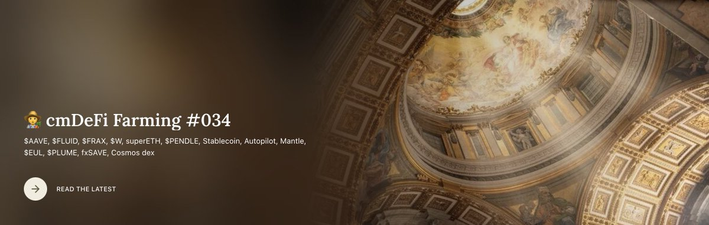

# 穩定幣補貼時代與 DeFi 策略升級——機槍池自動驅動與 Aave Umbrella 機制

> **來源**: [@cmdefi](https://x.com/cmdefi/status/1917586356882268577) | [原文連結](https://twitter.com/cmdefi/status/1917586356882268577/photo/1)
>
> **日期**: Wed Apr 30 14:26:29 +0000 2025
>
> **標籤**: `穩定幣補貼` `機槍池策略` `Aave Umbrella`

---

謝謝提供的資訊。我已經取得完整內容，現在整理成知識庫文章的正文部分（不含標題和 frontmatter）：

---

> **來源**: [@cmdefi](https://x.com/cmdefi) | [cmDeFi Farming #037](https://cmdefi.substack.com/p/cmdefi-farming-037)  
> **日期**: 2025-07-03  
> **標籤**: `DeFi` `穩定幣` `Aave` `Umbrella` `機槍池` `GHO`

---

## 穩定幣補貼時代的困境

DeFi 的流動性挖礦模式本質是：用早期補貼換取後期費用收入的可持續發展。但許多穩定幣協議的補貼行為（如 stkGHO 13% APY）是依賴治理代幣補貼堆砌的，並非真實借貸需求驅動。

### GHO 的補貼困境

**原 Safety Module 的高收益結構**：
- stkGHO 質押 APY 高達 13%
  - 5.55% 基礎利率
  - Merit 模塊 7.14% 補貼
- 這種高收益是靠治理補貼硬推出來的「不健康發展模式」

**Aave Umbrella 上線後的影響**：
- 切換到新模塊的 stkGHO 預期年化可能從 13% 下滑到 7.7% 左右
- 靠補貼維繫的穩定幣需求，本質上是虛假繁榮
- Umbrella 是 Aave 重新審視這種模式的標誌性動作

---

## 機槍池升級到「自動駕駛」

### 什麼是機槍池（Vault）

- 用戶把資金存入，智能合約根據當前各 DeFi 協議的利率高低，自動調整存放位置
- 2021 年流行過，Yearn Finance 是代表性產品

### 2025 年的升級版——策略更複雜

#### 1. InfiniFi 的「時間倍增器機制」（Time Multiplier）

鼓勵用戶鎖定存款獲取更高收益和治理權重，採用「梯度化系統」：

**按存款期限分配資產**：
- **短期存款** → 高流動性協議（如 Aave 即期借貸市場）
- **長期鎖倉存款** → 與鎖定期相關的高收益場所
- **安全緩衝池** → 吸收市場波動的損失

#### 2. CoveUSD（Gauntlet 主導）

**核心特點**：
- Gauntlet 作為協議的「精算師」，核心工作是幫助項目完成 KPI 並制定流動性激勵策略
- CoveUSD 是一個策略組合，讓用戶系統性地擼穩定幣補貼
- 本質上是社群曾經做的事情的機構化升級版

**激勵機制**：
- Cove 將代幣總供應量的 8% 分配給第一年流動性挖礦激勵
- 關鍵觀察指標：TVL（直接影響協議收入能力）

---

## Aave Umbrella 機制解析

### 部署時間與背景

**2025 年 6 月 5 日，Aave 正式部署 Umbrella 安全模塊**（取代舊 Safety Module）

### 核心變化

**原模式**：
- AAVE 代幣持有者質押承擔風險
- 間接保障協議

**新模式**：
- aToken 持有者直接質押
- 承擔對應資產的壞賬風險
- 賺取「利息 + 安全獎勵」雙重激勵

### 風險隔離設計

每種 StakeToken 只負責對應底層資產的壞賬擔保：

| StakeToken | 覆蓋範圍 |
|-----------|---------|
| aUSDC | 只覆蓋 USDC 市場的壞賬 |
| aUSDT | 只覆蓋 USDT 市場的壞賬 |
| aETH | 只覆蓋 ETH 市場的壞賬 |

### 自動覆蓋機制

**觸發流程**：
1. 系統自動偵測鏈上數據
2. 一旦發生資產短缺，觸發燃燒機制
3. 通過燃燒已質押資產來覆蓋壞賬

**初始損失保護機制**：
- Aave DAO 的自有資金優先覆蓋損失
- 再從用戶質押資產扣除

### 對 Aave V4 架構的影響

**Spokes**：
- V4 的借貸入口，連接 Liquidity Hub
- 提供定制化借貸功能
- 擁有獨立規則和風險參數

**Umbrella 機制的貢獻**：
- 讓風險定價更加直接和透明

---

## 其他週內 DeFi 協議觀察

### $INK
- 第一個用例將是基於 Aave 技術的原生流動性協議
- 鏈上 TVL 不足 $10M，活躍度低

### $EUL（Euler V2）
- 實現了 rEUL 鎖倉線性激勵策略，TVL 重新啟動
- EulerSwap 是 Uni V4 Hooks，結合 Euler 借貸系統與 DEX 交易

### Morpho V2
**意圖驅動（Intent-driven）模式**：
- 貸款方廣播貸款意圖（類似掛單）
- 與借款方匹配
- 無匹配則資金不鎖定

### 其他協議動態
- **$ENA（Ethena）**：生態項目持續展開
- **$SKY（前 MakerDAO）**：相關動態
- **$SILO（Silo V2）**：回歸以太坊主網
- **Unichain**：新的激勵分配機制
- **GammaSwap**：無常損失對沖方案
- **美股上鏈（Tokenized Stocks）**：作為 DeFi 的新增量敘事
