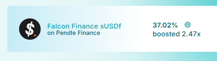
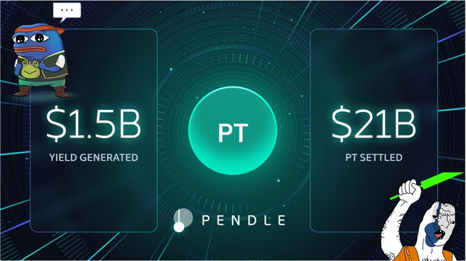
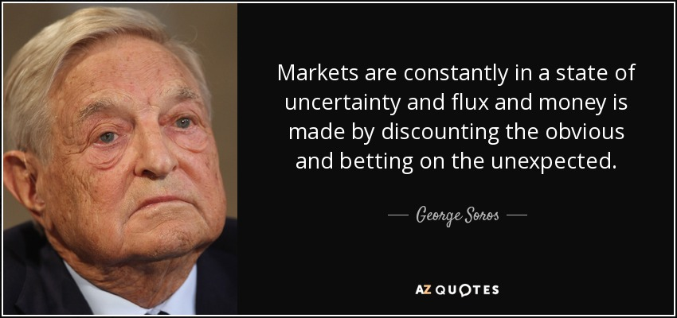
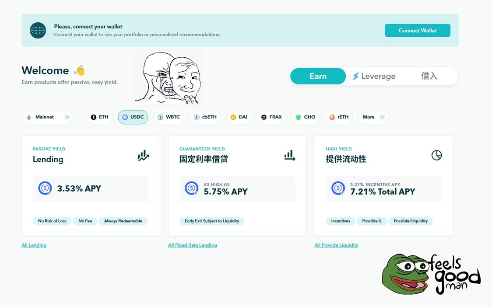
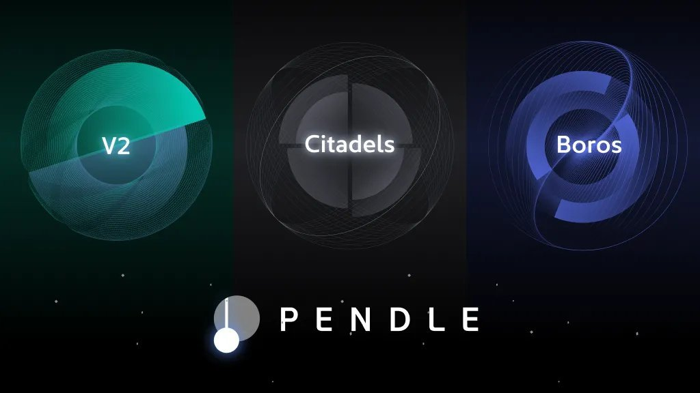

# Pendle 與 Penpie：解構固定收益 DeFi 的設計創新

> **來源**: [@bonnazhu](https://x.com/bonnazhu/status/1915762759993811287)
>
> **日期**: Fri Apr 25 13:40:09 +0000 2025
>
> **標籤**: `Pendle策略` `veToken流動性` `固定收益`

---

> **來源**: [@bonnazhu (Bonna | U酪乳)](https://x.com/bonnazhu)
> **日期**: 2026-02-18
> **標籤**: `Pendle` `Penpie` `DeFi` `固定收益` `veToken` `收益優化`

---

## Penpie 產品背景

最近 @DWFLabs 的穩定幣 USDf 上了 Pendle，給了 LP 很高的激勵，要比買 PT 高很多。但我因為沒 vePENDLE 給收益加成，直接做 LP 的帳面收益有點虧。於是我開始找有沒有第三方的收益平台，試了下 @Penpiexyz_io，終於吃到近 40% 的 APY，基本接近 50% 的 max APY 上限。

而 Penpie 產生的背景也跟 Convex 類似：

- vePENDLE 模式下，鎖倉時間長，流動性差
- 對普通用戶來說，收益是提高了，但代價太大

因此催生了像 Penpie 這樣的中間層，通過「平台代鎖 + 流動性代幣 + 治理外包」的方式，給礦工和項目方提供了參與 Pendle war 門檻更低的方式。

## Penpie 核心機制

### 1⃣ 平台代鎖

Penpie 這一類平台最大的價值，其實就是讓礦工在不需要自己鎖倉 veToken 的情況下，也可以獲得 veToken 帶來的收益加成。Penpie 會統一把平台內的 PENDLE 頂格兩年期限鎖成 vePENDLE，由協議統一掌控，並由所有平台上的礦工共享。

### 2⃣ 流動性代幣

那麼平台的 vePENDLE 從哪來？就是由另一部分用戶「貢獻」PENDLE 鎖倉而來。Penpie 會給鎖倉用戶發行 mPENDLE，作為 vePENDLE 的可流通版本。

mPENDLE 也因此可以獲取一部分 Penpie 平台的協議收入（來自 Penpie 平台從礦工的 APY 中抽取的收益，設定為 12%）。本質上來說，mPENDLE 面對的是那些想要質押 PENDLE 代幣獲取經濟收益，但因為 veToken 沒有流動性而望而卻步的人。

### 3⃣ 治理外包

不過，對於替 Penpie「貢獻」PENDLE 鎖倉的用戶來說，雖然換來了額外的收益 + 可退出的靈活性，也讓渡了原生投票權。鎖在 Penpie 裡的 vePENDLE 的投票權實際由平台統一行使，並由 PNP（Penpie 的治理代幣）鎖倉者決定投票方向。項目方如果想在 Pendle 上爭取更多激勵，可以選擇通過賄選的方式影響 PNP 社區決策。

目前 Penpie 控制的 PENDLE 基本上佔了 vePENDLE 的 1/3 的體量，影響力巨大。而對於 PENDLE 來說，Penpie 作為其之上的「收益加成平台 + 治理權二級市場」，是樂見其成的，因為這意味著 PENDLE 鎖倉的長期穩定性，也降低了很多項目方參與 Pendle War 的門檻。

### 4⃣ 核心挑戰

當然，mPENDLE 對 PENDLE 現貨是存在一定折價的。畢竟它代表的是鎖死後的 vePENDLE 份額，無法直接贖回，只能通過交易退出。這種折價本質上是對流動性喪失的定價，和 cvxCRV 等 veToken wrapper 一樣，屬於結構性特徵。歷史經驗來看，折價基本都在 50% 以上。

因此，給 veToken 的流動性代幣建立更深的流動性池，幾乎是每一個 veToken 收益加成平台的必經之路。而維持這部分 LP 的流動性，通常也需要持續付出激勵成本。

Penpie 相比其他平台的優勢在於，它是 @magpiexyz_io 旗下 veSubDAO 體系的一部分，自身持有多種治理代幣資產（如 CAKE、MGP），可以在不同鏈—如 BSC 上輔助 mPENDLE 的流動性建設，目前 @PancakeSwap 上 mPENDLE/PENDLE 池子 TVL 約 1.8M 美金。

不過由於前段時間的 Pancakeswap 代幣經濟的升級，不再使用 veToken 模式進行治理，短期上可能對 Penpie 的流動性佈局帶來一定間接影響。不過只要 veToken 體系還在持續發展，這種模式的需求就不會消失。

## Pendle 核心價值分析

越是 DeFi 老礦工，越是對鎖定 APY 有訴求，也越認可 @pendle_fi 提供的價值。

進入熊市之後，Pendle 也基本成為我除了 Curve 之外最主要的理財場所，因為確實只有在這裡，才能獲得相對滿意又穩定的收益，無腦買 PT 就完事了。

而 Pendle 也無愧這一輪週期 DeFi 新興領頭羊的稱號，也是少數 100% 協議收入都給到代幣持有者，產品價值和代幣價值清晰掛鉤的項目。那麼 Pendle 哪些地方做對了？

### 給資金提供「確定性」和「賠率」

加密市場兜兜轉轉這些年，去偽存真，到最後發現，其實就剩下了交易和收益兩大場景。

而固定收益則是金融終極訴求的反映：無論是需要借貸資金的做市商，還是追求收益的礦工，確定性和賠率都是關鍵訴求，資本都是厭惡不確定性的，並在賠率中下注。

Pendle 抓住了這一主旋律，它致力於讓用戶規避浮動利率波動，也給了願意為「賠率」而下注的投機者一個暴富的機會，成為他們在複雜市場中的理想選擇。

### PT/YT 博弈：重塑固定收益機制

但真正讓 Pendle 在這個賽道脫穎而出的，是它的工程手段，且與以 Notional Finance 為首的傳統固定收益協議有著本質區別：

#### 1⃣ Notional Finance 的局限

Notional Finance 等協議，本質上是通過重新協調和分配借貸雙方利益來實現固定利率的，放款人犧牲潛在收益，借款人妥協成本。

然而不管怎麼樣，雙方參考的準繩仍舊是主流浮動借貸市場的利率，而後者也無非是 3-5%。即使在牛市資金短缺時，浮動利率可能攀升至 10% 以上，但期望借款人長期鎖定如此高的成本並不現實。

結果是，平台上的原生收益率偏低，不足以吸引資金從浮動借貸利率市場遷出。這也是為什麼你看到 Notional Finance 上面常年冷冷清清，TVL 也起不來的原因之一，收益太低了，大家都不傻，外面花花世界，為什麼要來你這裡找不痛快，而平台如果要匹配用戶利益，就必須要進行大量補貼，對代幣價格又不利，陷入死循環。

#### 2⃣ Pendle 的創新機制

Pendle 則另闢蹊徑，通過 PT（本金代幣）和 YT（收益代幣）的博弈機制，徹底跳出借貸協調的局限：

- **PT**：用戶折價購買 PT，折價部分即收益
- **YT**：用戶市價購買 YT，博弈利息及獎勵

**博弈核心**：PT 和 YT 在 AMM 上交易，價格由市場供需決定。追求收益的風險偏好型用戶（YT 買家，賭利息和獎勵上漲）補貼追求穩定、見好就收的挖礦型用戶（PT 買家，鎖定固定回報），兩群人需求互補，協議無需依賴代幣補貼，就可以給到讓礦工滿意的 APY。

可能團隊自己都不會想到，當初受到傳統金融工程手段 Yield Stripping 啟發而來的設計，卻陰差陽錯，讓這個市場中最為極端的兩個群體發生了奇妙的化學反應。

### 牛熊兼顧：PT/YT 互為鏡面

除此之外，Pendle 的設計也有牛熊兩面的影子，Pendle 的 PT/YT 設計天然適應市場週期：

- **熊市**：PT 需求旺盛，礦工鎖定收益，規避市場波動
- **牛市**：YT 需求大漲，投機者追逐收益上漲潛力

這讓 Pendle 在牛熊切換中都至少能維護和聚攏一定的用戶資金，產品收益和代幣價格的週期波動性也一定程度上被顯著降低。

## Pendle 發展歷程與轉折點

不過，Pendle 的成長也並非一帆風順。早期，Pendle 主打 yield trading，乍一聽就比較小眾，UI 對散戶也不友好；此外，當時的池子也大多基於 Compound 等借貸協議，利率波動小，YT/PT 分歧、博弈空間有限，對外部資金的吸引力不足。

什麼時候事情開始發生變化呢？

- LST/Restaking 開始興起
- BTCFi 熱潮來臨
- 再到目前則是各種 Yield Stablecoin 的推出

這些場景與圍繞借貸關係產生的收益區別在哪裡？在於它們都提供了足夠的「想像力」，博弈空間足夠大，以至於有人願意承擔風險去賭項目上線後代幣兌換的 upside，而有的人則根本不 care，只想著見好就收，才會一拍即合。

## 未來展望與挑戰

### 新方向與潛在風險

那麼，未來如果這些新項目越來越少，博弈預期變少，對 pendle 是不利的麼？是的，lst/restaking, btcfi, pointsfi 都熄火，這一波新的穩定幣上線後沒有後繼的話，對 pendle 的 TVL 和估值肯定會有很大的影響。

這也是我認為 pendle 今年起不斷拓展新方向的一個原因，其中就包括了讓傳統機構和資金入場參與 PT/YT 交易的 Pendle Citadel 計劃，以及引入永續合約資金費率市場的 Pendle Boros 計劃。

不過，與 TGE 空投博弈相對有章可循不同的是，資金費率的波動雖然確實夠大，但也更加無序，其變化更多是一個結果。因而即便確實有像 Ethena 這樣的大金主有龐大的鎖定資金費率（購買 PT）的需求，但是 YT 這一端是否有足夠明確的畫像用戶來承接，確實還有待持續觀察。但從敘事方向上看，Citadel 和 Boros 確實讓人充滿期待，Pendle 團隊總是在做 0-1 的事情，不斷為開闢新可能。

### PENDLE 估值分析

不管如何，Pendle 未來的市值高度，仍舊取決於是否能承接更多的博弈場景，雖然還沒想到 LST/Restaking、BTCFi、Yield Stablecoin 之後的熱點主題會是什麼，但加密市場作為新敘事和新資產的試驗場，Pendle 只需要時刻做好準備承接即可。

據 DefiLlama，Pendle 年收入約 2200 萬美元（歷史數據），FDV 8.8 億美元，靜態 P/E 約 40 倍，這波從 1.8 美金開始的反彈後，雖然已經不算很便宜，但也絕對稱不上特別貴，尤其是這裡面其實包含了很多市場對於 pendle 團隊 @pendle_fi @tn_pendle @degens_grandma 執行力的信任，以及其市場地位的溢價。

回歸本質，PENDLE 依舊是值得放在熊市值得抄底的幣種列表清單頭部位置的，也是我會在未來 1-2 年內持續 DCA 的幣種之一。
