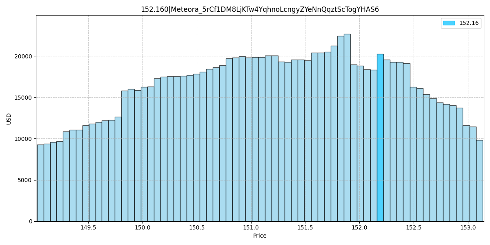
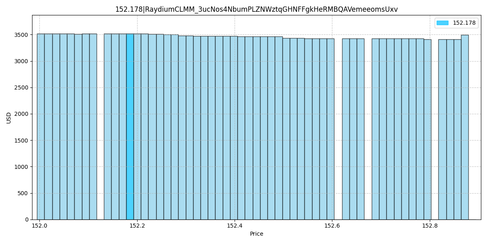

# DLMM 與 CLMM 流動性分布數學建模對比分析

> **來源**: [@ospopen](https://x.com/ospopen/status/1915656729456791558) | [原文連結](https://twitter.com/ospopen/status/1915656729456791558/photo/1)
>
> **日期**: Fri Apr 25 06:38:50 +0000 2025
>
> **標籤**: `流動性管理` `Meteora` `Raydium`

---

> **來源**: [@ospopen (吳翱翔 Kira)](https://twitter.com/ospopen)  
> **日期**: 2026-02-18  
> **標籤**: `DLMM` `CLMM` `Meteora` `Raydium` `流動性分布` `數學建模`

---

## 研究內容

潛心研究看了幾天 CLMM 白皮書和論文，把 DLMM 和 CLMM 流動性分布數學建模畫出來了。

## 數據對比

**Meteora (DLMM)**
- TVL: 3.7M
- 日交易量: 5600 萬

**Raydium (CLMM)**
- TVL: 9.6M
- 日交易量: 4900 萬

## 觀察與疑問

DLMM 池子 tick spacing 價格範圍更大，但好奇為什麼 Meteora 資金利用率遠超 Raydium。

有沒有可能 Jupiter 聚合器對自家的 Meteora 路由更優先？
