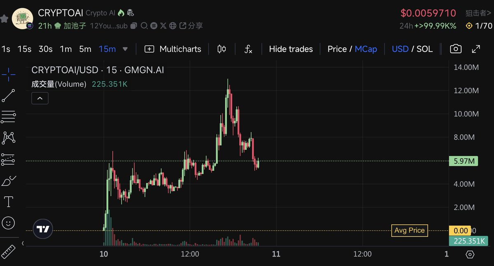
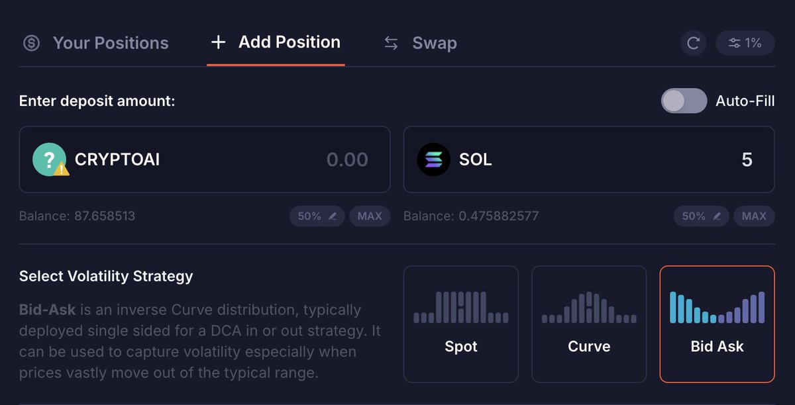

# DLMM 低風險 LP 策略：Bid-Ask 加單邊池自動止損

> **來源**: [@QuantVela](https://x.com/QuantVela/status/1910332091210006875) | [原文連結](https://twitter.com/QuantVela/status/1910332091210006875/photo/1)
>
> **日期**: 
>
> **標籤**: `DLMM` `LP策略` `風險管理`

---

> **來源**: [@QuantVela (Vela)](https://twitter.com/QuantVela)
> **日期**: 2026-02-18
> **標籤**: `DLMM` `流動性提供` `風險管理` `Solana` `DeFi`

---

## 策略概述

這是一個較低風險的 DLMM LP 策略，利用 Bid-Ask 機制配合 SOL 單邊池來實現自動抄底與風險控制。

## 策略設置

- **池子類型**：Bid-Ask + SOL 單邊池
- **價格區間**：調整到你想抄底的位置
- **風控機制**：配合工具的自動止損功能（撤池子 + 把 token 賣成 SOL）

## 運作機制

當幣價下跌時：
- 策略會慢慢買入標的代幣
- 跌得越多，買入越多
- 即使觸發止損，下跌過程中累積的可觀手續費收入也足以達到盈虧平衡

## 風險特性

這個策略的低風險特點在於：
1. 利用價格下跌時的手續費收入作為緩衝
2. 自動止損機制避免過度虧損
3. 單邊池降低無常損失風險
